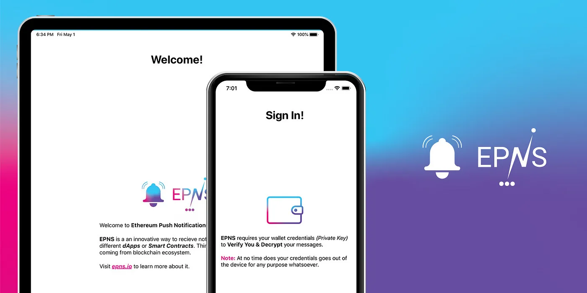

import { SubHeader, ImageText } from '@site/src/components/SharedStylingV2';

<!--truncate-->

It’s another day at [EthGlobal HackMoney hackathon](https://www.ethglobal.co/) and we are back with more detail and further progress.

While most of the dev project cycles start at smart contract and end at dApp, we have taken a different approach and instead are focusing on getting the EPNS mobile app and push notification server built out first.

The reasons? We are quite happy with the app specs and don’t think that will change anytime soon while we wanted to think and iterate a bit more on smart contract so we choose this route. Without further ado, Let’s dive into how we are going to create the magic in the mobile app.

### Features
The EPNS mobile app is built using react native and provides the following features:

- App should be able to receive push notifications.
- App should be able to connect the user’s wallet (singular at the moment) in a secure manner.
- App should connect the user wallet to the push notification device tokens that are generated by Apple Push Notification Service or Android Push Notification Service.
- App should be able to send this information to the epns server in a secure format.
- App should be able to fetch user notifications (kind of like emails) that were already delivered to them.

<ImageText>We all get a notification, woohoo !!</ImageText>

### Tech Specs
Mobile push notifications use [device tokens](https://help.pushwoosh.com/hc/en-us/articles/360000364923-What-is-a-Device-token-) for registration of the device and the push notification server then sends out mass or specific messages using these device tokens. For EPNS to work, we need to register these device tokens as well as the wallet to which they belong to.

For the EPNS Service to work, the following modules need to be built:

- Storing User Wallet Private Key (Offline on the User’s Device)
- Mapping user’s wallet address to device tokens
- Communicate with the epns server to verify and store these device tokens (mapped to wallet address)
- Handling Incoming Push Notifications
- Fetching Previous Notifications of the User

#### Storing User Wallet Private Key (Offline on the User’s Device)

The app needs to store the user’s wallet private key to decrypt the message received by the user and to encrypt the token registration process. This ensures that the epns server only maps the verified device tokens to the user wallet.

Furthermore, we need to provide either biometric or passcode based security to the user in the app since the app is storing sensitive user credentials. We will also be storing these user credentials in an encrypted format, we will mostly be using [React-Native-Keychain](https://github.com/oblador/react-native-keychain) for this.

#### Mapping user’s wallet address to device tokens

Once a user has imported the wallet, the device tokens which are generated would be mapped to the wallet of the user.

#### Communicate with the epns server to verify and store these device tokens (mapped to wallet address)

We will mostly be using [Eth-Crypto](https://github.com/pubkey/eth-crypto) to handle the secure verification process.

Current proposal is to send the operation code as <b>Register</b> along with the device token as the signature of the user using the above library and the public wallet address. The server will first decrypt the hash to find the public wallet address of the user and will only proceed if the public wallet address sent matches with the decrypted address of the public wallet. This ensures that spoofing can’t be done by any user to receive notifications meant for the intended recipients.

To know more about the server and it’s architecture, please head to [[epns-push-notification-server repo](https://github.com/ethereum-push-notification-system)]

#### Handling Incoming Push Notifications

The push notification handling (for when the app is open) will also be built to handle notifications received by the users when they are inside the app.

#### Fetching Previous Notifications of the User

TBA. We are still contemplating storing a cache on the epns server or handle it alternatively, community brainstorming is welcome :)

TLDR; try out the (not so complete work in progress) [react native](https://github.com/ethereum-push-notification-system/epns-mobile-app) app.

Please feel free to share your support and amazing feedback. If you liked this article, consider reading our previous posts as well!

[EPNS General specs](https://medium.com/@epnsdapp/building-ethereum-protocol-notification-system-d406f0efdba0)

[EPNS Game theory](https://medium.com/@epnsdapp/epns-game-theory-explained-25425bbe4eae)

Connect with us if you have any questions!

### About Push Protocol

Push is the communication protocol of web3. Push protocol enables cross-chain notifications and messaging for dapps, wallets, and services tied to wallet addresses in an open, gasless, and platform-agnostic fashion. The open communication layer allows any crypto wallet /frontend to tap into the network and get the communication across.

To keep up-to-date with Push Protocol: [Website](https://push.org/), [Twitter](https://twitter.com/pushprotocol), [Telegram](https://t.me/epnsproject), [Discord](https://discord.gg/pushprotocol), [YouTube](https://www.youtube.com/c/EthereumPushNotificationService), and [Linktree](https://linktr.ee/pushprotocol).
