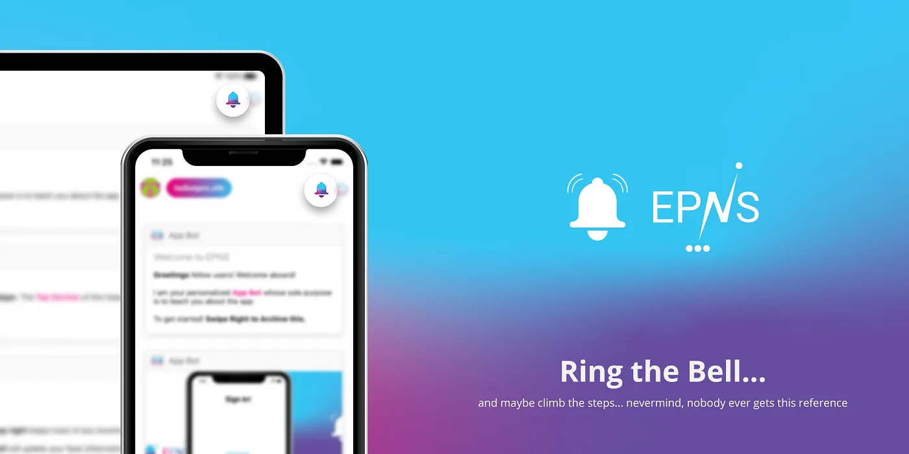
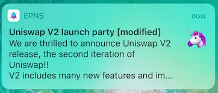
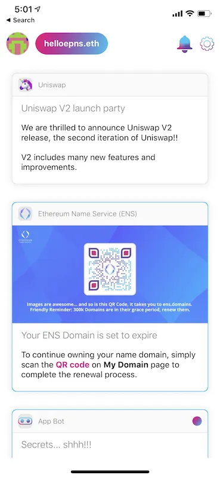
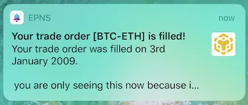

import { SubHeader, ImageText } from '@site/src/components/SharedStylingV2';

<!--truncate-->

We are back, sharing our [ETHGlobal](https://medium.com/u/3d1733b8e86a?source=post_page-----f5f5a1a2c477--------------------------------) Hack Money hackathon story. Can’t believe it’s already week -3!! It’s been an amazing learning experience so far. A big shout out to the [ETHGlobal Team](https://medium.com/u/8687f4bcbbed?source=post_page-----f5f5a1a2c477--------------------------------) for always being there to help and organizing the best AMAs and office hours sessions. Getting feedback and ideas from the devs at [Aavesome](https://medium.com/u/13bfa9f22920?source=post_page-----f5f5a1a2c477--------------------------------), Compound, etc has made this learning process about DeFi landscape and tech amazingly fun.

To begin with, we never wanted to deliver plain notifications to the users. We mean they are cool but there are so many things you can do when you make notifications behave like your twitter feed. This led us to think a lot about the payloads, analogies and the way we want to present notifications… and that’s how we came up with… drumbeats… notification feed and different formats of notifications.

### Groups and secrets…and secret groups?!
Let’s talk about the recipients of notifications first. Yes, there are two different target recipients: Groups and Secrets. Simply put, a channel owner or smart contract can send a broadcast to all recipients of their channel or can send encrypted messages (known as secret) to an individual person.

#### Group Messages

Group messages serve the purpose of communicating a piece of information to a subscribed channel. For example, Gitcoin can alert the developer community about the recently added 1000USD bounty task to its pool (that would be exciting!!).

But wait, there’s more… we went a step further…while group messages are a great way to send out notifications to a group of users, we thought the ability to send encrypted messages from channel owners to a specific user would really add so much value to push notifications in a variety of different ways.

#### Secret Messages

So how does the secret message work? Well, blockchain and specifically cryptocurrency has crypto in it for a reason, more on the specific details later as we think it needs an article on its own.

Though in brief terms, the way we achieve this is by encrypting few parts of the message payload with a secret that is further encrypted by the user’s public key.

For example, Aavesome can send its customer a message once the loan liquidation is complete.

### Message attributes
Let’s talk message attributes aka how rich we can present user’s with the information.

Messages are more useful (and more fun) when they are clickable, when you can interact with them and when they contain a number of great contexts. This was the approach we used to form different attributes for the message.

The idea is to give the channel owners enough flexibility so that they can play with permutations and combinations of message types and come up with intuitive messages for their users.

There are 4 message attributes.

1. Subject
2. Message text
3. Call To Action (CTA)
4. Image

### Use Cases
Messages get delivered to users as feeds on their [EPNS mobile app](https://medium.com/@epnsdapp/hello-world-buidling-a-working-epns-mobile-app-e9dcb8f5ed66), just like your Twitter feed, with flexible opt-in/opt-out capability to give users full control over the notifications they want to receive.

The cool thing about epns push notifications is that there are multiple ways of building messages to cater to different types of web3 users.

An epns general message is composed using a subject and message text together. Here we tried to make the message more interesting by introducing rich text format. Supporting text styles, bold, italics, colors, links, etc can be sent for enhanced user readability. This is a classic format of push notification to share key updates with the subscribed user group.

For example, it would be awesome to get notified when Uniswap V2 platform is launched this Q2 through a simple notification.

We took a stab at generating a few examples for the purpose of demonstrating how epns push notifications look in real life.

<ImageText>Looks like we are invited to the party!!</ImageText>

<ImageText>General Message Type</ImageText>

Taking it further, epns messages lets the user tap on a link embedded in the notification. This type of message includes a Call to Action(CTA) wrapped in a group message explained above. This CTA+group message type is meant for a group of users to guide them to a dedicated web page of an event, news, sign-up form, etc.

For example, the [ETHGlobal Team](https://medium.com/u/8687f4bcbbed?source=post_page-----f5f5a1a2c477--------------------------------) can send out a notification to all hackers for 2021 Virtual Hackathon registration, the user has to simply click on the link in the feed to find the registration form.

Now, these messages get more interesting when integrated with secret messages (meant for a single user). These targeted or smart CTAs can help enhance user experience as they securely deliver the right message to the right user.

For example, Binance DEX can send user notifications once their trade order is fulfilled.

But wait!! EPNS notifications can support images as well. A secret message with images can do so many cool things for a user.

For example, if a user's ENS domain name is in grace period and about to expire, the ENS team can send out encrypted QR image-based notification to its users. The user can then simply scan the QR image on their ENS domain page to complete the renewal and payment process.

<ImageText>
Encrypted Image Message
</ImageText>

We think there are multiple ways in which epns push notifications can add value to the decentralized finance ecosystem. The possibilities and use cases with epns notifications are endless and we are just getting started :)

<b>TLDR; try out the (almost complete) <a href='https://github.com/ethereum-push-notification-system/epns-mobile-app'>react native</a> app.</b>

Next up, the dApp and the smart contract…Please feel free to share your support and amazing feedback.

### About Push Protocol

Push is the communication protocol of web3. Push protocol enables cross-chain notifications and messaging for dapps, wallets, and services tied to wallet addresses in an open, gasless, and platform-agnostic fashion. The open communication layer allows any crypto wallet /frontend to tap into the network and get the communication across.

To keep up-to-date with Push Protocol: [Website](https://push.org/), [Twitter](https://twitter.com/pushprotocol), [Telegram](https://t.me/epnsproject), [Discord](https://discord.gg/pushprotocol), [YouTube](https://www.youtube.com/c/EthereumPushNotificationService), and [Linktree](https://linktr.ee/pushprotocol).
