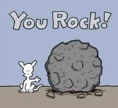
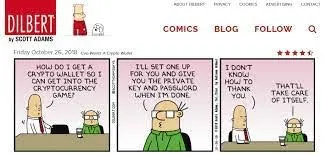

import { ImageText, VideoContainer } from '@site/src/css/SharedStyling';

<!--truncate-->

Be Excellent to Each Other!!!

Following an amazing [week 1](https://epns.substack.com/p/week-1-kernel-epns-update), filled with conversations about design, research and users. We thought Week 2 would give us a breather as we felt we conquered the world! but oh boy! @Gitcoin had so much for week 2, week 1 feels like a distant past.

Week 2 shifted us to getting to know hyper-sprinting better, we call it [Deepwork The Reawakening](https://deepwork.studio/) with Andrej. Everything was setup just right, Andrej setup the [Miro](https://medium.com/u/962c48776891?source=post_page-----2c84b9cdbd0--------------------------------) boards with every minute details for us, there were feedback walls, what to do with those walls, how to synthesize those feedback and essentially every step to follow. Vivek set the mood to awesome [ambient music](https://youtu.be/b5H3b_Hh0Lw) and the stage was set for 250 Kernel peeps to dive into.

That is until all of us went into Miro at once and broke it! Yes, if you have been following the story so far, you would know that one thing we truly are the masters of is [stress testing](https://en.wikipedia.org/wiki/Stress_testing) the heck out of any awesome tool which we come across. As with all the things we are getting taught in Kernel, one thing which all our mentors (and I would like to think) follow is the ability to get back on the feet whenever something doesn’t go as per plan (or more whenever you get every kernel fellow in a single room). A few minutes later, we had another process and everyone was collaborating, learning and having fun. Imagine, 250 peeps doing things all together and all at once, it’s a beautiful chaos that’s so beautiful to see!

Our only sorrow is we weren’t able to interact with [Austin Thomas Griffith](https://medium.com/u/610daeab315b?source=post_page-----2c84b9cdbd0--------------------------------), we absolutely love his wacky videos… shoutout to Austin if you are reading this! Teach us how to make those [awesome awesome videos](https://www.youtube.com/watch?v=30pa790tIIA&list=PLJz1HruEnenCXH7KW7wBCEBnBLOVkiqIi).

<VideoContainer>
<iframe width="100%" height="100%" style={{borderRadius: '32px'}}  src="https://www.youtube.com/embed/neZeaXAnkAg" title="The Burner Wallet Challenge" frameborder="0" allow="accelerometer; autoplay; clipboard-write; encrypted-media; gyroscope; picture-in-picture; web-share" allowfullscreen></iframe>
</VideoContainer>

Awesome Austin!!

As a startup, these experiences are gold for us and we are very fortunate to be in the company of such talented mentors, fellows who are helping us shape not just as a web3 project but also an amazing support system of friends and mentors.

Also, wanted to give a huuuuuuge shoutout to our **Kernel Batch — 2020 fellows** (it’s official that’s what we call ourselves now)**,** it’s amazing how everyone tries to help each other — learning materials, tools, project synergies or just meet at [airmeet](https://www.airmeet.com/) for a chat, you guys rock!!

EPNS Updates are here
=====================

*   First up, [EPNS White paper draft](https://whitepaper.epns.io/) is LIVE!! We have worked very hard on it and would love to hear feedback on it from all the amazing guys! We loved how you everyone helped us in shaping crucial parts of the product and want to continue the same thing moving forward :).
*   Feedback from previous week helped us massively in eliminating the biggest pain point! We are now in the process of translating that into code.
*   We now have a channel **#project-epns** on **Gitcoin Slack**, big thanks to Vivek for setting us up with this. Also, please feel free to join and hangout with us there! We love company.

Accomplishments
===============

*   Defi…shhhh from previous post is…. drumrolls…. is you guessed it, [DefiDad podcast about Ethereum Push Notification Service](https://twitter.com/DeFi_Dad/status/1287569217475076096?s=20)!!!
*   Spoke to some amazing projects and kernel fellows/mentors in the past week — [Umbra](https://twitter.com/UmbraCash), [Jo-Ann Rare birds](https://twitter.com/JAlexandrHamil), [Amy of BFLO](https://twitter.com/bflotech), Ganesh. Syncing up on ideas and project synergies definitely helps you see the bigger picture about the ecosystem.
*   EPNS team will be doing a [seminar](https://forms.gle/hsQmWATC5LPUhRdcA) for IIIT Kerala and Government of Kerala, India on Game Theory in DeFi.
*   Got a nice feature about our power-packed team from [BitcoinKE](https://bitcoinke.io/2020/07/the-epns-project/) team.
*   Participated for an AMA at DAO Hack Month [Fork The World — Day 4](https://twitter.com/epnsproject/status/1286352109311610880?s=20)!!
*   Lastly, super proud (and nervous!!) to be invited as speaker in [Edcon 2020](https://edcon.io/).

Ask
===

*   Expand our network
*   Learn how to market the product / growth hack
*   Improve product and come out of alpha stage
*   Improve the way we function and learn loads
*   Get some love on our [twitter](https://twitter.com/epnsproject) and [telegram](https://t.me/epnsproject) handle
*   Continue improving and pitch to right investors with the right deck (Amazing thanks to people helping us non-stop for this, they want to be incommunicado and so they shall remain)

Ending this week’s updates with a quote from Andy’s thoughtfulness of curated material:

> To make something good, just do it. To make something great, just re-do it, re-do it, re-do it. The secret to making fine things is in remaking them.
> 
> Kevin Kelly

And as once the wise man Ted said…

This is all for now. If you have been able to reach the end… then You are Awesome!!!! and thanks for taking the time to go through our updates.

Telegram (we brainstorm here): [https://t.me/epnsproject](https://t.me/epnsproject)

Twitter (we boast here): [https://twitter.com/epnsproject](https://twitter.com/epnsproject)
