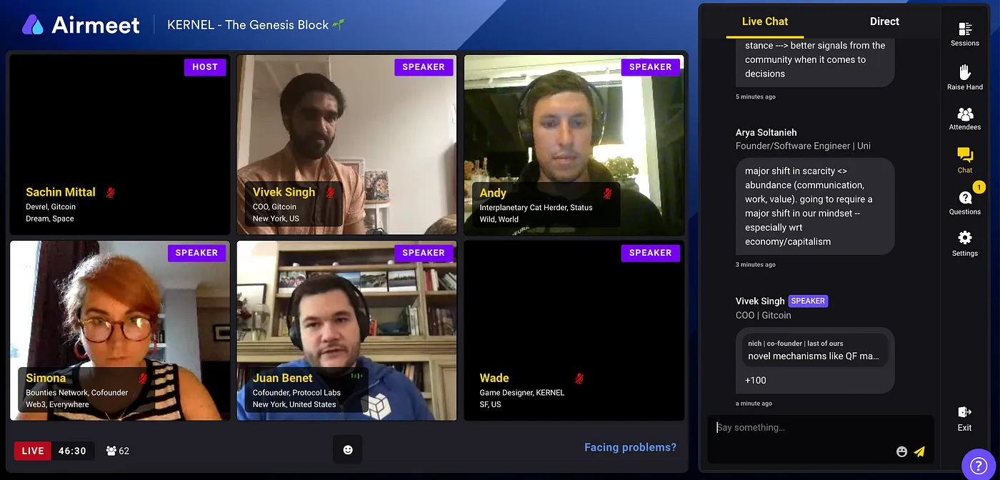

import { ImageText } from '@site/src/css/SharedStyling';

<!--truncate-->

Hello Awesome folks!! Time passes quickly when there is so much to learn and among friends! **@Gitcoin Kernel** Week -4 just kicked off and we are half way through our Kernel Journey ! Yayyy!!!

Our sincere gratitude to the many mentors and guest speakers who have taken time to share their experiences and learnings with Kernel fam, THANK YOU!!

# General Updates

- Our current development cycle focuses on building an alternate login flow on mobile app (using public wallet login).
- We are working on building few show runner channels on EPNS dApp like ENS domain expiry, ETH Gas price monitoring etc. We aim to complete at least 1 channel by end of this week and thereafter code review and start testing.
- We are also making important changes in our smart contract to ensure EPNS is highly scalable, and adaptable to upcoming technologies.
- Quick reminder and trying to squeeze this news back in here…..sssshhhhhh, EPNS Whitepaper v1.0 is now [**LIVE**](https://whitepaper.epns.io/). We are overwhelmed and humbled by the feedback and support from our beloved community and look forward to your continued feedback and support.
- New [website](https://epns.io/) updates ……coming soon!!!!
- To reduce efforts of tracking social media stats manually or through overly complicated tools, we created an **Automated Social Metric** Tracker at Kernel. Setting the given macros will take no more than 10 mins but after that you will have all the metrics automatically pulled and created for you.
- Big ShoutOut to Gitcoin’s Sachin & Angela for hosting Cultural Musing -Happy Hours over the weekend. Chilled out ice-breakers and fun games !!! Absolutely brilliant stuff!!

# Accomplishments

- Harsh Rajat was live on a panel discussion at [EDCON 2020](https://edcon.io/). The panel discussed “**DeFi 2.0 and Cross-Chain Composability**”. You can check out the [youtube](https://www.youtube.com/watch?v=fEFOoQxIMUU) video.
- Team EPNS delivered a webinar on Game Theory in DeFi at [Kerela Blockchain Academy](https://www.linkedin.com/feed/update/urn:li:activity:6694629114453741568/) to full house of blockchain enthusiasts and researchers from across India and globe.
- We showcased EPNS at our very first ETH Network community call over the weekend. Super thanks to DeFi Dude for his support!

# Asks

- We are looking forward to the upcoming Pitch day and interacting with the mentors for their feedback. We really want time box this one so we have enough time to get feedback on our pitch.
- Improve product and come out of alpha stage.
- Get some love on our [twitter](https://twitter.com/epnsproject) and [telegram](https://t.me/epnsproject) handle

Re — sharing our favorite quote from Jaun Benet’s fireside past week:

> The best way to predict the future is to invent it

**_And so we will…._**

This is all for now. If you have been able to reach the end… then You are Awesome!!!! and thanks for taking the time to go through our updates.

Follow our Story

- Telegram (we brainstorm here): [https://t.me/epnsproject](https://t.me/epnsproject)
- Twitter (we boast here): [https://twitter.com/epnsproject](https://twitter.com/epnsproject)
- Medium (Documenting our journey here): [https://medium.com/ethereum-push-notification-service](https://medium.com/ethereum-push-notification-service)

**Stay Awesome Folks!!**
