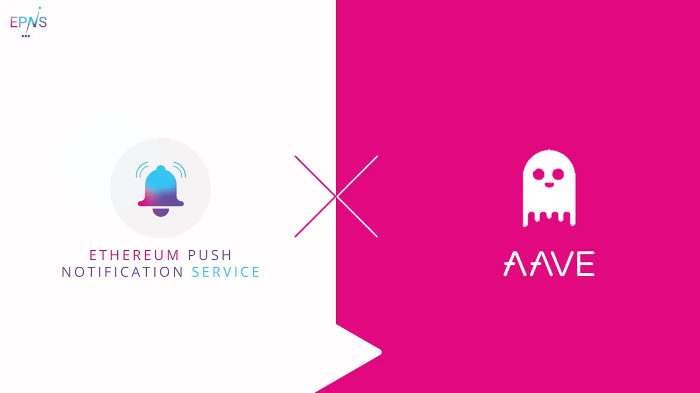

import { ImageText } from '@site/src/css/SharedStyling';

<!--truncate-->

AAVE grant, yayyy!!

We’re excited to announce that we’ve been awarded a grant by [Aavesome](https://medium.com/u/13bfa9f22920?source=post_page-----cc618dd48915--------------------------------). We’ll be using AAVE protocol to generate [EPNS](https://epns.io/) Channel stakes on Mainnet.

AAVE is a critical component of EPNS Game Theory, incentivizing users along with delivering notifications. When a Channel (services — dapps, SCs) stake on the EPNS protocol, the stake goes to a combined stake pool of Channels and starts earning interest using AAVE. This interest is then distributed to all the subscribers (wallet addresses)  of that service in a weighted manner preferring the earliest subscriber more than the later ones. Refer to the [EPNS Whitepaper](https://whitepaper.epns.io/).

The incentive part of the EPNS protocol was ideated and built at [ETHGlobal](https://medium.com/u/3d1733b8e86a?source=post_page-----cc618dd48915--------------------------------) HackMoney 2020. We are really grateful to the amazing AAVE team Stani Kulechov, Marc Billy Zeller, David Truong, Ernesto Boado for mentoring and guiding us during HackMoney.

Join us!
--------

Become part of our buzzing community! Join the conversation on one of our channels:

[Website](https://epns.io/) | [Twitter](https://twitter.com/epnsproject) | [Telegram](https://t.me/epnsproject) | [Github](https://github.com/push-protocol)