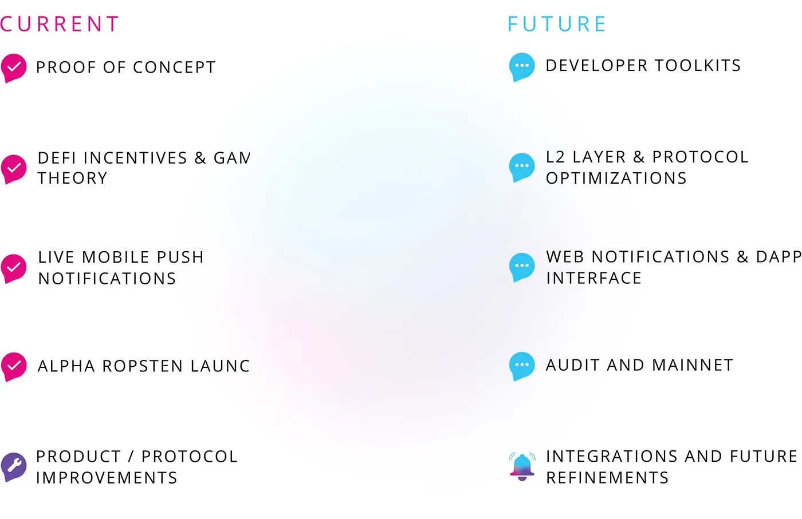

import { ImageText } from '@site/src/css/SharedStyling';

<!--truncate-->

AMA Transcript of EPNS Team with AMA Lovers Club!

Ethereum Push Notification Service (EPNS) Founder and Project Lead, Harsh Rajat, and Co-founder, Richa Joshi, joined AMA Lovers Club community on 12 November 2020 for an AMA session. We were thrilled to see such an overwhelming response from the community for EPNS and thoroughly enjoyed answering community member’s amazing questions.

**_Date_**_: Thursday, 12th November, 2020  
_**_Time_**_: 10:00 UTC_

_Find the AMA transcript below:_

# Part 1: Introduction

> _Q1 : Can you please introduce yourselves and your backgrounds. Also share details about the Team working on EPNS_

**Harsh:** Sure I guess I will go first. Hey Everyone! I am Harsh, Founder and Project Lead of Ethereum Push Notification Service. Some background about me, I love all things tech and have as a byproduct gathered 11+ years of experience in dabbling across various spectrums of tech and design in almost all popular fields (mobile, web services, saas and of course Blockchain).

**Richa:**Thanks for question! I am co-founder of Ethereum Push Notification Service (EPNS). I handle multiple jobs at EPNS though am focused on mostly Marketing and Product. Before EPNS, I worked with companies like Deloitte, Wipro etc. and have close to 12 years of techno-functional experience in various aspects of product management, design and various spectrums.

**Harsh:** Team: We have a globalized team of developers, marketeers and awesome peeps. The team has 5 leads (Project, Marketing, Strategy, Protocol / BizDev, Product / Engineering). Though, the entire team is flat and everyone wears multiple hats.

> _Q2 : Can you introduce the EPNS Project, do you have any competitor and what critical problems does it solve_

**Harsh:** Sure, EPNS is aimed at solving the missing piece of web3 which is ironically communications by service to users. Users are still expected in the blockchain world to keep track of their actions and services expect users to come to them. This might be fine when you dabble with 1 or 2 services but with the way blockchain has expanded, it really is a huge problem now. For example, your loans are liquidated with you finding about it, NFTs / Auctions come and go, critical governance actions are missed, and the list goes on.

EPNS fixes this by creating a decentralized notifications protocol that any service can use to send notifications to their users (wallet addresses). The protocol is platform agnostic which means the notifications can come to any platform (iOS, Android, Chrome or crypto wallets). Besides solving this communication gap, the DeFi aspect of the protocol enables incentivized notifications which means that not only you as user can receive notifications but you also earn from them as well.

We are the first one to address this problem so no competitors yet 🙂

> _Q3 : Can you briefly describe the Top milestones you have achieved and your target milestones with timelines, also share your roadmap_

**Richa:** We have had an awesome journey! We identified this huge pain point of lack of communication in Web3 in January, Ideation and loads of research took a couple of months after which we took the idea to **Ethereum Foundation**, from there we were lucky to be guided to **EthGlobal HackMoney,** after which we got selected and mentored by IDEO in their product validation day (PVD) and then got selected in **Gitcoin Kernel accelerator** / **incubator**, which is one of the most prestigious accelerator in our space. We are loving this roller coaster ride.

Current phase is protocol and product features refinement by showing the product to users & services and learning what things they feel good about and what things require to be changed.

Yes! The product is already in alpha and available for early access users. We are on ropsten already with majority features working. A few features related to spam throttling and governance are in the works.

Alpha dApp: [https://app.epns.io/](https://app.epns.io/)

Alpha mobile app: [https://play.google.com/store/apps/details?id=io.epns.epns](https://play.google.com/store/apps/details?id=io.epns.epns)

Milestones

Achievements

# **Part 2: Twitter Questions**

> _Q1: EPNS is building the worlds first decentralized finance notification protocol on Ethereum. What mechanism have you put in place to help ensure that you don’t just deliver plain notifications to your users? How exactly will you be adding value to the DEFI space with your solution?_

**Harsh:** That’s an awesome question. To ensure that notifications are meaningful and targeted, we have created content abstraction in the protocol itself, which simply means that there is a notification type assigned to each notification sent. This type defines: 1) Which decentralized storage the payload is stored at (IPFS for now), 2) How to interpret and display the payload (Whether it contains CTA, Images, Video or even encrypted txs and how to display them), 3) To whom the notification is intended to, ie: whether it’s a broadcast, meant for specific users or is encrypted by user public key (and thus can only be seen by the intended user). These three classification ensures that notifications are rich in nature and has use cases for any scenario, since these types are also extensible, we can keep on adding different specs as more people tell us what they need.

Another thing I forgot to mention is that the service sends whatever notifications they want to their user (as they are in the best position to decide that). Also, the user needs to opt in as a one time step to start receiving notifications (very similar to how you install an app on your phone and it asks for your permission to send you alerts and can only deliver them to you if you say yes)

**AMALoversClub Team:** It’s a detailed answer

**Harsh:**😅

> _Q2 : Regarding prevention of rug pull, how does the 2 day grace period from the time of minting until the tokens enter the AMM, help/warn liquidity providers of an exit scam?_

**Harsh**: Assuming this is talking about different projects doing AMM, the cool thing of epns is genuine communication between a project and their users which can even be watchdogs keeping an eye on projects and alerting their subscribers instantly on a shady project

**Richa:** You can also read more uses cases in this article [https://medium.com/ethereum-push-notification-service/13-defi-notifications-ethereum-needs-today-df4dcc98a797](https://medium.com/ethereum-push-notification-service/13-defi-notifications-ethereum-needs-today-df4dcc98a797)

> _Q3 : Can you explain briefly what the Alpha Production dApp is all about? How will the dAPP improve the EPNS project?_

Sure, the dApp provides a list of active channels (services) for user wallets to opt in and start receiving notifications.

Currently, we have ETH/BTC price alerts, GasPrice, ENS Domain Expiry, Bankless FR which are sending useful notifications already. User Wallet Tracker, Compound liquidation are coming soon :). The dApp provides users to see and opt in for notifications from all the services available on the protocol.

It will also provide dashboard for users to see their rewards, enable browser notifications and provide services with frontend to send manual notifications (AMA, bug report) as well in the future

# Part 3: Live TG Community Questions

> _Q1 : I understand that EPNS mainly focus on notifications, so I want to know if your notification could be integrated into platforms like telegram, Twitter, etc. Or on which platform could your notification function?_

Yes, we are platform agnostic though current focus is sending notifications directly to user wallets, TG and Twitter or other platforms will come in future

> _Q2 : PRIVACY is an issue when subscribed to services like EPNS, what is the standard of your security and privacy ?_

Setting the bar high, no centralized signup, your wallet acts as your username and no private info is taken ever!

> _Q3 : How can Decentralized Notifications can Revolutionize On-Chain Governance_

Great Q! One of the main issues in current on-chain governance voting model is low user turnout and voter apathy. EPNS can help provide a decentralized mode of communication between services and users and help bridge the gap when it comes to governance. Giving power back to people! We also wrote an article about it -: [https://medium.com/ethereum-push-notification-service/how-decentralised-notifications-can-revolutionize-on-chain-governance-part-i-ff09e7465279](https://medium.com/ethereum-push-notification-service/how-decentralised-notifications-can-revolutionize-on-chain-governance-part-i-ff09e7465279)

> _Q4 : EPNS notification protocol implements game theory, DeFi. And now EPNS has products such as:_
>
> _• Mobile App  
> • dApp  
> • EPNS Infra (Push Service)  
> • Showrunners  
> • JS Library_
>
> _Of all these products. I still haven’t found any products related to DeFi. In the future, does EPNS have plans to add products or services such as loans, borrowers and etc ..?_

The DeFi aspect is in the protocol. Notifications are incentivized as we require services to activate themselves by staking DAI which is lend out to AAVE to start generating interest, users who opt in to receive notifications from the service automatically get a share from the generated interest

😅 more info on this soon…

EPNS provides a middleware for all services to interact and send notifications to user wallets, it brings the experience of web 2 finally to web 3. And then we make it sweeter by making it platform agnostic and incentivized 😃

> _Q5 : How does EPNS work? For our users to understand better, can you explain the advantages and uniqueness of EPNS will bring?_

EPNS provides a middleware for all services to interact and send notifications to user wallets, it brings the experience of web 2 finally to web 3. And then we make it sweeter by making it platform agnostic and incentivized 😃

> _Q6 : What is the advantage solutions and feature that generates by ethereum Push notification partnership with AAVE!?_

I think the question is how are we using AAVE protocol. User incentives in EPNS are generated by a process of Staking (By Services) — Lending (Via Protocol) — Interest (To Users) using DeFi. Staking happens from the service (who wants to send notifications), they activate themselves on the protocol by depositing 50 DAI or higher. This deposit doesn’t come to us, but rather goes into the Lending pool. Lending happens via protocol — We integrate with AAVE protocol to lend the staked amount to the service which then starts generating interest.

We have also won a grant from AAVESOME AAVE team -: [https://twitter.com/epnsproject/status/1300356100173131781](https://twitter.com/epnsproject/status/1300356100173131781)

> _Q7 : 🔔Q1  
> There is a difference between receiving notifications that we consider important and receiving spam, so what is the method that ENPS applies to avoid spam?_
>
> _🔔Q2  
> What would be the characteristics of the public that ENPS is targeting? Or are they aimed at a general public?_

Answer for Q1) Awesome thinking, users opt in for notifications from a specific service before the service can send notifications, and they can opt out at any point… therefore spamming is counterproductive, this combined with our spam throttle algo ensures user centric protocol.

Answer for Q2) Communication is essential for everything though if we have to pick one segment first, it really is needed for all things DeFi

> _Q8 : How can we start earning on EPNS, what is needed to be done and how much we receive per notification sent to us, what are crypto assets we can get and what devices can be used for earning?  
> Can we apply for our advertisement so other people receive notifications and how?_

As a user, just opt in for notifications from service that interest you. Earnings are passively generated from the protocol and you as a user don’t have to do anything, it will accumulate for you automatically :)

> _Q9 : Does $EPNS not have a road map?_

We do and have shared above… though we are also working on a detailed timeline one and will be opening it soon to public

> _Q10 : Is there an idea and motivation when you find that the target EPNS is striving for is a potential job with the development of the defi blockchain?  
> EPNS recently announced that it will use AAVE to generate income for users. So what conditions do users need and how to make money from the platform here?_

The motivation and vision of EPNS is to become a Web3 standard for notifications. Web3 is growing at an exponential rate. With applications like DeFi (loan liqudation, change in interest ratio), DEX (trade order), domain name service (expiration period), NFT buying and selling, gaming and many more, a genuine medium of decentralized communication was missing. Hence, the genesis of Ethereum Push Notification.  
Second part of the Q, users simply needs to connect to EPNS app and opt in for notification of favorite channels from [https://app.epns.io/](https://app.epns.io/). For user incentives please refer the section of whitepaper [https://whitepaper.epns.io/protocol-specs-section/epns-protocol/subscribers/user-direct-action-subscribe#game-theory-and-user-incentives](https://whitepaper.epns.io/protocol-specs-section/epns-protocol/subscribers/user-direct-action-subscribe#game-theory-and-user-incentives)

> _Q11 : You stated on your white paper that “Users will be able to earn token incentives based on some of their direct or indirect actions within the EPNS protocol”.How much is the token incentives and for how long would they receive it?_

There are multiple ways for token incentives, one is the passive interest which I explained above, few others are through governance participation, usage mining (our form of liquidity mining) and some more. We will be sharing in-depth guide for each soon!

> _Q12 : How will EPNS solve the following problems :  
> 1\. Users not receiving notifications if loan is about getting liquidated  
> 2\. Users not getting progress status of trade orders placed on DEX  
> 3\. Users not getting simple notifications from projects._

Creating the notifications middleware solves this problem which is already live on ropsten and working for few services. Check out: [https://app.epns.io](https://app.epns.io/)

> _Q13 : The protocol the EPNS uses can incentivize users who receive notifications. Does that mean that we as users can receive incentives when using EPNS and how do you get these incentives?_

Thanks! Yes, there is a passive incentive for users who opt for notifications. Please refer whitepaper [https://whitepaper.epns.io/protocol-specs-section/epns-protocol/subscribers/user-direct-action-subscribe#game-theory-and-user-incentives](https://whitepaper.epns.io/protocol-specs-section/epns-protocol/subscribers/user-direct-action-subscribe#game-theory-and-user-incentives)

> _Q14 : How can the EPNS ensure storage, broadcast and sending notification? Is there a special groove used?_

Good Q! Please refer [https://whitepaper.epns.io/protocol-specs-section/specifications/notification-payload-specs#payload-types](https://whitepaper.epns.io/protocol-specs-section/specifications/notification-payload-specs#payload-types)

> _Q15 : What are the main products and services that EPNS is bringing to the market today? Why did you choose this as the main and central factor to develop EPNS?_

Our whitepaper (products segment) outlines this: [whitepaper.epns.io](http://whitepaper.epns.io/)

> _Q16 : When your team developed EPNS, did you take into consideration the feedback and needs of the community? How do you rate EPNS’s long-term market as positive? What difficulties do you face during this period?_

We did, IDEO PVD taught us that listening to users and services are a ongoing effort which we have continued doing bi-weekly to ensure that product features come from users and services and not from us. Some of the really neat and creative protocol features (if not all) are from those interviews :)

> _Q17 : What Type Of Notification Does $EPNS want To Push?_

We don’t define what notifications can or can’t be sent by a service, we figured that the service know what’s best to communicate with their users and hence they decide what they want to send

> _Q18 : At this point, do you think you need to communicate as a balance of growth? Or is it better to forget these things and focus on other activities? The marketing of EPNS is well known that every item in encryption needs to be adopted to achieve growth. So, what are the future plans for large-scale adoption of EPNS?_

Imo delivering a product that’s needed takes care of the growth as projects in Ethereum are run by really awesome folks that never hesitate to become better. We are however catalyzing this by driving awareness, creating instant value add product and interacting with awesome users like you :)

> _Q19 : What is the preferred way for you to receive this platform to dAPPs or other web3 services?_

Rn, notifications are supported on our Android app with ios and browse notifications coming soon. So preferred way currently are just our app though the end goal is to have notifications coming to crypto wallets and the user decides where they want to receive them

> _Q20 : Notifications are stored and treated like a JSON payload. Can you explain what a JSON payload is and how it works in EPNS?_

Sure, the notifications payloads segment in the whitepaper talks in great depth about this: [whitepaper.epns.io](http://whitepaper.epns.io/)

> _Q21 : Since your app with be having Access to customers wallet and private keys.. Then security on your app is a concern.. How good is your security and do you have any security threats_

We have a open repo from get go and normal users are encouraged to sign in with just public wallet address as most notifications are going to be non encrypted for now.

# Closing Remarks

Thanks for having us guys. Loved the questions and it was great fun! You can follow us on twitter for micro updates: [https://twitter.com/epnsproject](https://twitter.com/epnsproject) and we love to brainstorm on ideas on telegram so feel free to come join us there: [https://t.me/epnsproject.](https://t.me/epnsproject.) If you prefer the old school approach then you can reach us at founders@epns.io

This was awesome! and you guys Rock!!!

Follow EPNS on their platforms:  
Website: [https://epns.io/](https://epns.substack.com/)  
Telegram: [https://t.me/epnsproject](https://t.me/epnsproject)  
Twitter: [https://twitter.com/epnsproject](https://twitter.com/epnsproject)  
Telegram Announcement: [https://t.me/epnsproject news](https://t.me/epnsprojectnews).

Become part of our buzzing community! Join the conversation on one of our channels:  
[Twitter](https://twitter.com/epnsproject) | [Telegram](https://t.me/epnsproject)
