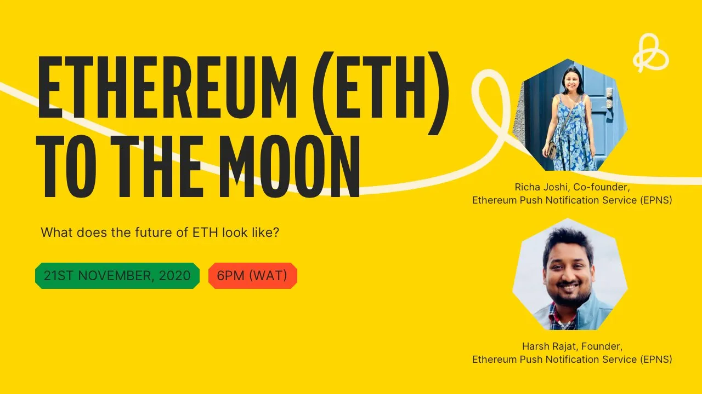

import { ImageText } from '@site/src/css/SharedStyling';

<!--truncate-->

Read the AMA transcript on the potential of Ethereum and its likely future.

Ethereum Push Notification Service (EPNS) Founder and Project Lead, Harsh Rajat, and Co-founder, Richa Joshi, joined [Bundle Africa](https://medium.com/u/d81ac2228c64?source=post_page-----2b209c426f80--------------------------------) community on 21st November 2020 for a lively discussion on “**The potential of Ethereum and its likely future**” AMA session. We were thrilled to see such an amazing response from the community and thoroughly enjoyed answering some amazing questions.

Find the AMA transcript below:

# Segment 1: Introduction

Joshua ⚡| Bundle Team: Hello Everyone! Good Evening! It’s my pleasure to welcome you to another exciting AMA. This time with the Harsh Rajat and Richa Joshi.

Harsh Rajat, is Founder and Project Lead of Ethereum Push Notification Service. Some background about me, he has over 11 years entrepreneurial experience in various spectrum of tech; including architecting, development and design in different tech fields (Mobile, Web Services, SaaS, Blockchain).

Richa is a co-founder of Ethereum Push Notification Service (EPNS). She worked with companies like Deloitte and. and has close to 12 years of techno-functional experience in various aspects of product management, design and various spectrum.

Having known a little about them.Today AMA will be in 3 Segments.

In segment 1, Richa and harsh will be teaching what the future of Ethereum looks like and its Potential 🚀

In segment 2, the chat will be opened for 5 mins so you can ask Richa and Harsh questions. They’ll will pick 5 of the most insightful questions to answer, If your answer is picked you’ll win NGN1,000.

And in segment 3, we will share a link to a form where you can drop your Bundle username, the first 5 Bundle users to drop their usernames will win NGN1,000 each.

At this point, I will give room to Richa and harsh to introduce there selves, then we can proceed to the order of the day.

Harsh: Thanks Awesome @Joshuaez for the intro and for hosting us! Feels amazing to be with the Bundle Crypto Community.

Joshua ⚡| Bundle Team: We’re happy to have you here

Richa: Thanks Joshuaez for the intro. Hello Awesome Bundle Africa community, great to be here 🙌😊

Joshua ⚡| Bundle Team: You’re welcome 🙌

Harsh: We are founders of Ethereum Push Notification Service (EPNS for short). Think a little intro about EPNS and our team is in order before diving deep into all things Ethereum :).

**Our Team**

Huge Shoutout to Our Awesome Team!! We are a global team located across continents including Asia, Africa, North America, Central America 🙂 Our team brings varied experience and skills across domains and has helped shape the project with a single goal of building a unique product which did not exist.

**About EPNS**

EPNS is solving the problem of communication, or the lack thereof in Web 3.0. We are creating a decentralized notification protocol that any dApps or smart contracts or any services can use to notify their users (wallet addresses).

But that’s not just it, you as a user are always in control, and are able to passively earn from it as well! And that’s where our DeFi aspects kicks in. Apart from that, we made the deal sweeter by ensuring that users are able to receive these notifications anywhere they want aka EPNS is platform agnostic :).

And now let’s get started… We have planned the following list of questions for all you awesome folks though feel free to ask us anything which you think we might have missed and we would love to dive deeper:

**\- What is Ethereum?**

**\- What is Blockchain?**

**\- What is Ethereum… again?**

**\- When was Ethereum created and who created it?**

**\- What does the future look like?**

Richa: **What is Ethereum?**

To understand Ethereum, we need to understand what is blockchain though I am sure many of you would already know 😉 but here goes nothing.

**What is Blockchain?**

I am glad you asked… haha. Blockchain simply put is a way to ensure that any historical data when put in it becomes non tamperable, this is exciting for many reasons but as you might have guessed already. The most fascinating use case of it is that for the very first time in history. We finally have a way to create a form of money that is non-tamperable (not dependent on the whims of a government), unique and truly limited (ie: gold can be found, money can be minted but 1 BTC is always 0.00000004% of total Bitcoin. Same for Ethereum which brings us to addressing the next question.

Harsh: Thanks Richa… seems like you just wrote it and didn’t prepare it in advance at all… haha

Harsh: Alright! so let me handle the next one

**What is Ethereum… again?**

Ethereum is the second most popular blockchain after Bitcoin as per the market cap. Though unlike Bitcoin which is usually touted as the next innovation in the concept of Money, ETH use cases are aligned more towards creating decentralized applications that can do much more than just transfer money. This is usually done by creating smart contracts which is code executed on blockchain through EVM (Ethereum Virtual Machine).

These decentralized applications, often called dApps open up a whole new range of utility for blockchain space. Most of you must be aware of DeFi which is majorly built in the Ethereum ecosystem, simply defined, it’s finance on blockchain including lending, borrowing and some other cool use cases.

For example, we now have tokens on Ethereum that have interest built into them which means that they keep on increasing passively (aDAI for example) without you as a user doing anything. This is a big feat, because it paves the way for banking to be on blockchain with interest rates that are global instead of country to county. In the US, the yield or interest rate is often so low on your savings account that it doesn’t make sense but DeFi fixes by offering 5% or more APR (Annual Percentage Rate).

This is not the only utility that can be tapped in, self sovereign identity is another use case. Having control over your data and moving it with you is again a huge advantage. NFTs and Auctions are again something smart contracts open up and so much more. The field is really early but it offers vast improvements over the traditional services.

For example, we at EPNS utilize the DeFi smart contracts to ensure that not only users (wallet addresses) are able to receive notifications but they are able to earn from them as well :).

**When was Ethereum created and who created it?**

Ethereum was released on 30 July 2015 though was proposed in late 2013. While Vitalik was always been associated with Ethereum, It also had a lot more co-founders. Some of the prominent ones are Joseph Lubin (Founder of Consensys) and Gavin Wood (Creator of Polkadot).

Richa: Great @harshr, let me handle the next one!

Harsh: 🙌

Richa : **What does the future looks like ?**:

The future of ETH is only bound by the imaginations of the developers building on top of it. You can practically build anything on top of it and most of the time it will always be better than what we have in terms of current technology services which relies on the server/client technology model, where in we as client are always dependent on the whims of the server to provide us with access and trust what we see.

The future of groundbreaking tech though really depends on scalability and speed. Both of which is what we see ETH 2.0 and several Layer 2 services on ETH trying to tackle. This race has actually always been chasing the Blockchain Trilemma, where it has been dictated that you can only choose to have two out of three things in your blockchain: Security, Scalability and Decentralization.

The one to achieve this blockchain trilemma is going to be the one that changes the entire web 3.0 landscape and Ethereum is well poised to do so. Another shameless plug, so apart from the blockchain trilemma, we also feel that communication as in services coming to users instead of other way round (like how it is currently in blockchain) is another thing which will help a blockchain win, that’s us btw ;).

Future of Ethereum looks awesome. One thing that Ethereum has gotten going for itself is the awesome community they have been able to gather and what we have seen so far is that community is resilient to the platform they come to, so it’s not easy to make them switch, that’s why many blockchains even when they are a bit better than ETH sometime in terms of speed is still not able to provide quality and useful smart contracts (or dApps) that Ethereum ecosystem is able to provide..

Harsh: Thanks Richa for tackling the question, @Joshuaez Think we are done with this segment and can move to next 🙂

Joshua ⚡| Bundle Team: Great, thank you for the awesome Session.

Surely you guys explain all we needed to know about Ethereum.

Harsh:🙏

Richa: 🙏🙏

# Segment 2: Community Questions

Joshua ⚡| Bundle Team: So, this brings us to segment 2, we’ll open the group so our members can ask questions, then you’ll will select and answer the 5 most insightful questions.

Richa: sure, sounds good

Joshua ⚡| Bundle Team: The group will be open in..

5️⃣

4️⃣

3️⃣

2️⃣

1️⃣

Q: Will ethereum surpass Bitcoin in value?

Q: Could you explain more about EPNS?

Q: You explained in the write up that Ethereum aimed at decentralized applications. My question is, is there any relationship between Ethereum and Ethereum classic? And is Ethereum classic a sub under Ethereum?

Q: 🔶How will the Ethereum 2.0 protocol affect the price of ETH, it’s efficiency and scalability over the coming months and years?

Q: Ethereum push notifications, are they only peculiar to dapps and smart contract address or to the whole Ethereum address?

Q: Can you please explain the basic different between Ethereum and Ethereum Push Notification

Q: You made mention of tokens that generates interest without doing anything, are these interest dependent on the price of such token?

Q: Who are the remaining founder apart from the one listed

Q: How does gas fee affect eth workability

Q: Privacy is one of the strength and flaws of the Blockchain technology today, what’s the level of privacy on messages sent over EPNS?

Q: Has EPNS been launched and what’s the your teams roadmap for its deployment

Q: What is the effect of the DApp in Ethereum price

Q: How does ethereum smart contract works?

Q: There are over 10,000 cryptos, and some are built on Ethereum blockchain as we know.

So what’s the probability that this very project is unique in its utility and would drag attention and mass adoption amongst other Ethereum Defi’s ? Kindly state why, how and the strategies you would deploy in the crypto market !

Q: What is the Ethereum network?

Q: What is the level of privacy on messages sent over EPNS.

Q: What are the real-world use-cases of Ethereum?

Q: I still don’t understand how we can earn passively in EPNS, and is it risk-free?

Q: Over the years, Ethereum has always had the highest transfer charges…at a time, it was close to $20…does ESPN bring a solution.to.this?

If yes, How?

**Responses to top 5 Questions by EPNS team**

**Q1. There are over 10,000 cryptos, and some are built on Ethereum blockchain as we know.**

**So what’s the probability that this very project is unique in its utility and would drag attention and mass adoption amongst other Ethereum Defi’s ? Kindly state why, how and the strategies you would deploy in the crypto market !**

Awesome question!

You are right. There are 1000s of projects and tokens in the cryptosphere.

What makes us more attractive and unique is that we are in our core an Infrastructure project. We are helping set a solid foundation so the entire Ethereum Ecosystem can grow.

We are a project in service of other projects!

We found a very interesting mix on how to create a win-win situation for all participants.

Business will increase customer attraction and retention, and clients will earn from all this.

Win-Win!

**Q2. What is the level of privacy on messages sent over EPNS.**

We had an eye on the privacy of the messages from the very start :). There are three levels of privacy on EPNS currently and it all depends on what the service wants to communicate to their users (subscribers).

a) Broadcast — This type of message is plain and is more like how a person communicates over twitter to their followers, useful in getting critical information or alerts out like a security audit, bug, governance voting or even an awesome AMA.

b) Targeted — This type of message is still plain but meant for a specific user, kind of like when your loan is about to be liquidated or your ENS domain is expiring or your wallet has seen movement of funds (incoming / outgoing). These are information that are out in public domain and hence doesn’t need encryption

c) Encrypted — These are as the name suggests encrypted and only the user will be able to see them. We do it via public / private key encryption which means the message is encrypted using your public key so your private key can only open it and thus you as the user is only able to see it, this is very similar to how Bitcoin or Ethereum encryption operates and hence is very secure

While these are the three privacy level we support currently, the beauty of our protocol is that it’s infinitely extensible which means other more complex privacy level can be added in the future and they will be automagically available for the services / users to use.

**Q3. I still don’t understand how we can earn passively in EPNS, and is it risk-free?**

Sure! Happy to answer and of course it’s totally risk free, in fact you as a user never have to deposit anything on our protocol, you just earn token incentives magically :).

While designing the EPNS decentralized notification protocol we wanted to design a WIN-WIN scenario for both the Users (receivers of the notifications) as well as Services (senders of the notification).

Our protocol requires a service to activate themselves before they can send notifications, this is a one time step and the activation requires deposit a one-time stake fee.

This stake fee is then automatically lend out to AAVE protocol and starts generating interest. This generated interest is then distributed to the subscribers of the channel (service) in a weighted fashion thus making the notifications incentivized for the users :).

You can also deep dive about it in our whitepaper.

**Q4. How does gas fee affect eth workability**

Another great question. ETH works on the concept of gas, which means that any operation you do is charged as units of gas, the gas fee is essentially the current ongoing rate of gas in Ether (ETH).

Since ETH is more like a decentralized computer for all the smart contracts running over it, this also means that apart from the transfer of ETH from one party to another, it is also used for countless other operations (like calculations you do in your code) for different things in a smart contract.

These things can be computationally expensive at times or might be meager which means they have different gas requirements, and since gas price is measured in ether, the gas fee is always done as gas_required_for_an_operation X current_gas_price

This means that if the current_gas_price (measured in ETH) goes up than the transaction becomes more expensive to perform. As with the rule of demand and supply, if the gas fee is higher, the network becomes expensive to use and thereby will have less people using it.

This is the reason why gas fee affect eth workablitily

**Q5. You explained in the write up that Ethereum aimed at decentralized applications. My question is, is there any relationship between Ethereum and Ethereum classic? And is Ethereum classic a sub under Ethereum?**

It’s a really nice question. Ethereum classic is a fork of Ethereum and in some way the original chain. Not many are aware now, but when Ethereum was launched, shortly after that, a hacker was able to drain majority of Ethereum funds out through a DAO hack.

This led Vitalik and co to fork the main chain to invalidate these transactions and led to the age old question that if code is a law then should it be forked? Nevertheless, some people believe and still do that code is law and they stuck to the original chain which became Ethereum Classic and the new chain became known as Ethereum.

Joshua ⚡| Bundle Team: Wow, this are excellent answers, thank you Richa and Harsh, you guys are awesome.

Harsh: Thanks again for hosting us @Joshuaez! We had amazing fun and you guys rock!

Joshua ⚡| Bundle Team: Great!

Richa : Thanks 🙏 we had loads of fun and brilliant questions

Joshua ⚡| Bundle Team: Thank you Richa.

Become part of our buzzing community! Join the conversation on one of our channels: [Telegram](https://t.me/epnsproject) | [Twitter](https://twitter.com/epnsproject)
