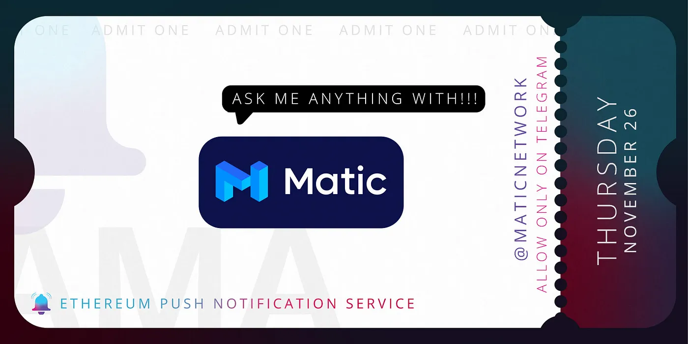

import { ImageText } from '@site/src/css/SharedStyling';

<!--truncate-->

Why Layer-2 solution is required to bring Web2.0 experience to Web3.0!
======================================================================

[Ethereum Push Notification Service](https://epns.io/) (EPNS) Founder and Project Lead, [Harsh Rajat](https://twitter.com/harshrajat), and Co-founder, [Richa Joshi](https://twitter.com/Riijo), joined [Matic Network](https://matic.network/) community on 26th November 2020 for a live AMA session on their telegram group. We enjoyed answering some awesome questions about EPNS, Matic layer -2 partnership and discuss why layer-2 solution is required to bring Web2.0 experience to Web3.0!

**_Date_**_: Thursday, 26th November, 2020  
_**_Time_**_: 3PM UTC_

_Find the full AMA transcript below:_

Part 1: Introduction
====================

> Q1. Hello Richa and Harsh, welcome to the Matic community 🙂. Could you please tell us a little about yourself and EPNS?

**Answer. Harsh:** Thanks Arun and Awesome Matic team for hosting us. Awesome to be here.

**Harsh:** I am Harsh, Founder and Project Lead of Ethereum Push Notification Service, we are building the world’s first notification protocol. Some background about me, I have over 11 years entrepreneurial experience in various spectrum of tech; including architecting, development and design in different tech fields (Mobile, Web Services, SaaS, Blockchain).

**Richa:** Thanks for the invite Arun and Hi All! Awesome to be here. I am co-founder of Ethereum Push Notification Service (EPNS). I wear multiple hats at EPNS though am focused on mostly Marketing and Product. Before EPNS, I worked with companies like Deloitte, Wipro etc. and have close to 12 years of techno-functional experience in various aspects of product management, design and development across multiple facets of the product lifecyle.

**About Ethereum Push Notification Service (EPNS)**

Ethereum Push Notification Service (EPNS) is a decentralized notification protocol that enables any dApp / smart contract / any service to send notifications to users (wallet addresses).

But that’s not just it, you as a user are always in control, and are able to passively earn from receiving notifications due to the DeFi aspect of the protocol! Other than that, services can send notifications to users(wallet addresses) in a platform agnostic way (mobile, tablet, web, fav. wallets, etc) making us Platform Agnostic 🙂

EPNS is bringing Web2.0 notification experience to Web3.0 powered by Matic Network for optimization and scalability 💪

> Q2. Sounds really cool! There is a strong focus on rewarding users for using EPNS. EPNS users who are subscribed to channels earn rewards, does this apply to all EPNS users or are there categories of users who earn from EPNS? And where does this reward come from?

**Answer. Richa:** Designing the protocol we wanted to have a WIN-WIN 🙌 (game theory) for all players involved in the ecosystem. When a user subscribes to a channel, they automatically become eligible for incentives from the channel. Moreover, the rewards are distributed to the users in a weighted manner, example, if Bob subscribes to a channel on Day-1 and Alice subscribes to the channel on Day-20, Bob would be eligible to receive a higher portion of the interest incentives compared to Alice. This also helps reward early adopters (supporters) of the service.

_Where does this reward come from?_

EPNS protocol requires a service to activate themselves before they can send notifications, this is a one time step and the activation requires deposit a one-time stake fee.

This stake fee is then automatically lend out to AAVE protocol and starts generating interest. This generated interest is then distributed to the subscribers of the channel (service) in a weighted fashion thus making the notifications incentivized for the users 😊

Blockchain has been long touted as power to the people and many don’t realize that it is now more possible than ever. While 2017 was about dreaming of having services that pay consumers like video streaming, content writing, etc. 2020 is all about making that possible and we are proud to have made incentivized notifications a possibility and hence contributed a little bit towards web 3.0 😊

> Q3.That’s a great, sustainable model. What are the major milestones EPNS has achieved so far and what are in the future pipeline? How soon can the community expect to use EPNS live on Matic?

**Answer. Harsh:** Sure, here comes a long answer 🙂

_What are the major milestones EPNS has achieved so far and what are in the future pipeline?_

We have been moving quite fast and all credit for this goes to our awesome team which is located across the globe and ensures that the EPNS is moving ahead every minute of the entire day.

Some of the major milestones achieved are:

\- Proof of Concept

\- Enabling incentives for users on protocol

\- Real time push notifications coming from Ropsten on Android (with iOS launching real soon!)

\- Alpha dApp that to enable browser notifications and dashboard for services

\- Plenty of channels including BTC / ETH Price Tracker, ETH Gas Price, ENS Domain, Wallet Movement Tracker, Compound with a lot more in the works

\- And 80% of Protocol features mentioned in the [whitepaper](https://whitepaper.epns.io/)

Future pipeline is looking awesome and we have plans for getting a full fledged protocol with governance, browser notifications, audit, mainnet and Matic launch along with a ton of channels coming out soon.

_How soon can the community expect to use EPNS live on Matic?_

Having EPNS on Matic is a priority as Matic is truly an awesome L2 providing all the speed and scalability which we want notifications to have. We have been working on Matic integration in parallel as we see awesome benefits to launch a hybrid protocol, and see the integration to enter into the test phase in less than two months.

We have always envisioned our protocol to fill the communication void between services and users and be scalable and fast. The scalability and fast feature is something which Matic provides to us besides giving us the pleasure to interact with the awesome Matic community (aka you guys!)

**_Other Milestones_**

Milestones are also measured in learning experiences and we are shameless to plug those details in as well :)… Though seriously, we have had an exciting roller coaster ride in which we have had the opportunity to be part of amazing learning experiences including:

\- Gitcoin Grants Round Top Project with **220 contributors** and match of **$16k**

\- Selected as **finalist** in **Gitcoin Kernel** as one of the **top 20 teams**

\- Won **grants** from **Matic Network** and **AAVE**

\- Selected and mentored by **IDEO CoLab Ventures**. Picked as **30 top teams** from 120+ teams for the program.

\- Featured in **Ethereum Foundation, Cointelegraph, YourStory, EthHub** and ton more awesome people

\- Speakers at **EthBerlin**, **EDCON**, **Ethereum Enterprise Alliance (EEA)** (upcoming)

> Q4.Hearing all of this awesome progress, I think there are many in the community who would love to be part of the EPNS Community and Network, how can people get involved? What are the main products and services that EPNS is providing?

**Answer. Harsh:** Thanks for the kind words 🙂

_I think there are many in the community who would love to be part of the EPNS Community and Network, how can people get involved?_

That’s super awesome, some if not all great ideas belong to our community and building a world’s first something always requires a community that guides and tells us what works and what should be tweaked. TLDR: we love you guys!

We love to get feedback from the community and provide them with the value add they need. For example, even in the alpha version, any web3 user can download our Android / iOS App and head to our dApp and setup notifications like Wallet Movement Tracker, BTC / ETH Price, ETH Gas, ENS Domain expiry to instantly see what we are solving and how it helps them. The incentive part though will come later though we have a sweet sweet surprise for our early adopters and ones that ask hard questions or tell us a feature. This is the first time we have spoken about these rewards and we love to share it with the Matic community first but yes, early adopters have some sweet sweet rewards coming to them real soon :).

_What are the main products and services that EPNS is providing?_

EPNS is an ecosystem which is flexible and will continue to grow, currently, we are focusing on providing:

\- Protocol that enables incentivized, opt-in and decentralized notification interfacing for any smart contract, dApp or traditional service.

\- Mobile Apps that enable instant value add by enabling decentralized notifications that are working even when we are on Ropsten network (test network of Ethereum)

\- dApp that enables another platform agnostic delivery and provides services that send notifications and for users to subscribe to

\- SDKs that will enable instant integration for services and other wallet providers to enable Protocol

\- And other node softwares that work in conjunction with each other to enable smooth functioning of these products

> Q5.Can you tell us, What are the advantages of using EPNS compared to other notifications Dapps?

**Answer.Richa**: Sure! There is no decentralized notification protocol which gives us a first mover advantage to start with :). Usually, people went to solve the blockchain trilemma which is scalability, security and decentralization but didn’t realize that there is an additional pillar and that is communication. We were the first one to identify this and the experience can be simply explained with the following comparison:

**Web 2.0 Experience**: Whenever a service has something which is important to you, they reach out to you by notification and you don’t have to keep track of what actions you have done on these services. For example, this TG chat would be a notification for some of you, your whatsapp chats, payments, important news break and even facetime calls are notifications and are then transformed into actions. In essence, services have learned to reach out to users and it increases communication, retention and engagement.

**Web 3.0 Experience**: Blockchain lacks this, users are expected to come to services and while it’s an ok experience if you have 1 or 2 dApps or smart contracts which you are interacting with. This quickly deteriorates with multiple services expecting you to keep track of the activities. For example: Loans on DeFi get expired and users don’t get to know. NFTs and Auctions occur and users are unable to learn about them. Governance proposals and DAO fails because users are unable to see and vote on them in time. Security bugs are found but users know about them when it’s too late. The list is practically endless.

This is where notifications protocol comes in and fills the gap. We created a middleware communication layer that any service can use to send notifications to user wallets without any centralized point of failure. This ensures that any dApp or smart contract can just integrate our protocol and is instantly communication ready. There are no projects that exist which are able to do that.

> Q6.Matic is Layer 2 scaling solution and EPNS is a DeFi protocol for sending notifications, how will Matic and EPNS work together on their partnership?

**Answer.Harsh:** Another great Question! We are a notification protocol at first, though we also are a DeFi protocol as well as the **staking (By Services) — lending (Via Protocol) — interest (To Users)** model enables users earnings along with receiving notifications… woohoo!!

Being a notification protocol, we are essentially a missing piece of Web3 infra which any project will have to integrate to make their experience better. While the communication part is taken care of us, the speed and scalability will come from Matic L2 layer and that’s why this partnership is so close to our heart.

ps: The Matic team and the way they help us in any and all technical and non-technical aspects is a huge plus as well :). Huge Shoutout to Sandeep, Arjun, JD, Anurag, Sumit, Arun and Ayush for being so awesome to us.

> Q7. We know now that EPNS is focusing on sending notifications, a question that naturally arises is how does EPNS mitigate sending spam notifications?

**Answer. Harsh:** We actually thought a ton about it and there are couple of ways by which we mitigate the issue (everything happens on protocol :)):

1) **Users in Control**: Users have to opt in to receive notifications from a service first before they can start communicating. This ensures that users are always in control, if they unsubscribe, there is no way for a service to add to them.

2) **Spam Health Score**: To ensure that a service doesn’t turn malicious later on, we attach a spam score to them as well which is adjusted by both positive (higher number of subscribers, passage of time, etc) and negative (unusual number of notifications, higher number of unsubscribes, etc) actions. This score when it crosses a certain threshold activates the protocol throttle mechanism which is a way to penalize services a bit at first and if they don’t stop then making the throttling go high thereby ensuring that it’s always in the best interest of services to not spam their users.

> Q8. How can someone set up his EPNS account and are there any requirements before anyone can start using EPNS?

**Answer. Richa:** Sure! beauty of decentralization is in pseudo anonymity of user wallets and posing no requirements 🙂. We follow this, all a user (user wallet) has to do is opt in for notifications from services they want on our dApp and that’s it. No centralized signup, no centralized server, just some awesome decentralized notifications that delivers important notifications to you and also rewards you for receiving them 😊

> Q9. Can anyone answer if early adoption results in greater rewards, won’t it affect or de-incentivise late comers?? And some rough estimate as a user how much the rewards would be. If I am using INR 5–10 worth of tokens in a month and increasing the notifications on my device, why would I be interested, what are other earning mechanisms for end user? \*\*community question

**Answer. Richa:** Sure, so early adopters get higher reward to drive users but after a while, the utility of the channel should ensure that people are not just getting driven cause of rewards, and late comers still passively earn, just their rewards begin from the day they join.

Sure, this really depends on the channel you join, some channels might put up higher rewards (based on their own game theory and incentives). As a user, you never spend any tokens, just opt in for receiving notifications from services you find useful and they communicate important events such as wallet movements, ENS domain expiry, loan liquidation, etc. We just sweeten this deal more by ensuring you are earning passively from them as well.

> Q10. Just one more quick question, can mainstream services like e-mail, apps like inshorts, twitter etc be linked to this. Will this require partnership from these or it will just aggregate them on one interface and I can personalize what I want to see(Without any partnership requirements)? I am sure I’ll get this answer on paper but was just curious about this one\*\*community question

**Answer. Richa:** Yes, though it can happen both ways :). Either a third party developer (or us) creates a channel that combines them and you as a user select just like you said or we partner with them.

Closing Remarks
===============

Thanks Arun and the Matic community for hosting and supporting us. It was delightful and we loved the questions 🙂 You guys are awesome!!

You can stay update to date and learn about EPNS through the following channels, please join us at.

**EPNS Telegram** [https://t.me/epnsproject](https://t.me/epnsproject)

**EPNS Twitter** [https://twitter.com/epnsproject](https://twitter.com/epnsproject)
