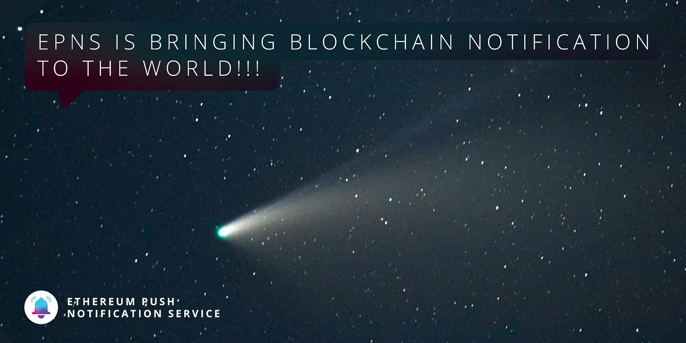

import { ImageText } from '@site/src/css/SharedStyling';

<!--truncate-->

In 2003, Blackberry announced a feature available to users of its phones, email notifications. The product release was met with small applause but signaled the first example of an innovation that would fundamentally transform Web2 and the Internet: **push notifications**.

For 6 years, nothing notable happened in the narrowly-defined world of push notifications. Then, in June 2009, Apple released iOS 3.0, which introduced [APNS](https://en.wikipedia.org/wiki/Apple_Push_Notification_service) (Apple Push Notifications Service), a protocol that would grow to revolutionize digital communication. APNS was introduced at a time when the Internet was still young; a time when Gmail was just launched, when Orkut and Myspace were a thing (time flies, huh?).

Apple took the notification idea Blackberry introduced in 2003 and evolved it into a product that would become a mainstream product expectation among consumers and would change Web2 to become the thing we know it to be today.

Apple did what they do best — found a way to incentivize continuous consumer use of its products. Before APNS was introduced, an application was effectively closed and out of sight if it was not being actively used. APNS enabled publishers and services to entice users to re-launch their apps by sending them short, optimized messages. With that opportunity available to apps, we saw entire ecosystems, business models, job titles, and revenue streams spring into existence.

# Push Notifications

Push notifications are now so engraved into our daily mobile experience that it’s difficult to exactly remember our digital experience a decade ago when the feature was nearly non-existent. We rely on them so much that we don’t necessarily recognize their intrinsic value. At best, we take notifications for granted. At worst, we consider them a nuisance. Rarely do we remember how fundamentally they have changed our digital behavior and relationship with businesses.

> _The main advantage of push notifications over in-app messages is the ability to draw the user back into the app after they’ve exited, unlike in-app notifications that require a user to be actively using an app to see them._

Push notifications allowed businesses to step up their marketing game, increased CTR, and even led to an increase in customer retention. Push notifications have evolved so much in the marketing space and in our technological culture in the past 10 years that now, if you do not send notifications to your clients, then you’ve essentially lost a large amount of potential returning customers. What we have seen is the fundamental reorganization and enrichment of consumer and application behavior and relationship in the face of push notifications.

Next up was to replicate the impact of push notifications on Web2 onto Web3 while improving the impact by adhering to the principles of decentralization, user ownership, and incentivization.

# The flawed user experience in Web 3.0

Decentralized, peer-to-peer blockchain technology is leading the way for Web3.0 but currently suffers from the subpar user experience.

Currently, there is no notification system that allows services to communicate with their consumers in real-time! With all the development going on in Web3.0, such an integral component to user experience has been overlooked for such a long time. The lack of a well-defined user experience in Web3.0 delays mainstream adoption, especially with everyone cozy and comfortable in their centralized Web2.0 bubbles.

Users are so used to push notifications and the value it provides in Web2.0 that services nowadays no longer expect users to come and check for an action item or an event, instead, the services come to you _(imagine if Amazon didn’t notify you that your product is about to be delivered and you had to check time and time again to know the status of your delivery_).

A few examples of the flawed user experience we have in Web 3.0 right now:

- You just traded on a DEX (Decentralized Exchange), but want to know if it went through? Looks like you’ve got to go back and check. **_No Notifications for You!_**
- Have a registered domain on a blockchain (example ENS), and want to be alerted when it is time for renewal? Too bad, schedule a reminder on your calendar and keep your fingers crossed. **_No Notifications for You!_**
- Are you providing a Web3.0 service and want to update your users on critical governance voting to help save your compromised protocol? Too bad, post a tweet or a Medium post and hope it reaches the required audience. **_No Notifications for You!_**

This is a huge gap in Web3.0, where users still have to return to apps and services to check on the status of their actions. This isn’t purposeful negligence of user experience; there exists no efficient, decentralized, Web3.0-based protocol for services to deliver notifications to users. Until now.

# EPNS Brings UX 2.0 to Web 3.0

This is where [**Ethereum Push Notification Service**](http://epns.io) (EPNS) comes in. EPNS allows services to send decentralized notifications to user wallets. Not only do users receive notifications, but the users also **earn** from **receiving** these notifications. Using the EPNS protocol; any dApp, service, or smart contract can send notifications to users (wallet addresses) in a platform-agnostic way. This is the critical missing piece of blockchain and will revolutionize the Web3.0 space!

The protocol allows users to be in direct control of what services they get notifications from, it imposes rules on the services including spam protection for users, limiting their ability to add wallets as subscribers, etc.

With EPNS, one can bridge the gap between the user expectations that are already established in Web2.0 but lacking in Web3.0, and make it a reality.

With the EPNS Showrunner Channels, you can even see the actual value provided by these notifications first hand!

- **Crypto Price Tracker:** Track the price of popular cryptocurrencies such as BTC and ETH on an hourly basis with the help of the Crypto Price Tracker Channel and stay updated always on the price of your favorite cryptos and avoid liquidation. As they say “one week in Crypto & DeFi is equal to one year in normal time”, and you can keep track of it all right at your fingertips.
- **ENS Domain Expiry:** Are you someone who has registered a domain on ENS (Ethereum Name Service)? If yes, then you may find solace that you no longer have to set reminders for yourself to renew your domain name, EPNS does that for you!
- **Wallet Crypto Movement Tracker:** Just traded on a DEX or transferred your funds to another account and would like to know if it went through? You might think this is possible now, but you would be astonished that this is not the case! Imagine if you never received a notification from a Traditional Bank when you completed a transaction online, you would be scrambling to check the confirmation of the transaction! What makes Web3 any different? EPNS solves this for you.
- **Compound Liquidation Alert:** Invested in DeFi and don’t want to get liquidated overnight? “Don’t worry, EPNS has got you!”. With the Compound Liquidation Showrunner Channel, you will be alerted when your assets are about to be liquidated!

These are just a few Showrunners that the EPNS has been working on to demonstrate the value of using such a revolutionary product.

Additional functionality with EPNS includes alerting token holders about critical Governance Proceedings. For example, what if there is a bug in one of the protocols you use, on protocols with a completely on-chain governance model, you may want to vote to fix it, but with the current medium of communication (example Twitter), there is no room to let your guard down and relax as you may — in simple words — miss it! EPNS allows you to stay up to date with the state of the protocols you use and makes sure that whatever information you must know shall and will be presented before you.

In the end, it all boils down to user experience. If Web3 needs to be widely accepted, we can no longer rely on outdated and inefficient methods of communication from service to client. **In other words, we cannot rely on Web2.0 to help run the communication of platforms on Web3.0.** There absolutely must be a clear flow of communication between users and the services running on the Web3.0 infrastructure; and EPNS is that protocol..

Apple may have changed the world with push notifications, but EPNS aims to decentralize them and return power to the people. And by doing this EPNS can propel Web3.0 to new heights, encourage greater innovations, and improve accessibility as services start to use this platform, just like push notifications were reimagined, revolutionized, and made mainstream by Apple.

In addition to this whole dynamic of enhanced user experience, EPNS also incentivizes you to use the protocol by paying you. Every channel stakes some amount of a stablecoin (such as $DAI) when activating itself as a channel. This stake is added to a staking pool which is then used to generate returns with interest with the integration of DeFi protocols such as AAVE. This interest gained is then distributed back to all the subscribers to that channel by giving a larger share to early subscribers (weighted distribution). And what do you as a consumer have to do? Just subscribe to the channels you want to receive notifications, and then sit back and let the passive income flow. This opens a whole new world of opportunities from the consumer perspective.

With rich text formatting, images, and videos along with your notifications, EPNS changes the very concept of the boring old text-based notification we are all used to and adds some style and flavor to it as well (imagine Twitter, but for notifications).

# Conclusion

It’s time for the world to see what decentralization can achieve. EPNS will be one of the key stepping stones for widespread and mainstream adoption of Web3.0 and blockchain technologies.

As the world moves to become decentralized in the coming years, we must try not to lose the functionality and user experience we have developed with the centralized systems over the past decade that our consumers now know and love. EPNS decentralizes Push Notifications in a platform-agnostic way in 2020, something that has never been seen before. History is in the making and you can be a part of it.

Listen up Web3.0 world, EPNS has got you 💖💖💖. Push notifications have come to Web3.0 and they are here to stay!

Don’t forget to 🌩⚡👉 ️ [FEEL THE THUNDER](https://epns.io/) 👈⚡🌩️

Stay in touch with Push! [Twitter](http://x.com/PushChain), [Telegram](https://t.me/epnsproject), [Newsletter](https://epns.substack.com/), [Website](http://epns.io)
