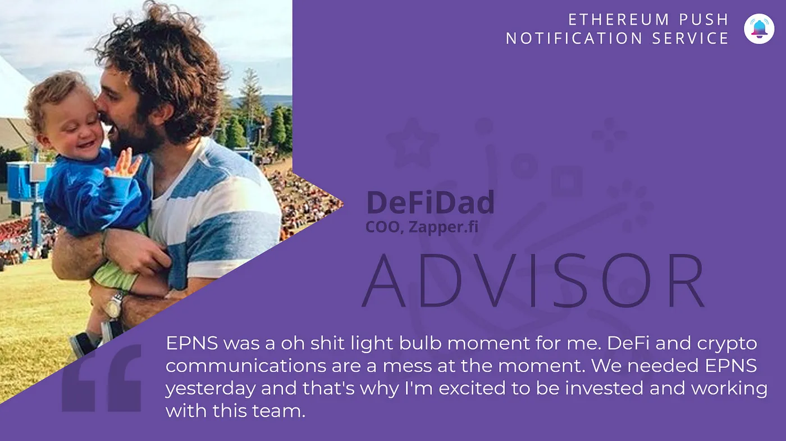

import { ImageText } from '@site/src/css/SharedStyling';

<!--truncate-->

We are excited to welcome our new Advisor — DeFi Dad

[Ethereum Push Notification Service](https://epns.io/) is beyond thrilled to announce that DeFi Legend [DeFi Dad](https://twitter.com/DeFi_Dad) has joined the EPNS Advisory.

DeFi Dad is the COO of [Zapper.fi](https://zapper.fi/). He is a DeFi Super User and educator through the hugely popular [DeFi Dad Youtube Channel](https://www.youtube.com/channel/UCatItl6C7wJp9txFMbXbSTg/) where he curates and produces free educational content on DeFi and Ethereum.

We first met DeFi Dad at [IDEO CoLab Ventures](https://medium.com/u/8eee9c7e6047?source=post_page-----176ceec0371d--------------------------------) Product Validation Day, where he shared his insights about DeFi Users Experience as part of product design thinking and interview. As an avid DeFi product and service user, DeFi Dad will bring his subject matter expertise to advise us on product design and strategy, which will reshape communication in blockchain as we know it.

In taking the advisor role, DeFi Dad said:

> EPNS was a oh-shit light bulb moment for me. DeFi and crypto communications are a mess at the moment. The ability to share product updates, notifications related to invested assets (ie real-time CDP liquidation warnings), urgent messages about bugs, new liquidity mining opportunities, or simply engage with your users based on wallets actually holding exposure to the native asset of your protocol… is a huge step forward. We needed EPNS yesterday and that’s why I’m excited to be invested and working with this team.

We love DeFi Dad 💖💖💖 and are honored to welcome him to the EPNS fam.

Stay in touch with Push! [Twitter](http://x.com/PushChain), [Telegram](https://t.me/epnsproject), [Newsletter](https://epns.substack.com/), [Website](http://epns.io)
