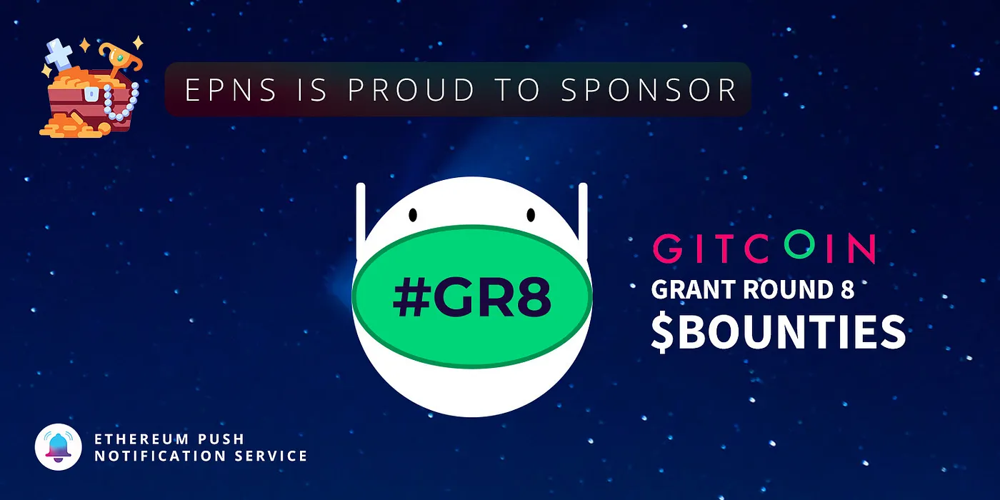

import { ImageText } from '@site/src/css/SharedStyling';

<!--truncate-->

Let’s build cool stuff together! 🤖

This feels #GR8…

We at Ethereum Push Notification Service (EPNS) truly believe in Gitcoin’s mission and vision of enabling anyone to work on the open internet, and using markets for good 🙏

EPNS was built at [**ETHGlobal**](https://medium.com/u/3d1733b8e86a?source=post_page-----5a829c357aa--------------------------------) **hackathon** from where our journey started! Later we got selected to be part of **Gitcoin Kernel0x** Accelerator. We are extremely grateful to Gitcoin and EthGlobal hack for their guidance and wanted to show our gratitude by supporting awesome builders, community members in the ecosystem. We are thrilled to announce that we are sponsoring [Gitcoin Grants Round 8](https://gitcoin.co/grants/) Hackathon— which will run from December 2nd to December 17th.

<iframe src="https://cdn.embedly.com/widgets/media.html?type=text%2Fhtml&amp;key=a19fcc184b9711e1b4764040d3dc5c07&amp;schema=twitter&amp;url=https%3A//twitter.com/gitcoin/status/1334250927948242953&amp;image=" allowfullscreen="" frameborder="0" height="466" width="680" title="" class="eo n ff dy bg" scrolling="no"></iframe>

# EPNS Bounties

We currently have 3exciting bounties to start working on:

- [Front-end SDK](https://gitcoin.co/issue/ethereum-push-notification-service/epns-protocol/1/100024360) ($1,500)— which is aimed to facilitate the integration of EPNS into your favorite dApps.
- [Document the EPNS Procotol](https://gitcoin.co/issue/ethereum-push-notification-service/epns-protocol/2/100024361) ($400)— take this opportunity to learn more about what's happening under the hood!
- [BUILD](https://gitcoin.co/issue/ethereum-push-notification-service/epns-protocol/3/100024421) our dApp notification displayer ($2,000) — by listening to EPNS protocol with [The Graph](https://medium.com/u/c2f061b81210?source=post_page-----5a829c357aa--------------------------------).

**But wait… that's not it!**, we have a few more bounties baking in the oven that will be up & running this week in our [Gitcoin EPNS bounties page](https://gitcoin.co/hackathon/gr8/?org=ethereum-push-notification-service). Make sure you keep an eye on us 🧐.

# Let’s get started

Learn about EPNS bounties, ask questions and learn about upcoming updates by joining our social platforms:

Discord chat: [https://discord.gg/32Jarc42](https://discord.gg/32Jarc42)

Telegram: [https://t.me/epnsproject](https://t.me/epnsproject)

Twitter: [https://twitter.com/epnsproject](https://twitter.com/epnsproject)

# Workshop Schedule

We will be shortly announcing more information about **workshops**, and other updates about our hackathon tasks through all of our media channels.

# Winners

Winners will be announced on January 7th, 2021.

Good luck and Happy Hacking!

# About Ethereum Push Notification Service (EPNS)

EPNS is a decentralized notifications protocol which enables users (wallet addresses) to receive notifications. Using the protocol, any dApp, smart contract or service can send notifications to users(wallet addresses) in a platform agnostic fashion (mobile, web, or user wallets). The DeFi aspect of the protocol also ensures that the user receives and earns from those notifications.

Stay in touch with Push! [Twitter](http://x.com/PushChain), [Telegram](https://t.me/epnsproject), [Newsletter](https://epns.substack.com/), [Website,](http://epns.io) [Discord](https://discord.gg/32Jarc42)
