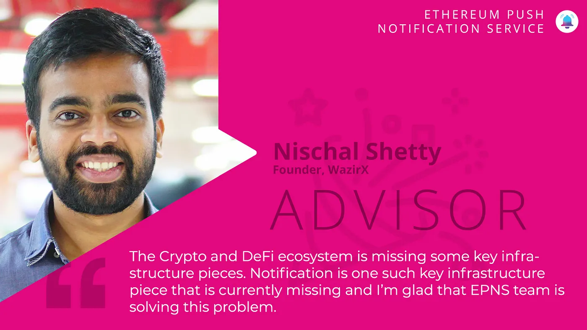

import { ImageText } from '@site/src/css/SharedStyling';

<!--truncate-->

We are excited to welcome our new Advisor — [Nischal Shetty](https://twitter.com/NischalShetty)!

Ethereum Push Notification Service Team is extremely excited to announce that [Nischal Shetty](https://twitter.com/NischalShetty) has joined EPNS project as Advisor.

Nischal is the founder & CEO of [WazirX Bitcoin Exchange](https://medium.com/u/d29061a6efc2?source=post_page-----d888c88462de--------------------------------), India’s largest cryptocurrency exchange, acquired by [Binance](https://medium.com/u/57600910a883?source=post_page-----d888c88462de--------------------------------). Prior to WazirX, Nischal founded [Crowdfire](https://twitter.com/Crowdfire), a social media management tool with 20 Million users. He has featured in Forbes ’30 under 30’ list and as India’s top crypto advocate with over 70K followers on Twitter, Nischal is passionate about crypto education and mass adoption in India (famously coined hashtag **#IndiaWantsCrypto**).

Nischal has been instrumental in guiding and helping us with business and growth strategy. He has driven tremendous value to the crypto ecosystem and we see EPNS to benefit greatly from his advisory with the aspiration to become a Web3 Standard for Notifications.

In taking the advisor role, Nischal said:

> The Crypto and DeFi ecosystem is missing some key infrastructure pieces. Notification is one such key infrastructure piece that is currently missing and I’m glad that the EPNS team is solving this problem.

We are beyond thrilled and honored to welcome Nischal to the EPNS family!

Don’t forget to 🌩⚡👉 ️ [FEEL THE THUNDER](https://epns.io/) 👈⚡🌩️

Stay in touch with Push! [Twitter](http://x.com/PushChain), [Telegram](https://t.me/epnsproject), [Newsletter](https://epns.substack.com/), [Website](http://epns.io)
