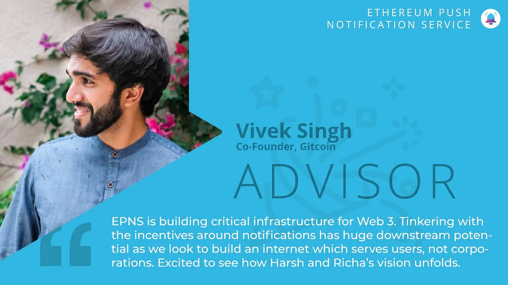

import { ImageText } from '@site/src/css/SharedStyling';

<!--truncate-->

[Ethereum Push Notification Service](http://epns.io) (EPNS) is building the world’s first decentralized notification protocol. Today, we are thrilled to announce that we have successfully raised $750k USD in seed funding at a valuation of $5 Million USD for achieving this vision!

The round saw backing from notable web3 leaders including [**Balaji Srinivasan**](https://twitter.com/balajis) (Fmr CTO of Coinbase, General Partner at a16z. Cofounder of Earn, Counsyl, Teleport), [**Scott Moore**](https://twitter.com/notscottmoore) (Co-founder, Gitcoin), [**Mariano Conti**](https://twitter.com/nanexcool) (Awesome Guy and Fmr Head of Smart Contracts, MakerDAO), [**Anthony Sassano**](https://twitter.com/sassal0x) (EthHub / TheDailyGwei), [**DeFiDad**](https://twitter.com/DeFi_Dad) (COO, Zapper.fi), [**Ravindra Kumar**](https://twitter.com/ravidsrk) (Frontier Wallet), [**Preethi Kasireddy**](https://twitter.com/iam_preethi) (Fmr Partner at a16z), **Andrew Chen** (Prescient Capital), [**Rezo**](https://twitter.com/rezoshm) **&** **Evgeny Zandman** (BR Capital), [**DeltaHub Capital**](https://cdn.discordapp.com/attachments/732837065175072818/785896598398959616/DHC_Logo_with_Words.png) **, Luka Sucic,** [**Ben Lakoff**](https://twitter.com/benlakoff), [**Auryn Macmillan**](https://twitter.com/auryn_macmillan) (Gnosis), **Danny Christ** (Moonwhale), [**Kenneth Ng**](https://twitter.com/nkennethk) (Ethereum Foundation)**, Ganeshram** **Gunalan**, **Thomas Kaseng Ao** and **Kathik Garg** (Bridge Capital LLC).

Popular VCs also joined the round including [**TheLaoOfficial**](https://twitter.com/TheLAOOfficial), [**MetaCartel**](https://twitter.com/VENTURE_DAO), [**Fourth Revolution Capital**](https://twitter.com/4RCapital), [**BlockRock Capital**](https://twitter.com/brcapital_fund), [**LD Capital**](https://twitter.com/ld_capital), [**D64 Ventures**](https://twitter.com/d64vc) and [**Moonwhale Ventures**](https://twitter.com/MoonwhaleBV).

EPNS was previously bootstrapped; this was our first seed round. 15% of tokens through private token agreement by a mechanism based on SAFT were given out for our upcoming (yet to be launched) governance token **$PUSH.**

“An ecosystem for push notifications that work across protocols is exactly what we need right now. I was lucky to judge EPNS at an ETHGlobal hackathon where I met Harsh and Richa and was impressed with their vision and execution and am excited to be on board.” — Mariano Conti

“We are truly grateful and happy to get them and embark on our next leg of the journey for building the world’s first decentralized notification protocol” — [Harsh Rajat](https://twitter.com/harshrajat) (Founder, EPNS)

These investors will help us ramp up efforts for making decentralized notifications a reality soon and to connect with projects and tweak the vision to better suit the entire ecosystem. We are deeply humbled and grateful for the support from our investors. Most of them are already our mentors and provide invaluable guidance, networking and deep practical knowledge of the ecosystem.

# Genesis of “Missing Piece of Web3 Infrastructure”

Previous technology often follows a pattern which can be observed to find ways to address the pain points in upcoming technology. As Mark Twain puts it, History doesn’t repeat itself but often rhymes. We can learn a great deal from observing and, of course, being at the right place at the right time.

The genesis of the idea for EPNS occurred when we sat down to observe what, if any, pain points still existed among blockchain apps (dApps / smart contracts / services) that we could solve. We were quick to realize that something felt a bit odd, but took some time to realize that Web3 tech behaved a lot like the early days of the internet.

Think 2004ish when GMail was launched and changed inboxes forever. At that point of time, the internet was still growing and the services offered behaved exactly the same way they do in Web3 today. For instance, you as a user were expected to log in to your mailbox to check email, reply to friends / work and then come back to it later and rinse and repeat. If you were the trendy one back in those days then maybe you went to Myspace and Orkut as well! But no matter the service, you were always going back to check on your actions.

[This drastically changed when Apple came up with notifications in 2010](https://medium.com/ethereum-push-notification-service/in-2009-push-notifications-changed-web2-0-in-2020-epns-is-bringing-them-to-web3-0-4ac506a0c9de) (though Google might have invented them). All of a sudden, services began to reach out to users whenever an action was required from their end. It increased engagement rate 7x and massively improved user experience. Notifications have been so engraved into our lives now that we hardly realize most of our online actions are caused by them; think about it, whatsapp, facetime, emails, payments, games all inform you now. You don’t go back to them to see if something has happened.

Contrast this experience with any dApps, smart contracts or services you interact with on Web3. There’s no way to inform users (wallet addresses) any time an important event occurs. Instead, the user is assumed to go back to the service time and time again to check their activity.

For instance, Liquidation on AAVE, Compound or any DeFi, DAO Governance proposal (Yam!), or ENS / dEx orders. Each of these are a reality right now but no solution exists to address them and the problem will only worsen as more services come to Web3.

This was the moment that we realized that this stone age era of communication in blockchain needs to go. You are not foreclosed by your bank without proper notices that reach you, but DeFi — while enabling awesome use cases — does that to you. And we wanted to fix that.

# Our Vision

Web3 users are wallet addresses and Web3 services are serverless. The entry point to any dApp starts with connecting your crypto wallet and thus it makes sense to enable notifications to wallets as that is at the core of the entire Web3 experience.

We envision a world of Web2 where notifications are delivered to whatever platform the user is using and can come from any blockchain apps that want to notify. The wallet should be able to earn part of the revenue as well, as they essentially are a part of the notifications experience and everything needs to be decentralized to ensure that things happen in a transparent, platform agnostic and of course DeFi incentivized way. And perhaps most importantly, users need to have complete control to ensure they are not inundated with unwanted, unhelpful, or overwhelming notifications.

The very next steps will be to build some of the remaining features of the protocol MVP and move towards audit and then come on Mainnet!

# EPNS Advisors

We are really grateful for the guidance and support (not to mention the love) we have been given by our Advisors and we wouldn't have been here without them. EPNS Advisory Board includes:

## [Nischal Shetty](https://twitter.com/NischalShetty) (Founder, WazirX | Acquired by Binance)

## [DeFi Dad](https://twitter.com/DeFi_Dad) (COO, Zapper.fi)

## [Vivek Singh](https://twitter.com/vsinghdothings) (Co-Founder, Gitcoin)

# EPNS Kudos

EPNS has had a really exciting roller coaster ride. In a span of few months, we have achieved:

- Top 5 Project of Gitcoin Grant (CLR7) with 216 contributors and over $16k in grant.
- Selected as Top 20 Project in Gitcoin Kernel Fellowship.
- Selected and Mentored by [IDEO CoLab Ventures](https://medium.com/u/8eee9c7e6047?source=post_page-----bec41eadd84d--------------------------------) for PVD (30 best DeFi projects out of 120+).
- Selected for CoinList Seed Fall 2020 batch.
- Featured and spoke about EPNS: [**Ethereum Foundation**](https://blog.ethereum.org/2020/08/19/esp-beyond-grants/), [**EthBerlin — 2.5 Talk Show**](https://medium.com/ethberlin/more-speakers-for-2-5-the-talkshow-sign-up-for-free-388b148aa559)**,** [**Ethereum Enterprise Alliance**](https://twitter.com/leahydeuces/status/1331301626028695554?s=20)**,** [**EDCON (ETHPlanet)**](https://twitter.com/EDCON_Official/status/1291454338674679816)**.**
- Won grants from [Matic](https://medium.com/u/7961fd6ea60b?source=post_page-----bec41eadd84d--------------------------------) and [Aavesome](https://medium.com/u/13bfa9f22920?source=post_page-----bec41eadd84d--------------------------------) ❤

# Thank you for believing in us!

We want to thank our awesome team, advisors, projects, programs ([EthGlobal](https://twitter.com/ETHGlobal), [IDEO](https://twitter.com/IDEOVC), [Gitcoin Kernel0x](https://twitter.com/KERNEL0x) Genesis, [CoinList](https://twitter.com/CoinList) Seed Batch), mentors, and investors that have helped and guided us in this journey. And to the amazing Ethereum community who’ve shared their invaluable feedback, support and love to pivot us in the right direction. Thank you for your support and encouragement!

It’s been a joy filled ride and we can’t wait to share our progress in the coming months.

# We are hiring!

We are a small vibrant team with a big vision! We are looking for creative developers, if you believe in the vision and feel that you can work with a team that’s global and likes to have fun when they work then do drop us a [line](mailto:founders@epns.io).

Also, don’t forget to checkout our new [website](https://epns.io/).

Loads of 💖💖💖

Harsh & Richa

Stay in touch with Push! [Twitter](http://x.com/PushChain), [Telegram](https://t.me/epnsproject), [Newsletter](https://epns.substack.com/), [Website](http://epns.io)
