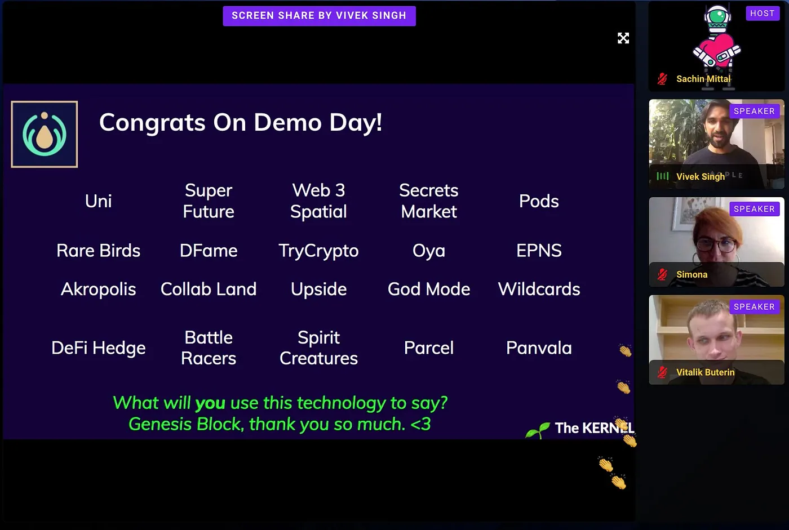
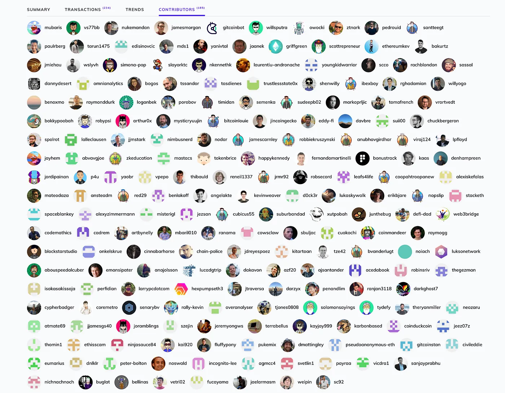
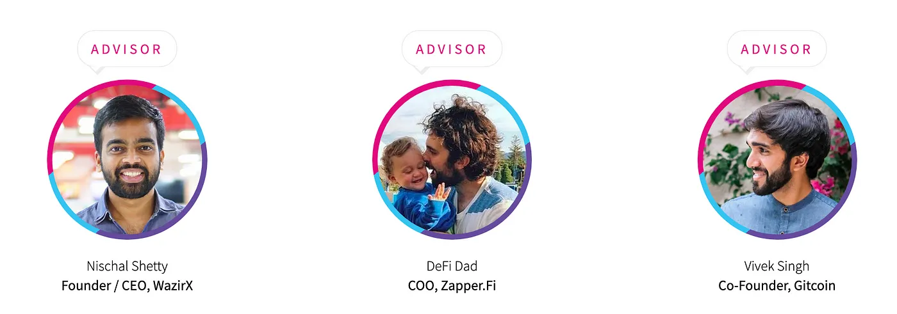
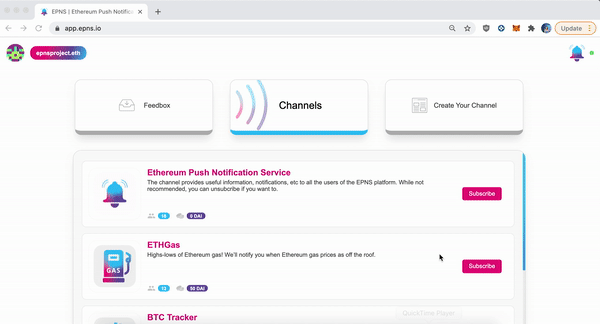
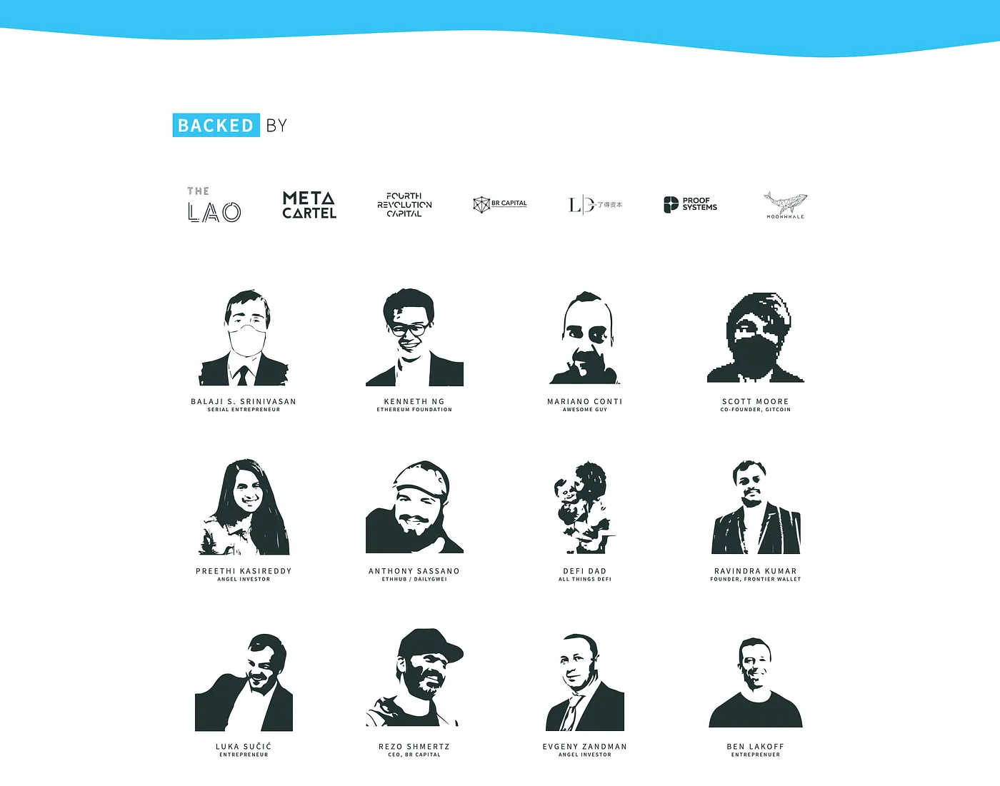

import { ImageText, VideoContainer } from '@site/src/css/SharedStyling';

<!--truncate-->

A snapshot of everything that happened around EPNS in 2020 🎉🎉🎉

2020 has been a year that would undoubtedly go down into the history books, for reasons that not only changed how the world runs but also how the world thinks and speaks. Despite the onset of the pandemic, we saw the crypto world booming, as DeFi started to explode and blockchain saw innovation at its height!

It is humbling to rewind over the past year and take a look back at what we have been able to achieve. From ideation to creation, and the alpha launch of EPNS protocol and products on Ropsten… it has been a awesome year so far, and we look forward to growing into greater heights in the year to come and are ever so grateful for the opportunities given.

We think the biggest credit goes to the love, support and backing of our AWESOME community! Though I also think equal credit belongs to the team ..for the efforts they did to enable coordinated remote work and timings; for adjusting their schedules and their timezones; for achieving a collaborative, conducive and fulfilling team environment, which when put together enabled us to achieve the vision of making EPNS what it is today!👨‍🔬 👩‍🔬

Welcome to the EPNS 2020 Rewind! 🎉🎉🎉 where we summarize the major highlights of the year and go through loads of awesome nostalgic vibes!

# 🌟**Reaching for the Stars — Our Journey**🌟

2020 marked the birth of EPNS. Since the ideation of EPNS back in January, it took us a couple of months to bring the idea to Ethereum Foundation who guided us to ETHGlobal HackMoney where we hacked and #buidl EPNS protocol and product MVP. With awesome guidance and mentorship from the folks at ETHGlobal team, AAVE, etc. the idea was refined, vetted, and validated thoroughly.

<VideoContainer>
<iframe width="100%" height="100%" style={{borderRadius: '32px'}} src="https://www.youtube.com/embed/kwwnlmUpRsk" title="Ethereum Push Notification Service (EPNS)" frameborder="0" allow="accelerometer; autoplay; clipboard-write; encrypted-media; gyroscope; picture-in-picture; web-share" allowfullscreen></iframe>
</VideoContainer>

<ImageText>How it started 💖</ImageText>

We didn’t even realized at that point of the massive support which was incoming from the community and our awesome mentors! Shortly after the hackathon, we were shortlisted by IDEO Collab (30 top DeFi projects from 120+) and were mentored during IDEO PVD (Product Validation Day) to synthesize user feedback and validate the idea. ⭐️

<iframe src="https://cdn.embedly.com/widgets/media.html?type=text%2Fhtml&amp;key=a19fcc184b9711e1b4764040d3dc5c07&amp;schema=twitter&amp;url=https%3A//twitter.com/IDEOVC/status/1273639750918782977&amp;image=" allowfullscreen="" frameborder="0" height="637" width="680" title="" class="eo n ff dy bg" scrolling="no"></iframe>
This was shortly followed by getting accepted into the first cohort of Gitcoin KERNEL 🌱 from which we graduated as top 20 finalists! We ❤️ 🌱 Forever!

Gitcoin Demo Day!!

Also, around this time, we got awarded grants from Matic and AAVE which motivated and encouraged us to shoot for the stars 🌠. Digressing from the journey a bit, we just want to highlight how awesome ecosystems requires superheros 🦸 who support innovation and Open Source Software (#OSS) projects through Grants! We really can’t thank them enough for all the support extended to all the projects because of them!

Speaking about #OSS, how can we forget the awesomeness Gitcoin has created for all of us through their grants round where community love and support is directly transformed into the quadratic funding for anyone’s next super cool idea!

This was also incidentally the next milestone of the journey and we were blown away by the validation and love the community gave us in [Gitcoin Grants (CLR7)](https://gitcoin.co/grants/936/ethereum-push-notification-service-epns) where we were one of the Top 5 projects by the number of contributors (over 250) 😍🙏

Thanks to all the amazing people who donated to our Gitcoin grant and all our well wishers

Later, EPNS also got selected for the CoinList Seed Fall 2020 Batch and they still help us to this very day with whatever things we want to learn about, not to mention that some of the investors of our seed round came in because of them selecting us in their prestigious batch ❤️!

Through out the journey, the thing that stuck out to us was how everyone helped us to grow and supported us at every step… which became our mantra and we would tell everyone who becomes able in the space to do 👇

> ⭐️ Pay it forward… ❤️❤️❤️!

In the same spirit, we returned back in Gitcoin #GR8 Round, not as grant participant but this time to proudly support the #GR8 Hackathon, we put forward some bounties for the hackathon and happy to share that all of them are coming back to EPNS ecosystem in the form of amazing features developed by awesome developers!

Apart from all the grants, accelerators, and hackathons, we were also fortunate and grateful for all the peeps that joined our advisory board, they help, guide and steer us in the right direction almost on a daily basis 🚀 and we can’t be here without them.

# 🌟**Our Backbone — The Tech/Protocol**🌟

EPNS aims to significantly improve the Web3 infrastructure by providing a critical yet, a missing piece in Web3 that directly correlates to User Experience — a decentralized communication middleware for Web3 services to send notifications to users wallets.

Year 2020 saw the release of our EPNS Protocol on [Ropsten](https://ropsten.etherscan.io/address/0xb02E99b9634bD21A8e3E36cc7adb673287A8FeaC#writeProxyContract) that paved the way for the first time for decentralzied notifications to operate! This was shortly followed with **_“notification receiving”_** platforms that enabled users to experience these notification just by signing through their wallet address.

These included alpha versions of the EPNS [iOS](https://apps.apple.com/app/ethereum-push-service-epns/id1528614910) and [Android](https://play.google.com/store/apps/details?id=io.epns.epns) app as well as EPNS [dApp](https://apps.apple.com/app/ethereum-push-service-epns/id1528614910). Of course the vision is to have EPNS protocol integrated across all user wallets for a seamless notification experience.

We also published the EPNS [Whitepaper](https://whitepaper.epns.io/) (and [Litepaper](https://medium.com/ethereum-push-notification-service/ethereum-push-notification-service-litepaper-e7ca0a662862)) earlier this year.

We also have been building some cool channels that can deliver much needed notifications to the users. So far we have deployed the following channels on our dApp (check them out at [https://app.epns.io)](https://app.epns.io).) with more coming soon! Team favorites channels are ETHGas, ENS Domain Expiry, ETH Tracker and BanklessFR so far!

Our vision of being a **Web3 Standard for Notification** is tightly coupled with a feature packed roadmap, we are working on it and still have few things to add (colored post-it are different cogs of the ecosystem), having said that, here’s a sneak peek 👀

# 🌟**Seed Announcement**🌟

The awesome journey and folks enabled us to raise our seed round which got announced during the start of December! We were able to successfully raised $750k at a valuation of $5 million. **$PUSH for the win!\*\* More than the raise! we are humbled and grateful for the support of Web3 Leaders and notable VCs who backed our vision of decentralized notifications and are our long term partners!

Visit [epns.io](http://epns.io) for all our awesome investors ❤️

# 🌟Website 2.0 — epns.io🌟

We were thrilled for finally having a website that let’s us put out and explain our vision to the World. We launched it along with our seed announcement and with a heavily biased recommendation we ask everyone to check it out: [Website](https://epns.io/).

# 🌟**Conferences, Talks, AMAs…Events Galore!!!**🌟

With most of us living the digital life this year, it also meant that there were no more physical barriers to attend events and host conferences. This year was packed with lots of amazing virtual events and talks that we were thrilled to be a part of.

Here is a quick round-up of some of the many events we had been a part of in 2020.

## **Ask Me Anything:**

- EPNS AMA with Matic
- EPNS AMA with Bundle Africa
- EPNS AMA with AMA Lovers Club

## **Conferences and Workshops:**

- 2.5 Talk Show at ETHBerlin
- ETHCon Korea
- Gitcoin: Welcome to Web3
- EDCON 2020
- BlockHash LIVE 2020
- Chainlink Hackathon Workshop
- Gitcoin Grants #GR8 Hackathon Workshop
- Ethereum Enterprise Alliance (EEA) Asia Pacific 2020
- ETHIndia Mentorship session

And so many more!! We are very grateful to all the organizers and sponsors for giving us the opportunity

There is nothing better than speaking to the community and educating everyone about the possibilities of DeFi, Game Theory, and Decentralized Notifications and then answering their questions and queries. We loved every second of talking to you all, and we hope to speak with the community at large more in the year to come.

# 🌟**EPNS Featured!**🌟

EPNS was proud to be featured in a number of articles, newsletters, and other publications. Some notable ones include **Ethereum Foundation Official Blog**, **TheBlock**, **EtherWorld**, **TheDailyGewi** & **EthHub** by **Anthony Sassano**, **Alex Saunders** of **Nugget’s News**, **DeFiDad**, **CoinTelegraph**, **DeFiTimes**, **YourStory**, **MojKripto**, **Product Hunt Launch** 🚀, **Dapp.com** and many many more 😃!

# 🌟**Our Heart Beat — The Community**🌟

EPNS would have never reached where it is without the awesome Web3 community backing us. The love you showed kept us going, made us hustle and even helped us keep sane and energized during sleepless nights! We do what we do to ultimately build something that could prove useful for the community and enable a better Web3 experience and you by your support on all mediums… be it Twitter, or Telegram, or Medium kept us going ❤️!

Woohoo!! Thank you Mariano

<iframe src="https://cdn.embedly.com/widgets/media.html?type=text%2Fhtml&amp;key=a19fcc184b9711e1b4764040d3dc5c07&amp;schema=twitter&amp;url=https%3A//twitter.com/krrisis/status/1339313012268797954%3Fs%3D20&amp;image=" allowfullscreen="" frameborder="0" height="514" width="680" title="" class="eo n ff dy bg" scrolling="no"></iframe>

We thank you for your support through out this year and for helping us grow!

<iframe src="https://cdn.embedly.com/widgets/media.html?type=text%2Fhtml&amp;key=a19fcc184b9711e1b4764040d3dc5c07&amp;schema=twitter&amp;url=https%3A//twitter.com/epnsproject/status/1274574944119091201%3Fs%3D20&amp;image=" allowfullscreen="" frameborder="0" height="720" width="680" title="" class="eo n ff dy bg" scrolling="no"></iframe>

# 🌟EPNS through Cool Stats🌟

- **Most Popular Blog Articles for 2020**
- [Ethereum Push Notification Service Successfully Raises $750k USD in Seed Round](https://medium.com/ethereum-push-notification-service/ethereum-push-notification-service-successfully-raises-750k-usd-in-seed-round-bec41eadd84d) **1k Views**
- [EPNS Game Theory Explained](https://medium.com/ethereum-push-notification-service/epns-game-theory-explained-25425bbe4eae) **400+ views**
- [13 DeFi Notifications Ethereum Needs today](https://medium.com/ethereum-push-notification-service/13-defi-notifications-ethereum-needs-today-df4dcc98a797) **300+views**
- Twitter**:** **5.8k followers**
- Telegram**:** **780 members**
- Our Weekly series**,** A Minute With EPNS — **11 series** published with over **70 sign-ups** ✍️

# 🌟Hello 2021 !!🌟

As we step into the year 2021, we have a lot of things planned for EPNS. Few major milestones includes:

- **#1** Protocol Audit + Mainnet launch!
- **#2** Beta releases with loads of feature for the dApp, Mobile Apps, Extension and integrations!
- **#3** Layer 2 scaling, continued addition of governance features, and more!

# 🌟…**And That’s A Wrap!! (+) Holiday Wishes**🌟

The year 2020, was a roller coaster ride. The pandemic gave us a world of uncertainty, but we try to hold on and push past it. During this holiday season, we wish all of you reading this to stay safe and have a wonderful 2021!

We hope things turn out better for those who had it worse, and things stay amazing for those who had it well and good. It was a year to be remembered, for good and for bad. People had to change their lifestyle, had to stop meeting friends and family and in general had a tough year to cope! Though on the good side, especially for all of us who are in crypto — we saw the explosion of DeFi, the start of Ethereum 2.0 and the massive bull run in the latter half of the year.

It was a year of innovation and digitization, the world has gone digital, crypto is now global, use cases are now becoming more mainstream with some brilliant minds solving some significant problems in the world with blockchain.

In our remote working digital lives, decentralization and Web3 will be key for a self-sovereign web, the internet of value is just beginning, and EPNS aims to be at the forefront of it by making things more user-friendly and bringing the best of Web2 to Web3. It’s a connected world out there, and we once again wish you all the best for the New Year to come.

It’s going to be one hell of a ride in 2021. Stay Tuned 💖💖💖

🌟 Let’s **#EthPush** for **#Web3Notif**!! 🌟

We send you our best wishes for an amazing 2021 🤗l!!

Follow us on [Twitter](http://twitter.com/epnsproject), [Telegram](https://t.me/epnsproject), [Newsletter](https://epns.substack.com/), [Website](http://epns.io)
