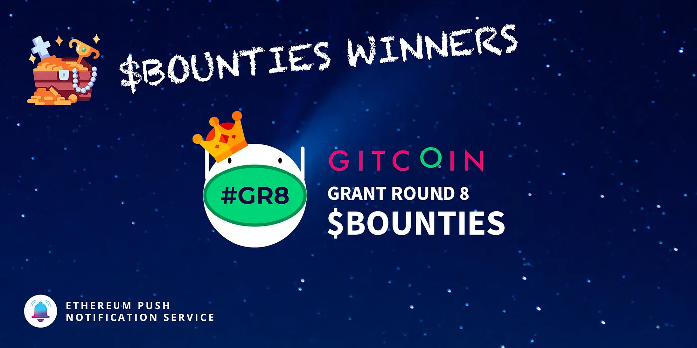
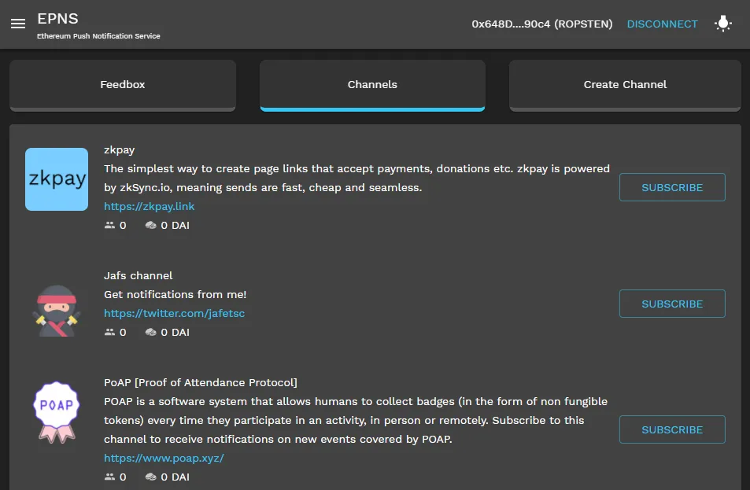

import { ImageText } from '@site/src/css/SharedStyling';

<!--truncate-->

We are stoked to announce our bounty winner for [Gitcoin Grants Round 8](https://gitcoin.co/grants/?) Hackathon that concluded on December 17th, 2020.

EPNS posted three bounties for the event:

- [EPNS Front-End SDK](https://gitcoin.co/issue/ethereum-push-notification-service/epns-protocol/1/) (1500 DAI)
- [dApp Front-End mechanism to fetch data](https://gitcoin.co/issue/ethereum-push-notification-service/epns-protocol/3/) (2000 DAI)
- [Documentation for our Protocol](https://gitcoin.co/issue/ethereum-push-notification-service/epns-protocol/2/) (400 DAI)

## The Front-End SDK meets the dApp mechanism to fetch data

Two bounties with two different goals:

- The SDK bounty aims to facilitates integrating EPNS notifications into other dApps.
- The dApp mechanism to fetch data was more open to the developer(s) creativity, and aims to create a mechanism to retrieve notifications data in a structured and organized fashion. Which will greatly help towards producing a richer User Experience.

It was truly a pleasant surprise running into a submission that combines both bounties in a nice elegant fashion.

The winner of the two bounties is Gitcoin user [**VBStreetz**](https://gitcoin.co/vbstreetz)! 🏆 Congratulations and many thanks for such an outstanding job! We are currently working to merge this improvement.

You can try the [**demo here**](https://epns-staging.surge.sh/#/), or you can [**see it in action here**](https://vimeo.com/492196309/bdb971e572).

While for the documentation bounty we didn’t receive any formal submission, we encourage those of you who were interested — not only in the bounty but in EPNS in general — to get in touch with us an express your interest in collaborating with the project and help with the documentation. We will be more than happy to work together with you.

# Thank you!

We would like to thank the awesome Gitcoin team (Big shout out to Scott, Connor, Joe) and everyone who participated in the hackathon. We look forward to collaborating with the Gitcoin community in future.

Lets continue #buidling cool stuff together and make a memorable 2021!
