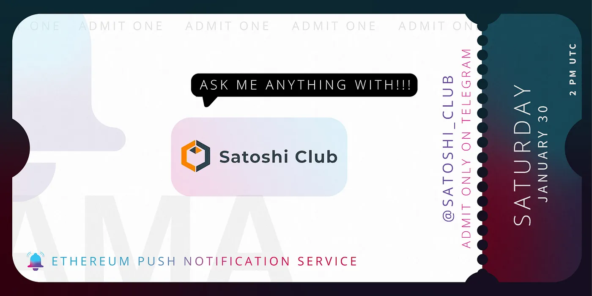

import { ImageText } from '@site/src/css/SharedStyling';

<!--truncate-->

Receive notifications from Web3 on your wallet address

[Ethereum Push Notification Service](https://epns.io/) (EPNS) Founder and Project Lead, [Harsh Rajat](https://twitter.com/harshrajat), and Co-founder, [Richa Joshi](https://twitter.com/Riijo), joined [Satoshi Club](https://esatoshi.club/) community on 30th January 2021 for a live AMA session on their telegram group. We enjoyed answering awesome questions about EPNS and receiving notifications from Web3 on your wallet address.

**_Date_**_: Saturday, 30th January, 2021  
_**_Time_**_: 2PM UTC_

<iframe src="https://cdn.embedly.com/widgets/media.html?type=text%2Fhtml&amp;key=a19fcc184b9711e1b4764040d3dc5c07&amp;schema=twitter&amp;url=https%3A//twitter.com/esatoshiclub/status/1354039885758394373%3Fs%3D20&amp;image=" allowfullscreen="" frameborder="0" height="664" width="680" title="" class="eo n ff dy bg" scrolling="no"></iframe>

The AMA session was divided into 3 parts with a total crypto reward pool of 600$. Find the full AMA transcript below:

**Part 1 — introduction and questions from the Telegram&Bitcointalk community**

**Mary | Satoshi Club**: Hello Satoshi Club! We are happy to announce our AMA session with EPNS! Welcome to Satoshi Club😀

**D. | Satoshi Club:** Hello everyone! 👋  
Another AMA in Satoshi club! And our guests today — @harshr @RJlwl! Welcome!  
Hello guys! 😃

**Harsh | EPNS**:  
Thanks, @Cool\_as\_Ice Really excited to be here!

**Mary | Satoshi Club**:  
Hello, Harsh👏 happy to see you here 👍

**D. | Satoshi Club**:  
Good to have you here 😃How are you doing?

**Richa | EPNS 📨 | won’t DM first:**  
Hey Legendary Satoshi Community & @Cool\_as\_Ice, great to be here 👋

**D. | Satoshi Club:**  
Hello! welcome! 🥳

**Mary | Satoshi Club:**  
Hello, Risha! Welcome to Satoshi Club 👏

**Richa | EPNS 📨 | won’t DM first:**  
Hey @madamlobster doing great, hope you all are having an awesome weekend as well.

**D. | Satoshi Club:**  
Do you guys ready to begin our AMA?

**Mary | Satoshi Club:**  
Guys, could you please introduce yourself and tell us how did you start with EPNS?😀

**Harsh | EPNS:**  
Thanks! Really feels awesome to be here… Hey awesome Satoshis ;). I am Harsh, Founder and Project Lead of Ethereum Push Notification Service. Some background about me, I love dabbling in all things tech; and have been fortunate enough to have the support from the awesome Ethereum and blockchain community to have been given the chance to create/change the communication layer for Ethereum and Web3 which we like to call as The missing piece of web3.

**Richa | EPNS 📨 | won’t DM first:**  
Sure! I am the co-founder of Ethereum Push Notification Service (EPNS). I wear multiple hats at EPNS though am focused on mostly Marketing and Product. Before EPNS, I worked with companies like Deloitte, Wipro, etc., and have close to 12 years of techno-functional experience in various aspects of product management, design, and development across multiple facets of the product lifecycle.

**Harsh | EPNS:**  
A bit about our journey:

**Mary | Satoshi Club:**  
Nice background! Sure it will help EPNS a lot👍

😉

**Harsh | EPNS:**  
We have had an awesome journey! We identified this pain point, ie: lack of communication in Web3 in January, Ideation and loads of research took a couple of months after which we took the idea to Ethereum Foundation, there we were lucky to be guided to EthGlobal HackMoney, after which we got selected and mentored by IDEO in their product validation day (PVD) and then got selected in Gitcoin Kernel accelerator/incubator, which is one of the most prestigious accelerators in our space. We are loving this roller coaster ride!

**Mary | Satoshi Club:**  
Yes! And I see that your coaster ride is really successful 😀

**D. | Satoshi Club:**  
Awesome journey indeed! 😁

**Harsh | EPNS:**  
Also, really happy and grateful to share that we recently completed our seed round and were honored to get backing from notable web3 leaders including Balaji Srinivasan (Fmr CTO of Coinbase, General Partner at a16z. Cofounder of Earn, Counsyl, Teleport), Kenneth Ng (Ethereum Foundation), Scott Moore (Co-founder, Gitcoin), Mariano Conti (Fmr Head of Smart Contracts, MakerDAO), Anthony Sassano (EthHub / TheDailyGwei), DeFiDad (COO, Zapper), Ravindra (Frontier Wallet), Preethi Kasireddy (Fmr Partner at a16z), Auryn Macmillan (Gnosis), TheLAO, MetaCartel VC and several more awesome peeps!

**Richa | EPNS 📨 | won’t DM first:**  
To learn more about our investors please visit: [https://epns.io/](https://epns.io/)

**Mary | Satoshi Club:**  
A lot of familiar and famous names 👏

**Richa | EPNS 📨 | won’t DM first:**  
🙌

**D. | Satoshi Club:**  
Congrats on this achievement 👍

**Harsh | EPNS:**  
😃

**Mary | Satoshi Club:**  
You have an amazing intro, guys!

**Richa | EPNS 📨 | won’t DM first:**  
Thank you dear @madamlobster.

**Mary | Satoshi Club:**  
Thank you and are you ready to start with the questions from our community?😀 We want to know more about EPNS🚀

**Richa | EPNS 📨 | won’t DM first:**  
Sure! let’s do this.

**D. | Satoshi Club:**  
Q1 from Telegram user @jobel4  
As the trademark or tagline of EPNS goes ” Subscribe, notify and earn.”. Firstly, is the subscription of EPNS is free or need to pay? If need to pay, what is the medium of payment? Can I also unsubscribe? Secondly, How can I get notified, is that thru email, SMS or multimedia messaging? Lastly, as a curiosity how can I earn in your platform if the service you have is giving notification? Thank you.

**Harsh | EPNS:**  
Awesome question!

EPNS is free or needs to pay?  
Subscribing is a one-time process that is always free!! with the exception of users paying gas for opt-in, which can in many instances be taken care of by services frontend (or through us) via meta transaction.

When it comes to users, all they have to do is pay the gas fees which can vary depending on if it’s done through L1 or L2. The medium of payment is only in relation to gas and hence ETH. For unsubscribe, A communication protocol needs to have users in full control and hence the user can always unsubscribe with the service having no control over it.

How do you get notified?  
Since we abstracted sending notification and receiving part, in essence, notifications can be delivered to any platform including the ones you mentioned! But for now, we want to focus on pseudo-anonymous web3 notifications which mean you are notified on your wallet address. The design is simple, subscribe to a service you want to receive notifications from, connect your public wallet address to either our mobile app, dApp, or extension (coming soon) and that’s it! Let the notifs will come to you.

In the future, we envision EPNS protocol to also be integrated among your favorite crypto wallets which will mean that whatever web3 entry software you use will show these notifs to you!

The Earn part is our favorite! Since we are a decentralized notification protocol, the services before they can send out notifs to their subscribers are required to activate themselves, which we call it creating a channel. For this, they are required to stake DAI (50 or higher) to the protocol. This DAI is then lending out via the protocol to AAVE and in turn, starts generating interest which is distributed among the subscribers of that channel in a weighted manner towards early subscribers.

**Mary | Satoshi Club:**  
Do you have guides on how to use your services?

**D. | Satoshi Club:**  
Can we already use your service? on which platforms it’s available?

**Richa | EPNS 📨 | won’t DM first:**  
Sure, we are coming out with our How-to-Guide soon. For now, users can reach us on our telegram group [https://t.me/epnsproject](https://t.me/epnsproject) and we can guide them on each step on how to set it up 👍

**D. | Satoshi Club:**  
👍👍👍

**Mary | Satoshi Club:**  
\[In reply to Richa | EPNS 📨 | won’t DM first\]  
Great! I already downloaded your app, but I think I will need help😉

**Richa | EPNS 📨 | won’t DM first:**  
Yes, While we are on Ropsten, notifications are live and working.

**Richa | EPNS 📨 | won’t DM first:**  
Haha, sure! Here to help.

**Mary | Satoshi Club:**  
👍

**D. | Satoshi Club:**  
Nice! I need to try this 👌

**D. | Satoshi Club:**  
Thank you for your answers! ready for the next question?

**Mary | Satoshi Club:**  
We need to try😉 sure, it will be very useful!

**Richa | EPNS 📨 | won’t DM first:**  
Yes.

**Richa | EPNS 📨 | won’t DM first:  
**💯

**D. | Satoshi Club:  
**Awesome! Let’s do this!

**D. | Satoshi Club:**  
Q2 from Telegram user @Highpee  
Notification providers can become annoying sometimes with the way and rate at which they send unsolicited spam notification to users. As a Push Notification Service, how does EPNS ensures that notifications are not unnecessary overbearing but are specifically targetted to add value to the user? Do you have a content filtering and abstraction mechanism within your Protocol to filter unhealthy notifications from service channels and throttle-limit channels with poor spam health score? Our users also able to control spam-related content?

**Richa | EPNS 📨 | won’t DM first:**  
Hahaha, yeah we understand the problem users face when it comes to unsolicited and spam notifications 😅. We actually thought a ton about it and there are a couple of ways by which we mitigate the issue (everything happens on protocol :)):

1) Users have to opt in to receive notifications from the service first before they can start communicating. This ensures that users are always in control, if they unsubscribe, there is no way for a service to add to them.

2) To ensure that a service doesn’t turn malicious later on, we attach a Spam Score to them as well which is adjusted by both positive (higher number of subscribers, the passage of time, etc) and negative (unusual number of notifications, a higher number of unsubscribes, etc) actions. This score when it crosses a certain threshold activates the protocol throttle mechanism which is a way to penalize services a bit at first and if they don’t stop then making the throttling go high thereby ensuring that it’s always in the best interest of services to not spam their users.

We are also planning verified badges in the future to ensure that while everyone can create a channel and everyone can opt-in, there is a distinction between spammy channels and verified ones.

**Mary | Satoshi Club:**  
So, users can control this by subscribing and unsubscribing 🙂

**Richa | EPNS 📨 | won’t DM first:**  
Yes, the user is in control 💪

**Mary | Satoshi Club:**  
Did you already notice spammers on your services? Or they didn’t try?

**Richa | EPNS 📨 | won’t DM first:**  
Lol, they are definitely trying more on staging for now 😉

**Mary | Satoshi Club:**  
They also in beta 😂

**Richa | EPNS 📨 | won’t DM first:**  
😅

**Mary | Satoshi Club:**  
Thank you! I am sure you won’t give them any chances 👍

**Mary | Satoshi Club:**  
Ready for the next question?

**Richa | EPNS 📨 | won’t DM first:**  
Yes, please.

**D. | Satoshi Club:**  
Q3 from Telegram user @AmirJosh  
Device token is a unique key for the app-device combination which is issued by the Apple or Google push notification gateways. Can you please explain further what is Device Tokens importance and functions needed to be able to make it compatible or work efficiently with EPNS App?

**Harsh | EPNS:**  
Seems like someone really is into push! The Apple (and google) push notification gateway also works on the concept of a middleware handling all the notifications from every app and ensuring that the user has opted in for it. In apple’s case, it’s called APNs (Apple Push Notification Service) which is why we choose EPNS (Ethereum Push Notification Service).

To answer this in TLDR → For Receiving Decentralized Notifications: Each platform has its rules in engaging push notifications. The way EPNS works is that it standardizes the communication layer and the payload emitted out (whether encrypted or plain) which is then read by our infrastructure (or other infra) nodes who can then compose the notification payload out and push it out to the app (essentially decentralized to centralized carrier delivery).

While we are planning for the nodes will be p2p in the future and will allow wss connections, the receiving part for specific apps logic is left onto them. For us or anyone who wants to push them out to iOS or Android (for example our app or other third-party apps who wants in) will need to enter their creds in the node which is not shared and need to have our SDK in their app. The SDK essentially will be responsible for connecting device tokens to wallet addresses and the rest of the thing is already taken care of by our protocol!

**Mary | Satoshi Club:**  
Great system!

**D. | Satoshi Club:**  
Will you use your own token in this system? If so, when and how people can obtain it?☺️

**Harsh | EPNS:**  
Yes, we do have our governance token $PUSH that will enable users to govern the protocol, handle game theory between all our participants, and… 🥁🥁have reward/pool sharing built into it so every player wins!!

We will also have liquidity/usage mining that will reward participants among several other use cases.

They are incoming and not yet out… we will have an announcement on it pretty soon 😊

**D. | Satoshi Club:**  
great! 👍 we will be waiting for an announcement then 😉

**Richa | EPNS 📨 | won’t DM first:**  
🤝

**Mary | Satoshi Club:**  
Cool, stay tuned Satoshiclubbers 🚀

**Mary | Satoshi Club:  
**Ready to proceed?😀

**Richa | EPNS 📨 | won’t DM first:**  
Yes, please.

**D. | Satoshi Club:**  
Thank you for the great answers!

**D. | Satoshi Club:  
**Q4 from Telegram user @K2ice  
If am right, the current focus of EPNS now is sending notifications directly to user wallets. Are there plans to include Telegram, Twitter, and other platforms in the nearest future?

**Richa | EPNS 📨 | won’t DM first:**  
You are 100% right! This is where EPNS is really flexible, we are platform agnostic so in the future, we can deliver notifs to telegram, Twitter, or to any other platform as well!

**Mary | Satoshi Club:**  
Do you see user’s demand in this?😀

**Richa | EPNS 📨 | won’t DM first:**  
We do see some users wanting it, but most want it pseudonym, exactly like their wallet address without any identity connection..like the rest of the Web3 which is why we are first focusing on wallet addresses.

**Mary | Satoshi Club:**  
Oh, understand 😂

**Mary | Satoshi Club:**  
Btw, which notification services do you see as your competitors?

**Harsh | EPNS:**  
We are the first one to do this so no direct competitors ;). Some indirect ones do it differently in which they monitor a few smart contract and events and ask users to log in to their centralized platforms and create hooks which in essence only adds to the problem as a) they pick and choose smart contracts and b) how can the user be expected of keeping track of all notifs (imagine if every time you installed Telegram, you had to go somewhere, register and add hooks to receive emails), now try it with 50+ services. While these indirect competitors have created awesome tech, we feel that the middleware which we are creating in essence enables this to be done smoother and see them as our future partners 🙂

**Mary | Satoshi Club:**  
Yes, you’re right! Better become partners😉

**Mary | Satoshi Club:**  
Ready to jump to the next question?

**Richa | EPNS 📨 | won’t DM first:**  
Yes.

**D. | Satoshi Club:**  
🚀🚀🚀

**D. | Satoshi Club:**  
Q5 from Telegram user @Antoni\_azx  
There’s a medium article called “Building the cities of the future with EPNS”, It’s about a fictional city and its citizens that interact with various processes and gives an idea of how EPNS could eventually impact our lives, will this all stay fictional? How are you planning to get these features in real life?

**Richa | EPNS 📨 | won’t DM first:**  
Thanks for going through the post! Hope you loved the vision! Any tech which we use at the moment was fictional at one point in time ;). Jetsons and facetime, anyone?

We imagine facetime to become decentralized, DeFi to have mass adoption, Governance of projects done by several users, gaming characters to be truly unique, your mails, and data staying with you among countless other things.

All of this requires communication and services to come to users when their attention is required. Like how TG is sending us notifications of users joining our channels from your awesome Satoshi Club which is of importance to us :). This experience of Web2.0 is needed to enable adoption for Web3.0.

For example, when you take a loan from a bank before it’s liquidated, you are sent several alerts from your bank. The same or any type of alert is not present in Web3.0 and it creates blockers for innovation that we see to be 10x better than web2 yet still have user engagement and experience issues.

All of this led us to research and create a protocol that is infinitely extensible to not only handle notifs that are text but can also handle any type of payload (which in essence is what APNs do as well). This enables us to send even right now notifs that can carry CTA, Youtube Videos, Encrypted Transactions, or anything else that is imaginable.

In essence, we have already created that standard which is content independent (allowing usage for any service imaginable), storage independent (support IPFS, smart contract, and any other storage standard that comes out), supports encryption (to support chats, video calls, MFA, etc) and delivery independent (platform and in future blockchain agnostic).

**Mary | Satoshi Club:**  
What is your nearest goal now? And which goal is the most important?

**Richa | EPNS 📨 | won’t DM first:**  
Audit and Mainnet 😅

**D. | Satoshi Club:**  
You are building a very useful service in people’s lives, to be honest😄👍

**Mary | Satoshi Club:**  
Oh, I see😂 do you already started with audit?

**Mary | Satoshi Club:**  
Golden words 👏

**Richa | EPNS 📨 | won’t DM first:**  
💖

**Harsh | EPNS:**  
We are talking with various firms and trying to see which one works best!

**Mary | Satoshi Club:**  
👍

**D. | Satoshi Club:**  
Nice approach! thank you for answers! ready for the last question from part 1?

**Richa | EPNS 📨 | won’t DM first:**  
Sure!

**D. | Satoshi Club:  
**Q6 from Telegram user @Indomiekuy  
I read your telegram that EPNS already has a partnership with Aave and Matic Network, as I know Matic is a layer2 scaling solution and Aave is Defi protocol focus for deposit and borrowing. What is the result of EPNS with Aave and Matic from work together? Do you have a plan for other partnerships in the future?

**Richa | EPNS 📨 | won’t DM first:  
**Thanks for going through them! Both of them are extremely important to us. Fun fact: When we first started building PoC, Stani was the one who told us we would love to personally use this service and when Stani says that he would want something, you have to go and build it out ;).

AAVE is used by us to generate interest and of course, we love them a ton! Matic is our goto solution for L2, both for making sure, notifs are delivered faster, become cheaper for services, and also to scale the solution to match web2 standards!

We are always on the lookout for great partnerships and synergies! Heavy believers of win-win game theory 😊

**Mary | Satoshi Club:**  
Yes, Matic is becoming one of the leaders of l2 solutions!

**Richa | EPNS 📨 | won’t DM first:**  
Yes, they’re awesome!

**Mary | Satoshi Club:**  
Will we hear about some new partnerships soon?😉

**D. | Satoshi Club:**  
Maybe you can give us some hints already? 😄

**Harsh | EPNS:**  
We are told by our advisors to be 🤫 about this! but many more coming soon!

**D. | Satoshi Club:**  
Got it 😁😉

**Mary | Satoshi Club:**  
Ohhhh😂 those advisors😂

**Mary | Satoshi Club:**  
But I understand.

**Mary | Satoshi Club:**  
We will wait for news from EPNS!

**Part 2 — live questions from the Telegram community**

**_Q1 from Telegram user @Pro Trader_**

**Do you have any plans to earn money from ads?**

**Richa | EPNS 📨 | won’t DM first:**  
That’s a really cool use case, and yes we will be exploring the possibilities, and yes we have something in the future pipeline but which would again be user opt-in.

**_Q2 from Telegram user @Memo_**

**I understand that EPNS is only responsible for sending the notification, no matter what its content is, but is this really not dangerous for you? In case they are inappropriate content, could you not be accused or prosecuted for being an accomplice publishing it?**

**Harsh | EPNS:**  
Yes, we thought about this a ton! Innovation often can be misused and in the end, we tried to tackle this by ensuring governance takes care of removing the channel if it used for a nefarious purpose. Also, open to awesome ideas as this is ever-growing and evolving protocol.

**_Q3 from Telegram user @Luis_**  
⛔️ **Only services can decide what to communicate to their users. Are these services exclusively focused on user preferences, or can any non-wanted service be spammed all the same?**

**Harsh | EPNS:**  
User preference is a future feature which ensures that user even can conditionalize it from there end. if a service spams after a while then spam throttle index of protocol will ensure that they are penalized by throlling notifications via a quadratic formula.

**_Q4 from Telegram user @Jade_**

✅ **EPNS says that is the missing piece that needs the WEB3, so apart of its desktop version, EPNS can be integrated to wallets like Metamask or Trustwallet?**

**Harsh | EPNS:**  
Yes! That’s exactly what our vision is. To have any wallets give you the notifs you opted in for!

**_Q5 from Telegram user @o0s$a4l_**

**I have not seen $PUSH listed on any exchange or had a pre-sale, in what form will it launch its token?**

**Harsh | EPNS:**  
We will be releasing awesome details soon! But yes, we are going to launch with public sale, loads of gratitude and with some really awesome perks that we will announe soon!

Important: Please beware of scams. The token contract address will only be published in the official EPNS Telegram [https://t.me/epnsproject](https://t.me/epnsproject) group and other official channels. When in doubt, please reach out to us on telegram or through other official means on the [https://epns.io/.](https://epns.io/.)

**_Q6 from Telegram user @Dr Araceley_**

**I’m a creative developer who loves working on cool tech, and would love to work with EPNS, how do I reach out?**

**Richa | EPNS 📨 | won’t DM first:**  
Thank you for being so awesome and willing to contribute to EPNS. Please join us on telegram [https://t.me/epnsproject](https://t.me/epnsproject) or if you want to deep dive into tech join our discord [https://discord.gg/UUdjemmQbc](https://discord.gg/UUdjemmQbc)

**_Q7from Telegram user @Femi Oyinloye_**

**During the start up of your project, what are the technical difficulties you faced and how did you overcome them?**

**Harsh | EPNS:**  
Any start up will have several things that will require attention and honestly, we are grateful that the awesome Ethereum community handled it for us. We recommend askign for help whenever you start something, you can’t do everything yourself but you have so many awesome people who would love to help, guide and grow you if you just ask. Once we started doing this, these tech difficulties went away!

**_Q8 from Telegram user @Robocop_**

**After learning about EPNS project, in my opinion, there will be many people who won’t become part of EPNS network and community, how could we as a community get involved? Do you have any bounty or maybe airdrop program that ongoing for now?**

**Harsh | EPNS:**  
Awesome! We wouldn’t want it any other way! We love our community and to get involved, just start poking around, either in development, marketing or anything in between. We love suggestions on any and everything and honestly, some of the coolest features of the tech and some of the awesome campaigns are ideas our community told us!

We can’t share any plans about bounty or airdrop except that we are grateful to our community support and this won’t just remain on paper 😉

**_Q9 from Telegram user @Jesus Freites_**

**EPNS uses a loan to AAVE to generate interest that is distributed among the subscribers of the service. Percentage-wise, how high is this interest? Are there other incentive protocols that you will employ to entice more users to use EPNS PUSH notifications?**

**Harsh | EPNS:**  
Since generated interest as well as the stake of channel defines incentives (and opens up possibility of incentivized promotion for them), it becomes tricky to answer it. The user passive income depends on what channels they have subscribed and what those channels have offered. Pro tip: this is a passive income so subscribe to notifications you want which will make the experience of Web3 better :).

We will be having other incentive protocols in the future and there is going to be rewarded for active user participation as well 🎉 Stay tuned for a very detailed reward of EPNS guide which will come out very soon!

**_Q10 from Telegram user @Roger Grass_**

**Can EPNS be in the BSC or Tron network rather than eth where the gas fee is getting higher?**

**Richa | EPNS 📨 | won’t DM first:**  
Sure! While we have Ethereum in the name, we actually are blockchain agnostic! It’s just that we would want to tackle the problem of DeFi first hence EPNS and why we are on Ethereum first! That, and besides the awesome support we have gotten from the community means that we have to solve this for them first and then get it to others 🙂

Part 3 — Quiz Results
=====================

As usual, for the third part, Satoshi Club Team asked the chat 4 questions about the crypto project. A link to a Quiz form was sent into the chat.

You can stay update to date and learn about EPNS through the following channels, please join us at.

**EPNS Telegram** [https://t.me/epnsproject](https://t.me/epnsproject)

**EPNS Twitter** [https://twitter.com/epnsproject](https://twitter.com/epnsproject)