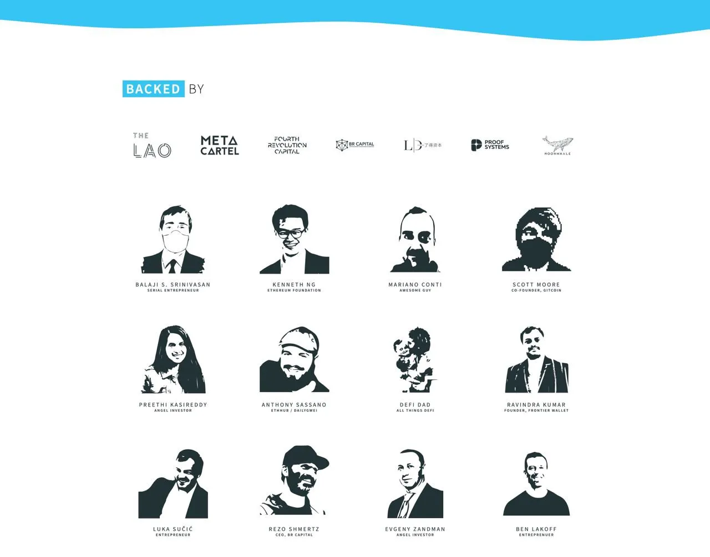

import { ImageText } from '@site/src/css/SharedStyling';

<!--truncate-->

[Ethereum Push Notification Service](https://epns.io/) (EPNS) Founder and Project Lead, [Harsh Rajat](https://twitter.com/harshrajat), and Co-founder, [Richa Joshi](https://twitter.com/Riijo), joined Decentralized Club community on 5th February 2021 for a live AMA session on their telegram group. We were asked some really awesome and interesting questions. Here’s our recap.

**_Date_**_: Friday, 5th February, 2021  
_**_Time_**_: 12PM UTC_

✔️Introduction with EPNS : 👉
=============================

| DK | 🌿 | Never PM/DM First 🐞 Decentralized Club:  
First question of Introduction :

Q1. Can you provide a brief introduction to the core team behind EPNS?

Harsh | EPNS:  
Awesome! I mentioned my intro above owing to the excitement but here it is again 😅: I am Harsh, Founder and Project Lead of Ethereum Push Notification Service. Some background about me, I love dabbling in all things tech; and have been fortunate enough to have the support from the awesome Ethereum and blockchain community to have been given the chance to create/change the communication layer for Ethereum and Web3 which we like to call as The Missing Piece of Web3.0

| DK | 🌿 | Never PM/DM First 🐞 Decentralized Club:  
Very Impressive👍👍

Richa | EPNS 📨 | won’t DM first:  
I am the co-founder of Ethereum Push Notification Service (EPNS). I wear multiple hats at EPNS though am focused on mostly Marketing, Growth and Product. Stoked to be #BUIDLing World’s First Decentralized Notification Protocol. Looking forward to some awesome questions.

EPNS Journey so far: We have had an awesome journey! Ideation and loads of research were taken to Ethereum Foundation -> EthGlobal HackMoney 2020 where we build POC -> selected for IDEO PVD -> selected for Gitcoin Kernel fellowship and came out as top 20 projects! -> entered Gitcoin Grant round 7 (top 5 projects / 210+ contributors) which led us to raise our seed!!!

Really happy and grateful to share that we recently completed our seed round and were honored to get backing from notable web3 leaders including Balaji Srinivasan (Fmr CTO of Coinbase, General Partner at a16z. Cofounder of Earn, Counsyl, Teleport), Kenneth Ng (Ethereum Foundation), Scott Moore (Co-founder, Gitcoin), Mariano Conti (Fmr Head of Smart Contracts, MakerDAO), Anthony Sassano (EthHub / TheDailyGwei), DeFiDad (COO, Zapper), Ravindra (Frontier Wallet), Preethi Kasireddy (Fmr Partner at a16z), Auryn Macmillan (Gnosis), TheLAO, MetaCartel VC, BR Capital, 4RC and several more awesome peeps!

So, yeah, we had an amazing time so far and I think it was all due to the community love and support for which we are forever grateful and indebted 🙏!

You can learn more about our team, Advisors and very awesome Investors and backers on our website [epns.io](https://epns.io/)

thank you ☺️

| DK | 🌿 | Never PM/DM First 🐞 Decentralized Club:  
Amazing👍👍

You’re welcome😉

Ok, can we go on to next question🙋?

Richa | EPNS 📨 | won’t DM first:  
Done

| DK | 🌿 | Never PM/DM First 🐞 Decentralized Club:  
Next question🙋

Q2. Can you talk a bit about what services does EPNS offers and how customers can subscribe to it ?

Richa | EPNS 📨 | won’t DM first:  
Ethereum Push Notification Service (EPNS) in its core is a decentralized communication protocol that enables any smart contracts, dApps or even traditional services to send notifications to wallet addresses… as long as those wallet addresses have opted in to receive them from a particular service.

There is also a DeFi aspect to the protocol that is used to enable incentives or passive earnings for the users along with receiving these decentralized notifications.

how customers can subscribe to it ?

Being a communication middleware, users have to visit [https://app.epns.io](https://app.epns.io/) and subscribe (opt in) for notifications from a channel (services that want to send notifs). The next step is receiving those notifs for which users can download our iOS or Android app and they are ready to go! (check out [https://epns.io](https://epns.io/) for relevant links).

Dropping the teaser cause we worked really hard to make it: [https://www.youtube.com/watch?v=kwwnlmUpRsk](https://www.youtube.com/watch?v=kwwnlmUpRsk)

| DK | 🌿 | Never PM/DM First 🐞 Decentralized Club:  
Amazing 😎 It shows a lot of transparency

Richa | EPNS 📨 | won’t DM first:  
🙏

| DK | 🌿 | Never PM/DM First 🐞 Decentralized Club:  
Next question :

Q3. Can you throw some light to how many subscribers are currently utilizing EPNS services and what’s their feedback ?

Harsh | EPNS:  
We are currently live on ropsten as an alpha and users can subscribe to their favorite channels and get live notifications! We have over 500 users on the protocol and counting!

Some of the awesome channels we currently have (channels are services sending notifs to their subscribers) are Wallet Movement Tracker, ETHGas Tracker, ETH/BTC Price, ENS Domain Expiry and more are coming soon! All of them getting delivered pseudo anonymously to a user wallet address just like how web3 communication should be :).

Feedback is awesome, services wanted this on web3 for a long time and users are now able to get notifs which we all have come to love and rely upon when we do anything virtual!

| DK | 🌿 | Never PM/DM First 🐞 Decentralized Club:  
Cool 😎

Last question of introduction :

Q4. What is further planned for EPNS in 2021 ?

Richa | EPNS 📨 | won’t DM first:  
We have loads of awesome features planned for 2021 and beyond ⚡️. The main ones include TGE, and of course Audit and Mainnet. Loads of incoming features L2 intgeration. A detailed roadmap is in progress and will be shared very soon on our tg channel ([https://t.me/epnsproject](https://t.me/epnsproject))

| DK | 🌿 | Never PM/DM First 🐞 Decentralized Club:  
Thank you [@harshr](http://twitter.com/harshr) [@RJlwl](http://twitter.com/RJlwl), super insightful and very easy to understand.

🐧 Community ask Questions by Twitter ✔️
========================================

| DK | 🌿 | Never PM/DM First 🐞 Decentralized Club:  
Twitter question no 1.  
Username : [@Wormz28](http://twitter.com/Wormz28)

How can you say or believe that almost any application in the Web3 ecosystem can benefit from notifications? Can you give some of the highest-impact immediate opportunities in using a DECENTRALIZED PUSH NOTIFICATIONS?

Richa | EPNS 📨 | won’t DM first:  
Communication from services to the users has been a game changer since notifications were introduced in 2010. If you think about any web2.0 interaction you have in the virtual life, chances are that it began with notifs. For instance: even this TG AMA is getting to many users through notifications! There are many more examples: like the payments you make, your social media interactions, any application you are on and even your facetime calls and messages, they all rely on notifs to get to you!

Contract this to web3 and you start seeing the importance of communications, the lack of it causes so many pain points including your loans getting liquidated, governance proposals getting missed, ENS domains getting expired, staking rewards getting missed, security audits not reaching the users and many many more!

In essence, a lot of innovative products are being deployed on Blockchain & Web3 especially when it comes to DeFi but they all still face the issue of not being able to communicate with users directly. This tends to be a huge barrier for mainstream adoption, and for customer retention and engagement rates.

Even in DeFi alone, we see these to hugely benefit from notifications:

\- Near Liquidation Alert (Borrowers & Liquidators),  
\- Staking Rewards Available to Claim (Stakers),  
\- Staking Rewards About to Expire (Stakers),  
\- Price Alerts (Traders),  
\- Stablecoin Peg Slippage (Arbitragers),  
\- Low Gas Cost (Devs, ETH Power Users),  
\- Rebalances (Token Set Users),  
\- Index Selection/Weighting Changes (Index Users),  
\- Token/Contract Migrations (Protocol Users),  
\- Governance Updates, Token Launches,  
\- New Collateral Types on Money Markets,  
\- New Liquidity Mining Incentives,  
\- Yield Farming APY alerts,  
\- Escrow Periods Ending / Tokens Coming Unlocked

| DK | 🌿 | Never PM/DM First 🐞 Decentralized Club:  
Twitter question no 2.  
Username : [@RahulJayaraj9](http://twitter.com/RahulJayaraj9)

Innovation, development, value, from those three things which part do you prioritize the most? And can you explain the reason?

Harsh | EPNS:  
This is tricky for a startup to answer! It really depends on phases imo. At the start, innovation is definitely needed otherwise you aren’t really solving a problem. Though right after, you have to do development but in the start you have 1000 things to develop and of course that means picking those development tasks that can drive higher value. This is not to say that the other dev tasks won’t be done but as I said, all of three of these play a huge part though at different phases of a start up cycle. I think currently we are at the value phase.

| DK | 🌿 | Never PM/DM First 🐞 Decentralized Club:  
Twitter question no 3.  
Username : [@ShaneNane707](http://twitter.com/ShaneNane707)

Liquidity, transaction fees and delays are always important factors in financial services. How does EPNS solve the above problems to attract users?

Harsh | EPNS:  
Awesome question and one of the reason for EPNS to exist. For transaction fees, we already are working on L2 and that should take care of scalability and fees unless a mainnet contract wants to send notif (in which case, having 0.1% higher fees for including alerts shouldn’t be an issue). For Liquidity, I am not sure whether it’s related to us as we are a communication middleware with DeFi aspect and not a DeFi protocol :).

Harsh | EPNS:  
Done!

Richa | EPNS 📨 | won’t DM first:  
And to add -: EPNS forms a critical piece of web3 infrastructure. Imagine new liquidity pools being created on Uniswap or ethereum gas fees coming down or any new / emergency Governance proposal coming up (remb YAM!!). EPNS can ensure communicating such time critical and financial impact updates and news to the users.

DONE

🌍 Community ask question by Website 👨‍💻
==========================================

| DK | 🌿 | Never PM/DM First 🐞 Decentralized Club:  
Website question no 1.  
From : Sunidhi Jena

How can a user control what notifications he needs in EPNS ?

Richa | EPNS 📨 | won’t DM first:  
Yes! we understand the problem users face when it comes to unsolicited and spam notifications 😅. We actually thought a ton about it and there are a couple of ways by which we mitigate the issue (everything happens on protocol 😊):

1) Users have to opt in to receive notifications from the service first before they can start communicating. This ensures that users are always in control, if they unsubscribe, there is no way for a service to add to them.

2) To ensure that a service doesn’t turn malicious later on, we attach a Spam Score to them as well which is adjusted by both positive (higher number of subscribers, the passage of time, etc) and negative (unusual number of notifications, a higher number of unsubscribes, etc) actions. This score when it crosses a certain threshold activates the protocol throttle mechanism which is a way to penalize services a bit at first and if they don’t stop then making the throttling go high thereby ensuring that it’s always in the best interest of services to not spam their users.

We are also planning verified badges in the future to ensure that while everyone can create a channel and everyone can opt-in, there is a distinction between spammy channels and verified ones.

| DK | 🌿 | Never PM/DM First 🐞 Decentralized Club:  
Website question no 2.  
From : Samuel lux

Is there a certain credibility system assigned to a subscription service using which we can understand if it’s spam or legit ?

Harsh | EPNS:  
hehe, I think Richa covered this in the first questions itself :D. In short, we attach a spam score as described above to throttle notifications from the protocol itself in case a service starts spamming the users. The last option being removing the service through our on-chain governance. This combined with user always in control ensures that it’s in the best interst of the service to stay complaint!\\

| DK | 🌿 | Never PM/DM First 🐞 Decentralized Club:  
Website question no 3.  
From : Annayna Bhakta

How did you came up this project idea ?

Richa | EPNS 📨 | won’t DM first:  
The genesis of the idea was when we sat down to observe what, if any pain points still exist in the way blockchain apps (dApps / smart contracts / services) that we can solve. We were quick to realize that something felt a bit odd and narrowed it down soon to how Web3 tech behaved a lot like the early days of the internet.

Think 2004ish when GMail was launched and changed inboxes forever. At that point of time, the internet was still growing and services offered there behaved exactly the same way it does so in Web3 right now. For instance, you as a user were expected to login to the mailbox to check the email, reply to friends / work and then come back to it sometime and rinse and repeat. If you were the trendy one back in those days then maybe you went to myspace and orkut as well! But no matter the service, you were always going back to check on your actions.

This drastically changed with notifications in 2010. All of a sudden, services began to reach out to users whenever an action was required from their end, it increased engagement rate to 7x and massively improved user experience. Notifications have been so engraved into our lives now that we hardly realize most of our online actions are caused by them, think about it, whatsapp, facetime, emails, payments, games all inform you now. You don’t go back to them to check it out.

Contrast this experience with any dApps, smart contracts or services you interact with on web3. There’s no way to inform users(wallet addresses) any time an important event occurs, instead, the user is assumed to go back to the service time and time again to check their activity. For instance, Liquidation on AAVE, Compound or any DeFi, DAO Governance proposal (Yam!), or ENS / dEx orders. Each of these are a reality right now but no solution exists to address them and the problem will only worsen as more services come to Web3.

This was the moment that we realized that this stone age era of communication in blockchain needs to go…you are not foreclosed by your bank without proper notices that reach you, but DeFi while enabling awesome use cases does that to you ohh so often and we wanted to fix that. With this new found observable knowledge, and the destiny which led us here from being a mobile app entrepreneur in 2010 and seeing the transformation notifications had, we kind of understood that this is what we are meant to create and thus Ethereum Push Notifications Service (EPNS) was born.

✍️ Telegram live Questions answered by EPNS ✔
=============================================

Kop:  
🚩Q.Many projects rug pulled and exit scam recently. Why should investors trust your project not to do the same?

Harsh | EPNS:  
4️⃣ That’s a great question! I would suggest all investors to really not trust anyone and instead to their own research! Crypto being the wild west, it is essential for anyone to dig around before investing! The same applies for our project as well :). Having said that, in addition to doing your own research, some of the ways by which we can be vetted are:

\- By looking at our investors list which includes some notable web3 leaders and then ensuring that these investors have indeed spoken about us  
\- By looking at our vesting schedules and vesting contracts which will be available soon to ensure that we can’t rug pull even if we want to  
\- By asking questions and looking at whitepaper to make sure that it makes technical sense  
\- And lastly, by trying the app / protocol out to ensure that the tech is real and not hog wash

Though I would again re-iterate that these are some of the ways that we can suggest, in the end, you as a user needs to come up with many many more before you can be sure so always always ensure that you are doing your own research!

Richa | EPNS 📨 | won’t DM first:  
3️⃣ [@Randy0061](http://twitter.com/Randy0061)  
Q: EPNS uses a loan to AAVE to generate interest that is distributed among the subscribers of the service. Percentage-wise, how high is this interest? Are there other incentive protocols that you will employ to entice more users to use EPNS PUSH notifications?

While designing the EPNS decentralized notification protocol we wanted to design a WIN-WIN scenario for both the Users (receivers of the notifications) as well as Services (senders of the notification). Our protocol requires a service to activate themselves before they can send notifications, this is a one time step and the activation requires deposit a one-time stake fee.  
This stake fee is then automatically lend out to AAVE protocol and starts generating interest. This generated interest is then distributed to the subscribers of the channel (service) in a weighted fashion thus making the notifications incentivized for the users 🙂  
In future, we may employ other protocols as well.

Harsh | EPNS:  
2️⃣ It’s going to be $PUSH which is governance and reward share token. We are heavy believers of game theory and believe in win-win for everyone in the ecosystem and the token is designed to enable that as well!

$PUSH will enable users to govern the protocol, handle game theory between all our participants, and… 🥁🥁have reward/pool sharing built into it so every player wins!!

We will also have liquidity/usage mining that will reward participants among several other use cases.

They are incoming and not yet out… we will have an announcement on it pretty soon 😊

Richa | EPNS 📨 | won’t DM first:  
1️⃣ [@Naia999](http://twitter.com/Naia999)  
What is business model of your project? How it works? and  
Who are your potential customers and which markets are you targeting on?

We are big fans of game theory and ensuring win-win for all actors involved in the ecosystem. This ideology along with building the world’s first decentralized notification protocol meant that we can get creative with our business model which is what we went ahead and did, that is created a business model that supports and rewards all 4 participants of our ecosystem:

Services that send notifications: They are rewarded in our governance token $PUSH which is rewarded based on the verified number of user wallets that have subscribed to receive their notifications. This ensure that we not only attract official services (AAVE, Compound, ENS, etc) but also third party developers who have the ability to create useful notifications for the Web3 ecosystem as they are also incentivized to do so

Users who receive notifications: We wanted this to be a user centric protocol at it’s very heart, this means that the protocol values users a lot, this means that the user have a lot of win win scenarios including receiving notifications from the services, getting passive income from receiving notifications, rewarding them in tokens for active ecosystem participation, rewarding them for participating in governance and then some more.

Infrastructure / User wallets showing notifications: Our end vision is to have user wallets and any end point that serves as an entry point for Web 3 to start supporting notifications and EPNS protocol. For that, our governance system will ensure a perpetual split in the fees for these as long as they can get the governance proposal passed via on-chain governance. The fees segment is collected and distributed via the protocol and will be borne by the services in future as micro fee per notification, monthly or yearly subscription.

Governance Token Holders: The token holders essentially control the core features of the protocol and decide the way forward, for which the protocol rewards them the most by ensuring that they are rewarded for their efforts and are incentivized to balance the protocol. The rewards to token holders are dis in $PUSH tokens which is converted a part of the fees and thus can be really creative in our business model which is what we did exactly.

The DeFi characteristic of the EPNS protocol incentivizes users to earn rewards. The protocol has $PUSH , a non-refundable functional utility token designed to reward users for continuous involvement and engagement in the adoption of the protocol and to achieve the vision of becoming web3 notification standard. $PUSH will be used as a medium of exchange to interact on the protocol. The token is necessary to vote on the features of the protocol. The protocol fees are charged in $ETH or $DAI within the EPNS protocol, but the $PUSH token holders may vote to change these fee parameters.

As we are a decentralized protocol, the markets are global and decentralized as well 🙂

Edited by : 🌿DK✍️
==================

You can stay update to date and learn about EPNS through the following channels, please join us at.

**EPNS Telegram** [https://t.me/epnsproject](https://t.me/epnsproject)

**EPNS Twitter** [https://twitter.com/epnsproject](https://twitter.com/epnsproject)
