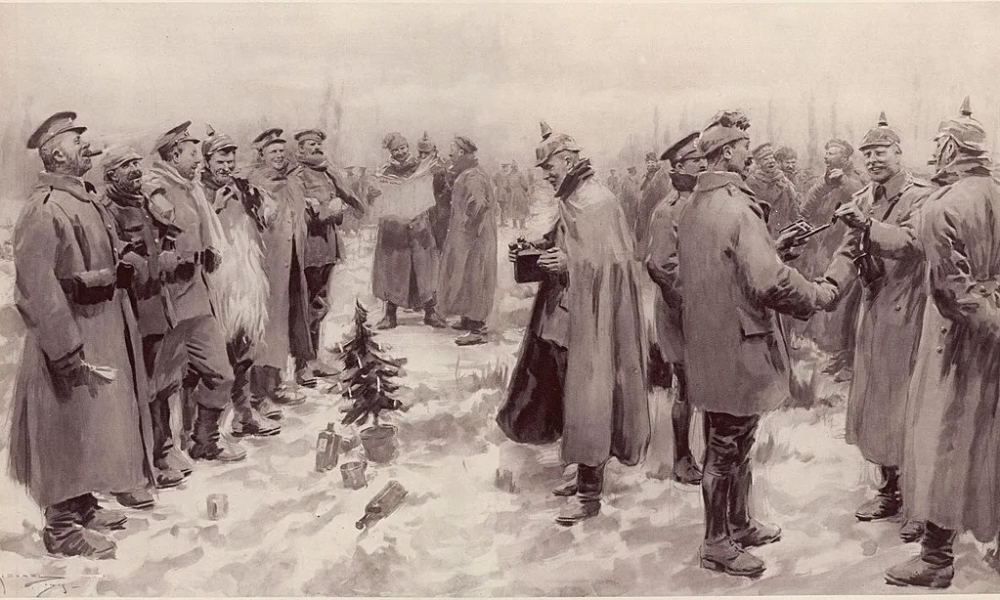
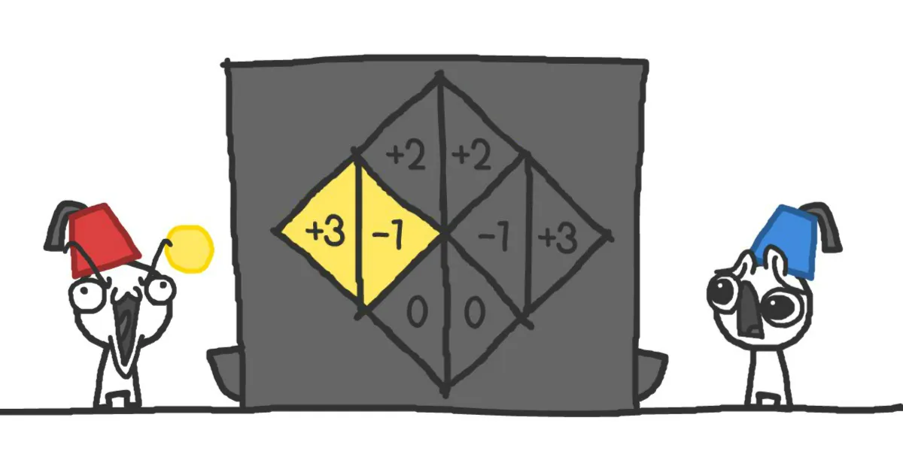

import { ImageText } from '@site/src/css/SharedStyling';

<!--truncate-->

Game theory history and decentralization!!

Game theory is the study of rational behavior in situations involving [interdependence](https://www.intelligenteconomist.com/game-theory/#:~:text=Game%20theory%20is%20the%20study,rational%20individuals%20who%20behave%20strategically.&text=For%20an%20individual%20to%20decide,others%20are%20going%20to%20act.). It is a formal way to analyze the interaction among a group of rational individuals who behave strategically. In the simplest of terms, game theory refers to people making rational decisions based on the given information or situation at hand. The concept of game theory can often be confused with general logic and logical reasoning, but it is based on pure mathematics and has applications in any domain where people interact or coordinate with each other, even in business. Initially developed in 1944 by mathematics genius John von Neumann and economist Oskar Morgenstern in their book _Theory of Games and Economic Behavior,_ game theory was recognized as one of the greatest scientific achievements of the century, as it provided a systematic way to understand the behavior of players in situations where their fortunes are interdependent.

It originally addressed zero-sum games, in which one person’s gains result in losses for the other participants. This can be easily visualized in a game of poker — any profits gained by a player in a game is caused by the loss of the other players playing in that game.

# **The (bizarre) Christmas Truce of 1914**

One of the most historic showcases of game theory was the Christmas Truce of 1914. In 1914, during the First World War, an unofficial truce was declared on Christmas Eve among the men in the trenches from both the rival sides.

In some places, men from both sides of the war ventured into no man’s land on Christmas Eve and Christmas Day to mingle, exchange food and souvenirs, and even play with each other all in the spirit of Christmas.

This event in history was later dubbed to be **_‘_**[**_The Christmas Truce_**](https://www.vox.com/2014/12/25/7448471/christmas-truce-1914)**_’_**.

In this situation, the incentive for soldiers on both sides of the war was that **if everyone cooperates** they could celebrate for a day without any worries, with no discrimination and live a day with no sorrow and acknowledge each other as fellow human beings. A **win-win situation** for all parties involved.

The **penalty** being, not following rules and not cooperating would result in being holed up in trenches and keeping a watch on the enemy throughout this festive day.

One could easily visualize this as below:

The soldiers know that if they disregard the truce and initiate a **_“surprise attack”_** they could possibly do lots of damage and gain a significant advantage (_as denoted by the top-right and bottom-left cells_), but they also realize that if the other side also is prepared for an attack, **nobody wins** and Christmas would be just like any other day during the war. To them, the optimal solution, in this case, would be to go through with the truce and ensure a win-win situation for all parties involved and have a jolly Christmas.

Although this agreement deteriorated slowly in the following years as the war got more aggressive, the Christmas Eve of 1914 shows us how a simple consensus for peace and happiness and celebrating humanity even for a day can be rationalized.

# **Game Theory in Blockchain and Decentralized Technology**

The goal of game theory for blockchain systems and protocols is to build networks that need no oversight by modeling and predicting human reasoning and yet have positive outcomes for the greater good. This is done with the help of coordination games or by achieving a Nash Equilibrium in a non-zero-sum game, and by aligning stakeholder incentives in such a way that any action that they perform for their **self-gain** would result in the **gain of the entire system at large.**

Coordination games are strategic games with multiple Nash equilibria. Nash equilibrium (named after John Forbes Nash Jr.) is an outcome of a strategic game in which none of the participants wants to change their choice of actions, given the actions of the other players. In other words, each player plays a best-response strategy by assuming the other player’s moves. In the Nash Equilibrium, each player is assumed to know the strategies of the other players, and no player has anything to gain by changing only their own strategy.

Let us first explore what economists actually consider as a **_game_**.

A game according to an economist — [_as explained by Dr. Stephanie Hurder_](https://medium.com/prysmeconomics/nash-equilibrium-and-blockchain-d6a6f47a7a37) — satisfies these criteria:

1.  A game must have 2 or more players
2.  Each participant is going to choose among several actions available to them.
3.  The goal of each participant is to choose the action or mix of actions that maximize their payoffs.
4.  Each participant’s choice of action determines the payoff that he/she gets in the game and the payoffs of the other participants in the game.
5.  All participants choose their actions in isolation, and their choices are only revealed to each other after all choices are made.

When a participant is playing a game, their payoff-maximizing choice depends on what they believe that the other participants will do, and knows that their choice will affect the optimal choices of their opponents.

Here, a payoff can be anything that can be represented by numbers — revenue, profit, tokens, or anything else that the participants would prefer to have more of.

Blockchain, by being decentralized, becomes a **collaborative technology** that thrives on coordination and collaboration of participants in the network, who are themselves driven for their self-gain but also by doing so contribute to the overall success of the network. An example of this is evident in Bitcoin. Bitcoin incentivizes miners to use their computing power to secure the network by rewarding them with bitcoins — this is an economic incentive. Bitcoin makes mining intentionally difficult and inefficient, thus making it costly for malicious actors. In this way, it makes sure that the miners do not deviate from protocol and hence makes the network more secure.

This game-theoretical thinking of promoting good behavior and punishing bad exists in daily life, as we’ve built societies to reward work that we value and deter behavior that we don’t. Hence, game theory plays a very important role in governing decentralized protocols and ensuring that all participants in the network act for the benefit of the protocol.

# **The Game Theory in EPNS**

EPNS has designed its protocol in such a way that the incentives are aligned for all participants in the network, which makes its governance effective, and self-sustaining for the long run.

The game theory of governance is designed keeping in mind all participating users of the EPNS ecosystem. The more users the protocol has, the more services will come leading to an increase in fees pool and rewards leading to a direct impact on the token utility as the token is intrinsically linked to protocol growth, being a key medium of exchange for all activities occurring thereon.

As mentioned in the [_Ethereum Push Notification Service (EPNS) Whitepaper_](https://whitepaper.epns.io/), **$PUSH** tokens, the **protocol’s native governance tokens** are used to control various core functionalities of the protocol. The fees are charged in **$ETH** or **$DAI** within the protocol but the control to change the various fees lies with the governance token holders.

All fees collected from the EPNS protocol usage forms the **Fees pool** and will be distributed in the following proportion:

**30%** for the Ecosystem development pool

**Ecosystem development pool (EDP)** = **x%** for Integration partners pool

**y%** for Future integration reward pool

Where **x%** \+ **y%** \= **100%** of **EDP**

The incentive layer of the EPNS protocol is designed as follows for the different ecosystem participants.

1.  **Service Providers** ​are already incentivized to send notifications as it brings them on par with the web2 experience, and with platform-agnostic and incentivized notifications, we can even go ahead and state that EPNS betters the current notification game of web2 / centralized. The subsection of this will also be ​**vendors** ​who are third party developers that will be creating channels to capitalize on liquidity mining.
2.  **Users**​ are incentivized as they want to receive notifications related to payments, DeFi, gaming, or service​ ​on web3. As can be seen by traditional services (web 2) and the rampant use of notifications to drive engagement which is working and has become a part of all of our daily lives. Users also benefit by ​**receiving token incentives from notifications** ​and by **universal delivery**​.
3.  **Wallets / Infra Services**

- **Existing Wallets / Services** ​are incentivized to continue performing as that ensures their perpetual share from the integration partners pool.
- **Future Wallets** ​are incentivized to integrate with the growing reward pool of **EDP**, ​as​ ​it gets higher over time as more fee flows in the protocol (as more and more notifications are sent). This creates an incentive for future wallets to consider integration to the protocol to claim this reward and also to move a proposal to have a perpetual share in the Integration partners pool.
- **Note:** ​The integration in turn drives more users to the protocol which drives more services and thus an increase in the fees pool which starts the cycle of future wallets integration again.

**Token Holders** ​are incentivized to keep and to pass the best proposal and keep core features fees competitive at the best rate possible as they gain the most of all the participating users are properly incentivized as it drives utility to the protocol and the usage of the protocol.

In this way, for EPNS — a decentralized notifications platform — game theory becomes very important in order to effectively align stakeholder incentives in both business and economical sense in order to enhance network effects and drive more users and services to the platform.

# **Takeaways**

Game theory is the study of rational behavior in situations involving interdependence. Blockchain, by being decentralized, becomes a collaborative technology that thrives on coordination and collaboration of participants in the network, who are themselves driven for their self-gain but also by doing so contribute to the overall success of the network. The goal of game theory for blockchain systems and protocols is to build networks that need no oversight by modeling and predicting human reasoning and yet have positive outcomes for the greater good. EPNS being a decentralized notifications protocol uses game theory in order to generate network effects and creates a win-win situation for all parties involved in the ecosystem, be it users, services, wallet providers, or token holders.

## **BONUS!**

If you made it this far and would like to learn more about how game theory works, check out this game — The Evolution of Trust ( [https://ncase.me/trust/](https://ncase.me/trust/) ) — that explores how different personalities and relationships of trust can create different outcomes in different games, and also it illustrates how important it is to align incentives in such a way that we create a win-win situation for all. Shoutout to Gitcoin [Kernel](https://www.notion.so/What-is-KERNEL-b9520eb29d954f5fb709150cae3975b1) for original share of this awesome game!!

