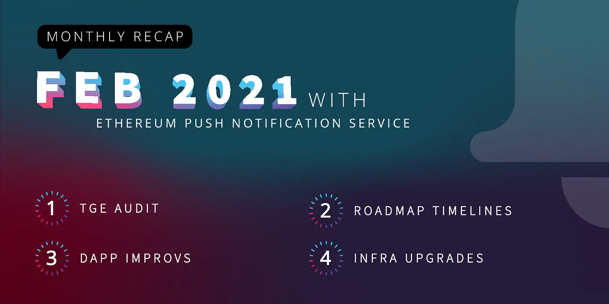

import { ImageText } from '@site/src/css/SharedStyling';

<!--truncate-->

This February has certainly been another exciting month in the crypto space in so many ways! And for EPNS it has not been different, let’s take a look at what our team has been up to.

# **Token Generation Event & Roadmap**

We are getting closer to the big moment: the Token Generation Event.

Our team is working hard with advisory from great mentors and collaborators to ensure our tokenomics is sound, and our incentive mechanisms are on point to grow a healthy and successful ecosystem. Contract auditing is just around the corner!

We are parallelly finetuning our roadmap to come up with the most accurate timelines to set the right expectations for our community, starting with Q2/2021 and until the end of year and beyond!

We will make a formal announcement with dates and conditions in the next weeks…📢

**Important**: Please beware of scams. The token contract address will **only** be published in the [official EPNS Telegram](https://t.me/epnsproject) group and other official channels. When in doubt, please reach out to us on [telegram](https://t.me/epnsproject) or through other official means on the [website](https://epns.io/).

# **Product Updates**

These are some other activities that have been keeping our development team busy this month.

**A One-stop-shop Development Environment**

Our [Staging](http://staging-app.epns.io/) environment is where a lot of the magic occurs. We added quick access to resources that users might need to interact with our dApp.

- DAI minter
- Ropsten Faucets
- Links to download the App (Android & iOS)
- Quick access to documentation material

This is now deployed in [production](https://app.epns.io) as well!

Check out a fully functional, raw designed Feedbox now!!!

**Tooling & Infrastructure**: As we mentioned with the previous edition, one of our main goals over this year has been setting up a solid foundation that allow us to scale and adapt quickly to emerging trends and technologies.

- Added internal monitoring for wallets.
- Alerts and thresholds for infrastructure events
- Still developing more on our Subgraphs and SDKs.
- Adding efficient pagination mechanisms to improve performance.

**Documentation**: this month a good amount of our time was invested in creating very detailed documentation about our Showrunners Channels infrastructure. This documentation will be made public in the near future, and will be announced [official EPNS Telegram](https://t.me/epnsproject).

# Community Updates

We have to start by thanking our community for the great feedback and interest we have received. All opinions count and help us shape our product.

Our highlights for February 2021:

- **Conferences**: [ETHDenver & Colorado Jam](https://www.ethdenver.com/), Our co-founder Richa Joshi spoke on “[How we got here: What is Ethereum Push Notification Service](https://www.youtube.com/watch?v=Rv8KLiWsGQA)” and founder Harsh Rajat presented “[Game Theory in DeFi](https://www.youtube.com/watch?v=A0gM252wu9A)”. Harsh Rajat presented at Gitcoin Kernel Block-2 “[Leveraging KERNEL: Community Growth](https://www.youtube.com/watch?v=mTfN9DqSNiU&feature=youtu.be)”
- **Podcast :** We discuss about Decentralized Notification Protocol and so much more in the [DEFI TIMES](https://podcasts.apple.com/de/podcast/defi-times/id1541829695?i=1000507084479) and [EpiCenter](https://epicenter.tv/episodes/377) Podcast.
- **AMAs:** [Decentralized Club](https://medium.com/ethereum-push-notification-service/ama-with-decentralized-club-7f852c9dd4a1) , and Generation Crypto.
- **Blog posts**: this month we talked about [Why Game Theory is the most important thing in a Decentralized Notification Protocol](https://medium.com/ethereum-push-notification-service/why-game-theory-is-the-most-important-thing-in-a-decentralized-notification-protocol-c407bf97ff46), and also about [The importance of EIP-1559 for the future of Ethereum](https://medium.com/ethereum-push-notification-service/what-is-eip-1559-why-is-it-important-for-the-future-of-ethereum-f0c0cb174c37). Check them out!
- Twitter growth metrics (Feb): 1901 new followers (9119 followers)
- Telegram growth metrics (Feb): 338 joined (2246 members)
- Top engaged tweet (Feb):

<iframe src="https://cdn.embedly.com/widgets/media.html?type=text%2Fhtml&amp;key=a19fcc184b9711e1b4764040d3dc5c07&amp;schema=twitter&amp;url=https%3A//twitter.com/epnsproject/status/1358719341596844036&amp;image=https%3A//i.embed.ly/1/image%3Furl%3Dhttps%253A%252F%252Fabs.twimg.com%252Ferrors%252Flogo46x38.png%26key%3Da19fcc184b9711e1b4764040d3dc5c07" allowfullscreen="" frameborder="0" height="721" width="680" title="JavaScript is not available." class="eo n ff dy bg" scrolling="no"></iframe>

Things are moving hyper fast for EPNS! We are uber- excited about all the upcoming events & milestones that we have been working on — starting with our Token Generation Event and much more surprises 👀

That’s it for this month!

Thanks for reading!
