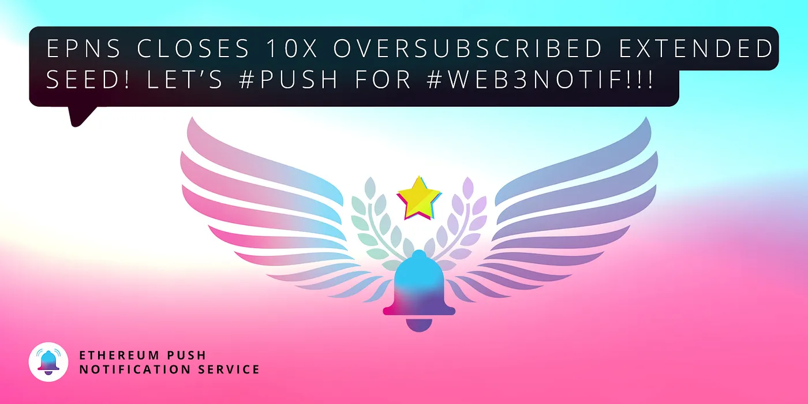

import { ImageText } from '@site/src/css/SharedStyling';

<!--truncate-->

> Ethereum Push Notification Service (EPNS) is honored to announce an extended seed investment round from top blockchain VCs and angels.

Today, we’re excited to announce the closing of our extended seed round of $660k USD at a valuation of $12 Million USD. The 10x oversubscribed fundraising was exceptionally well received and the EPNS team is humbled and grateful for the continued support!

We are ecstatic to share the amazing roster of strategic VCs who joined our seed investors, including [**True Ventures**](https://twitter.com/trueventures), [**Binance Labs**](https://twitter.com/BinanceLabs), “**Mysterio”**, [**IOSG**](https://twitter.com/IOSGVC), [**Bixin**](http://bixincapital.com/), [**Bitscale**](https://bitscale.capital/)**,** [**LD** **Capital**](https://ldcap.com/)**, and** [**BR** **Capital**](https://twitter.com/brcapital_fund), [**M6**](https://momentum6.com/), [**LinkPad VC**](https://twitter.com/linkpadvc) along with prominent industry leaders [**Sandeep Nailwal**](https://twitter.com/sandeepnailwal) (Co-founder, [Polygon](https://twitter.com/0xPolygon)), [**Ajit** **Tripathi**](https://twitter.com/chainyoda) (Head of Institutional Business, [Aave](https://twitter.com/AaveAave)), [**Kaito**](https://twitter.com/CoffeeTimesTW) (Founder, [Webshake](https://twitter.com/WebshakeHQ) and Bspeak Capital), [**PareenL**](https://twitter.com/PareenL) (AVP-Marketing, WazirX).

Back in December, we raised our [seed investment](https://medium.com/ethereum-push-notification-service/ethereum-push-notification-service-successfully-raises-750k-usd-in-seed-round-bec41eadd84d) with over 25 exceptional Web3.0 leaders and crypto funds, including [**Balaji** **Srinivasan**](https://twitter.com/balajis) (former Coinbase CTO, a16z General Partner, Co-founder of Earn, Counsyl, Teleport), [**Kenneth** **Ng**](https://twitter.com/nkennethk) (Ethereum Foundation), [**Scott** **Moore**](https://twitter.com/notscottmoore) (Gitcoin Co-founder), [**Mariano** **Conti**](https://twitter.com/nanexcool) (former MakerDAO Head of Smart Contracts), [**Anthony** **Sassano**](https://twitter.com/sassal0x) (EthHub, TheDailyGwei), [**DeFiDad**](https://twitter.com/DeFi_Dad) ( Zapper.fi COO), [**Ravindra**](https://twitter.com/ravidsrk) (Frontier Wallet), [**Preethi** **Kasireddy**](https://twitter.com/iam_preethi) (former a16z Partner), [**Auryn** **Macmillan**](https://twitter.com/auryn_macmillan) (Gnosis), [**TheLAO**](https://twitter.com/TheLAOOfficial), [**MetaCartel** **VC**](https://twitter.com/VENTURE_DAO), [**Fourth Revolution Capital**](https://twitter.com/4RCapital), [**MoonWhale Ventures**](https://twitter.com/MoonwhaleBV)**,** and [more](https://medium.com/ethereum-push-notification-service/ethereum-push-notification-service-successfully-raises-750k-usd-in-seed-round-bec41eadd84d).

With our extended seed round, this group backing our vision to build the world’s first decentralized notification protocol now stands at over 35! To each one of them — thank you! The extended seed round will help us grow faster, and adds a variety of experience and strategic expertise that will help us build the communication pillar of Ethereum and Web 3.0.

Our extended seed investment happened through a private token agreement based on SAFT, giving away 5.5% of the (yet to be launched) governance token **$PUSH**.

> _“We aimed for investors who have defined Web 3.0. Each one of them has gone through the journey which we are embarking upon!” — Harsh Rajat, Founder, Ethereum Push Notification Service (EPNS)_

# **Deep Dive**

[**True Ventures**](https://twitter.com/trueventures) is one the most founder-friendly VCs out there. Their experience and expertise in helping build world class companies is something we’re lucky to have with us. With their workshops, access to resources, and a proud “true family” founder and partner network, we are learning so much from the team.

We’re very excited to have the support of [**Binance Labs**](https://labs.binance.com/), the VC and incubator arm of global ecosystem player [**Binance**](https://twitter.com/binance), which invests in and supports fundamental components of the Web 3.0 infrastructure as a whole.

[**IOSG Ventures**](https://twitter.com/IOSGVC) is helping us build a strong community in the China region and has already started introducing us to their portfolio companies.

[**Bixin Capital**](http://bixincapital.com/) is an amazing team that is always there to advise and brainstorm on a whole array of issues, from community- building in China, growth, token economics, and more.

[**Bitscale**](https://bitscale.capital/) has been helping us with marketing and community building strategies.

[**Sandeep Nailwal**](https://twitter.com/sandeepnailwal) is a force to be reckoned with! His “how may I help” attitude for everyone he comes in contact with is something we all love. He’s showered us with solid advice on making sure our journey is guided by his wisdom and experience running one of the most successful companies in this space.

We had an instant connection with [**Ajit Tripathi**](https://twitter.com/chainyoda) that led us down a rabbit hole of many beautiful coincidences. We are honored to have his expertise in decentralized finance with us.

We’ve been lucky to be working with [**Kaito**](https://twitter.com/CoffeeTimesTW) building our community and project awareness initiatives in Japan.

# What’s next?

> _“Extended seed is just one of the many milestones of 2021 that you’ll be hearing about. We can’t wait to share what’s up next.” — Richa Joshi, Co-founder Ethereum Push Notification Service (EPNS)_

And finally, we are very grateful to each one of you for your continued support in our mission to build decentralized notifications for Web 3.0. Decentralized Notification FTW 🚀🌕

Loads of 💖💖💖

Richa **+** Harsh

Stay in touch with Push! [Website](https://push.org/), [Twitter](https://x.com/PushChain), [Telegram](https://t.me/epnsproject)

**Important:** Please beware of scams. Any information including the token contract address will only be published as a pinned message in our [official EPNS Telegram group](https://t.me/epnsproject) (and our [announcement group](https://t.me/epnsprojectnews)) and other [official channels](https://epns.io/). When in doubt, reach out to us on Telegram or through [our website](http://epns.io/)!
