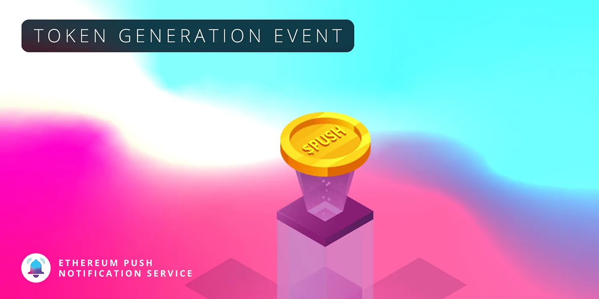

import { ImageText } from '@site/src/css/SharedStyling';

<!--truncate-->

> Note: EPNS has been rebranded to Push. The latest token design is available at [https://comms.push.org/docs/tokenomics/deepdive/$push/](https://comms.push.org/docs/tokenomics/deepdive/$push/)

Since we announced our seed round last fall, we’ve been heads down continuing to build the world’s first decentralized notification protocol for Ethereum. We’re fast approaching mainnet launch, so we’re taking the time today to explain to the community what they can expect for the $PUSH token generation event (TGE).

$PUSH is the native governance token for the EPNS protocol. $PUSH grants its owners voting rights over core functionalities of the protocol, in addition to revenue accrued as network fees. For notifications sent through the protocol, micro-fees are gathered from the service providers. Fees are distributed in a ratio of 70% for $PUSH holders and 30% for the ecosystem development pool. $PUSH governance can vote on fee structures and more.

The total token supply of $PUSH will be 100,000,000. The supply will be broken down across **community, investors, team, advisors,** and **foundation.**

# Community

53% of $PUSH supply is reserved for **community allocation.**

3% of the total supply is allocated for **strategic investment** during the early months and years of the protocol’s launch.

2.58% of the total supply is allocated for **public listings** during token genesis.

We also want to take this opportunity to say **thank you** to the wonderful community of early adopters and grantors who helped get us here today. To properly show our gratitude, we will be airdropping $PUSH to the following addresses:

1.55% of the total supply is reserved for **gratitude allocations** at the time of token genesis.

- 1.03% will be distributed to over 900 early users of the EPNS beta product (snapshot taken on March 20, 2021).
- 0.28% will be distributed to those who donated during Gitcoin Grants rounds 6 and 7; over 200 addresses.
- 0.24% is reserved for distribution through a community NFT activation immediately following token genesis. Stay tuned for more on this soon! 🎨🙃

5.51% of the total $PUSH supply is reserved for **LP Rewards and Staking.**

- For the 3.01% reserved for LP rewards, 35,000 will be unlocked every week, with 100 fewer $PUSH released every week (i.e. 34,900 released during week 2). This will continue for 100 weeks.
- For the 2.51% reserved for staking, 30,000 will be unlocked every week, with 100 fewer $PUSH released every week (i.e. 29,900 released during week 2). This will continue for 100 weeks.

# Investors

20.5% of the total $PUSH allocation is reserved for early **investors** of the protocol, divided among our [seed and extended seed rounds of investment](https://medium.com/ethereum-push-notification-service/epns-closes-10x-oversubscribed-extended-seed-round-ae03c60ae0f8).

Investor allocations are subject to a cliff and vesting period. 20% of investor allocation will unlock 3 months after the TGE, with the rest vesting over 21 months.

# Team

The **EPNS team** is allocated 16% of the total $PUSH supply. The founders are subject to a 12 month cliff after TGE, followed by a 48 month vesting period. The rest of the team is subject to a 9 month cliff after TGE, followed by a 48 month vesting period.

# Advisors

Our **advisors** have been allocated 3.5% of the total $PUSH supply. Our advisors joined us long before we got to this moment, and have graciously guided us along this journey, agreeing to push back their vesting periods to align with others. Our advisors are subject to a 6–9 month cliff, followed by a 12–36 month vesting period.

# Foundation

7% of the total token supply is reserved for the **Foundation**. The Foundation is a reserve of $PUSH that can be applied towards ecosystem developments, market making, protocol activations, and more.

The Foundation has a vesting period of 6–48 months.

# What’s next? What is the timeline?

The $PUSH TGE will happen soon! Shortly following the TGE, we’ll be launching EPNS on the Ethereum mainnet to bring decentralized notifications to all.

Follow us on [Twitter](https://twitter.com/epnsproject?lang=en) and join us on [Telegram](https://t.me/epnsproject) to stay up to date with TGE announcements and EPNS information.

## Disclaimer

⚠️ Everything related to $PUSH tokens, smart contracts and their addresses will be only available on official channels. EPNS team members will **NEVER** **DM** you ever about anything. Official channels are:

**Telegram Chat** [https://t.me/epnsproject](https://t.me/epnsproject)

**Telegram ANN** [https://t.me/epnsprojectnews](https://t.me/epnsprojectnews)

**Twitter** [https://twitter.com/epnsproject](https://twitter.com/epnsproject)
