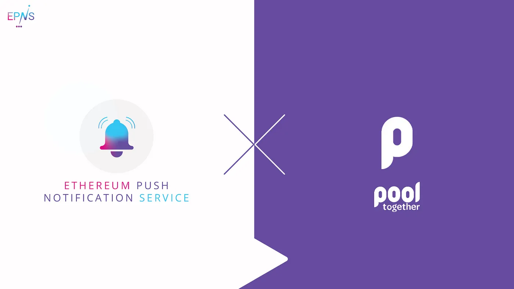

import { ImageText } from '@site/src/css/SharedStyling';

<!--truncate-->

Making DeFi simple and fun to learn for people is never easy. Ethereum’s most loved no-loss lottery, [PoolTogether](https://pooltogether.com/), does this both elegantly and in a fun way. PoolTogether combines principles of DeFi and Game Theory, and has had a big role in boosting adoption in the space. They single handedly gamified savings for the users and introduce zero loss lottery which we all know and love!

PoolTogether recently decentralized with the POOL token and in light of this, we’re proud to announce EPNS for decentralized notifications. This integration will enable us to to bring new frontiers for User Experience for PoolTogether users! Not only that, it will also help us to explore, understand and bridge any feature gap for the v1 of the EPNS protocol.

Our pilot program with PoolTogether will consist of:

*   Creating a channel for PoolTogether to notify their users on the prize pools. Users will get notified when they win in any of the four governance managed prize pools: DAI, USDC, COMP, and UNI.
*   Exploring and building notifications for various use cases.
*   Working with the PoolTogether team to enable technical discussions towards building a decentralized communication layer that is scalable and powerful for the whole of Web3.0.

PoolTogether is a clear example of **Game Theory** put into practice, and for us is a pleasure to work side by side with a team that reflects our same core principles.

_Save, Play, Notify!_

**About PoolTogether**
----------------------

PoolTogether is the world’s first open source, decentralized, and permissionless protocol for no loss prize savings. PoolTogether offers a gamified alternative for savings that will also allow users to participate in the governance of the protocol.

Stay in touch! [Website](https://pooltogether.com/), [Twitter](https://twitter.com/PoolTogether_), [Discord](https://discord.com/invite/hxPhPDW), [Medium](https://medium.com/pooltogether)
