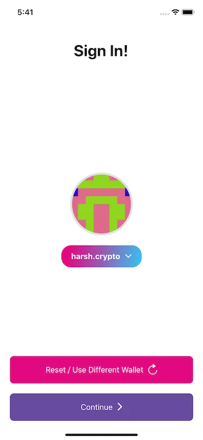
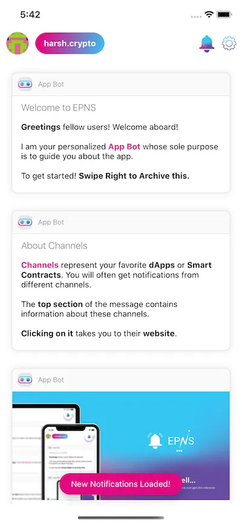

import { ImageText } from '@site/src/css/SharedStyling';

<!--truncate-->

Unstoppable domain .crypto domain support

We’re happy to announce our partnership with [Unstoppable Domains](https://unstoppabledomains.com/)! Ethereum Push Notification Service (EPNS) has integrated **.crypto** domains to the EPNS products (app and dApp) and will be working with UnstoppableDomains to explore various synergies between us in the future!

What’s the deal?
================

*   Using the EPNS protocol, any dApp, service or smart contract can send notifications to users (wallet addresses) in a platform agnostic way (mobile, tablet, web, fav. wallets, etc).
*   With [Unstoppable Domains](https://get.unstoppabledomains.com/epns/), you can replace any long wallet address with a domain name as simple as \[YourName\].crypto.
*   Enjoy receiving real time Web3 alerts to any activity related to your easy-to-remember blockchain domain!

Awesome! So how does it work?
=============================

*   In this example, using _harsh.crypto_, we will explore notifications delivered to one of the many platforms — EPNS mobile app.
*   Download EPNS app from [AppStore](https://apps.apple.com/app/ethereum-push-service-epns/id1528614910) or [Google PlayStore](https://play.google.com/store/apps/details?id=io.epns.epns).
*   Get your .crypto domain from [Unstoppable Domains](https://get.unstoppabledomains.com/epns/).
*   Sign-up for EPNS by using your new .crypto name (scan via QR code or enter .crypto wallet address manually).

Login using your .crypto public wallet address

*   Verify your .crypto domain name
*   Setup a passcode for app security

*   Enable FaceID, optional although it further improves the security and enables fast access.
*   Your setup is now complete.
*   Get ready to receive sweet sweet decentralized notifications on your .**crypto** domain! Yayyyyy!

How do I get a \[MyName\].crypto?
=================================

Follow [Unstoppable Domain’s Guide](https://community.unstoppabledomains.com/t/unstoppable-user-journey-purchasing-a-domain-claiming-a-domain-adding-crypto-address-to-a-domain/222) to purchasing a blockchain domain, claiming a domain, and adding a crypto address to a domain.

About Ethereum Push Notification Service
========================================

EPNS is a decentralized notification protocol that enables users (wallet addresses) to receive notifications. Using the protocol, any dApp, service or smart contract can send notifications to users in a platform agnostic fashion (mobile, tablet, web, user wallets, etc). The DeFi aspect of the protocol ensures that the user receives notifications and also earns from them.

Stay in touch! [Website](https://epns.io/), [Twitter](https://twitter.com/epnsproject), [Telegram](https://t.me/epnsproject), [Medium](https://medium.com/ethereum-push-notification-service)

About Unstoppable Domains
=========================

[Unstoppable Domains](https://unstoppabledomains.com/) is onboarding users to the decentralized web with easily-readable blockchain domain names that are the standard for sending & receiving cryptocurrency. They are pioneering Web3 by enabling decentralized websites that allow users to take back control of their data and digital identity. The company was founded in 2018 and is backed by Draper Associates and has received grants from the Ethereum Foundation.

Stay in touch! [Website](https://unstoppabledomains.com/), [Twitter](https://twitter.com/unstoppableweb), [Telegram](https://t.me/unstoppabledomains), [Medium](https://medium.com/unstoppabledomains)