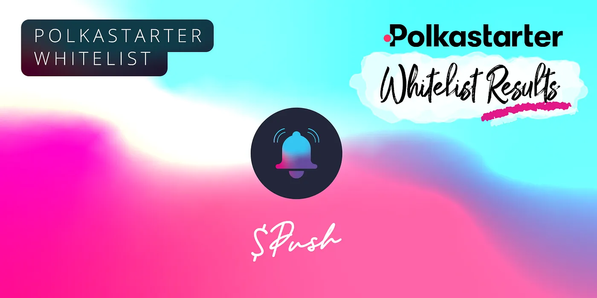

import { ImageText } from '@site/src/css/SharedStyling';

<!--truncate-->

The EPNS team is very grateful to our awesome community for their overwhelming response for EPNS Polkastarter IDO on April 13th 2021! The whitelisting process closed on Tuesday April 6th 2021 8AM GMT.

The EPNS Polkastarter Whitelist received **400,000+** 🤩 submissions. Bots, duplicate and fraudulent entries were removed from the whitelist, to ensure a fair process for all.

Emails have been sent to the whitelisted community members. Recipients must complete **KYC within 48 hours i.e.** no later than **Saturday April 10th, 2021 8AM GMT** or they will not be eligible to participate in the IDO. The email will be **only** sent from [polka@epns.io](mailto:polka@epns.io) to the shortlisted participants with further instructions and information related to KYC.

**WARNING**
===========

Please **beware** of **scammers** and **fake addresses**. All official communication will come from [polka@epns.io](mailto:polka@epns.io). [polka@epns.io](mailto:polka@epns.io) will **NEVER ask for funds.** Whenever in doubt please visit our [website](https://epns.io/) and the only official links of the project are present on the website. **$PUSH will not be available** until the Polkastarter IDO on April 13.

Next Steps
==========

*   Keep an eye out for an email **_only_**  from [polka@epns.io](mailto:polka@epns.io). Be aware of email “spoofing” and when in doubt, check your address [**against the confirmed whitelist**](https://docs.google.com/spreadsheets/d/1UICkgTxB5-X18KCbG845QVYqWWguTFmXyBtHqaKGea4/edit#gid=0) and be sure to check with our admins for any questions: [https://t.me/epnsproject](https://t.me/epnsproject)
*   There are 550 whitelisted individuals who need to complete their **KYC** no later than **Saturday April 10th, 2021 8AM GMT** of receiving the email. In case some participants do not complete the KYC on time, we may draw for other lottery participants to replace the spot.
*   KYC is mandatory in order to participate in the EPNS $PUSH Polkastarter IDO on April 13th 2021.
*   Please note that being whitelisted and completing your KYC is not a guarantee you will successfully participate in the Polkastarter IDO and purchase $PUSH. The IDO will be first come first serve from a limited whitelisted group.
*   For those that want to check whether they have a whitelist spot, they can check the following excel.

**Shortlisted participant list:** [https://docs.google.com/spreadsheets/d/1UICkgTxB5-X18KCbG845QVYqWWguTFmXyBtHqaKGea4/edit?usp=sharing](https://docs.google.com/spreadsheets/d/1UICkgTxB5-X18KCbG845QVYqWWguTFmXyBtHqaKGea4/edit?usp=sharing)

> **Update:** The first publication of this blog listed 550 whitelisted addresses. With the KYC response rate of the initial batch of whitelisted addresses, we have randomly whitelisted an additional 53 addresses and requested KYC. Additionally, we have verified 19 previously KYC’d individuals who requested to change their addresses, which have been added to whitelist sheet.

*   **For any KYC related issues** please contact our KYC support person by joining our telegram channel: [https://t.me/epnsproject](https://t.me/epnsproject) and DM our KYC Support Team (TG username): [@Keyur1203](https://t.me/Keyur1203)

We thank the community for your patience and participating in the whitelisting process.

We look forward to your continued support and love. You guys rock 🌟!!

Best & 💖,

EPNS Team

**Disclaimer**
==============

🚨 **WARNING** 🚨
-----------------

❗**Beware of scammers and fake addresses**❗

❗EPNS team members will **NEVER DM** you ever about anything!❗

❗**$PUSH will not be available** until the **Polkastarter IDO on April 13**❗

✅ Ensure email is from [polka@epns.io](mailto:polka@epns.io). Be aware of email “spoofing” and when in doubt, be sure to check with our admins for any questions: [https://t.me/epnsproject](https://t.me/epnsproject) ✅

✅ Only follow the **official links** for trusted information ✅

✅ Join the **official EPNS channels**  ✅

**Website** [https://epns.io/](https://epns.io/)

**Twitter** [https://twitter.com/epnsproject](https://twitter.com/epnsproject)

**Telegram** [https://t.me/epnsproject](https://t.me/epnsproject)

**Telegram** **Announcement** **Channel** [https://t.me/epnsprojectnews](https://t.me/epnsprojectnews)

🚨 WARNING 🚨
-------------
