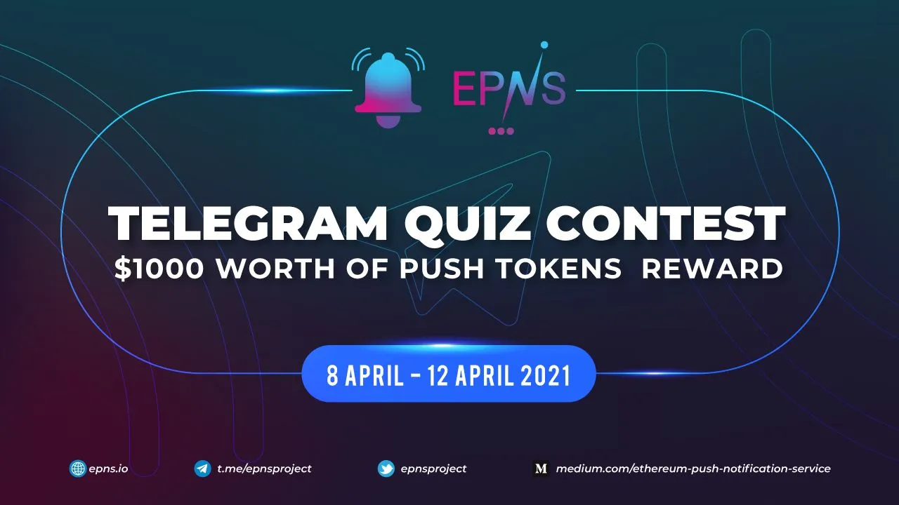

import { ImageText } from '@site/src/css/SharedStyling';

<!--truncate-->

**The EPNS 5-day Telegram Quiz Starts Today!**

Do you want to receive all your important notifications to your wallet?

Do you never want to miss an important DeFi yield or loss control opportunity?

Do you want to make money while receiving incentivized push notifications?

Start learning how to use the EPNS push notification service today and get the most from the intelligent, interactive web, Web3, with integrated push notifications while taking part in our Telegram Quiz campaign. The EPNS decentralized notification service securely sends all your important notifications from any dApp on any blockchain to your wallet.

Win rewards while learning how to use the EPNS push notification service in our 5-day Telegram Quiz contest.

*   $1000 worth of $PUSH tokens up for grabs
*   **8 winners daily will win $25 worth of $PUSH tokens each** (at the public sale price of $0.12)
*   Each day, we will ask 4 quiz questions and for each question there will be 2 winners.

**To participate, join the EPNS Telegram Community:** [t.me/epnsproject](https://t.me/epnsproject)

The Telegram Quiz contest starts right away and there will be no fixed time for the Quiz, yes you heard it right and that’s the most exciting part of this quiz. We will drop questions at anytime in the day to make it more fun and rewarding for the active members in the community and also in order to cover all the timezones, so keep an eye out for the questions.

Moreover, this is a good time to learn and share about the EPNS Project.

Get a head start by reading the [EPNS Whitepaper](https://whitepaper.epns.io) and [Medium articles](https://medium.com/ethereum-push-notification-service). Enjoy, learn and earn!👨‍💻

**Winners will be announced the same day. All tokens will be released to the winners after 4 weeks of IDO Date.**

ALL THE BEST!!

Disclaimer
==========

🚨 WARNING 🚨
-------------

❗**Beware of scammers and fake addresses**❗

❗EPNS team members will **NEVER DM** you ever about anything!❗

❗**$PUSH will not be available** until the **Polkastarter IDO on April 13**❗

✅ Only follow the **official links** for trusted information ✅

✅ Join the **official EPNS channels**  ✅

**Website** [https://epns.io/](https://epns.io/)

**Twitter** [https://twitter.com/epnsproject](https://twitter.com/epnsproject)

**Telegram** [https://t.me/epnsproject](https://t.me/epnsproject)

**Telegram** **Announcement** **Channel** [https://t.me/epnsprojectnews](https://t.me/epnsprojectnews)

🚨 WARNING 🚨
-------------
