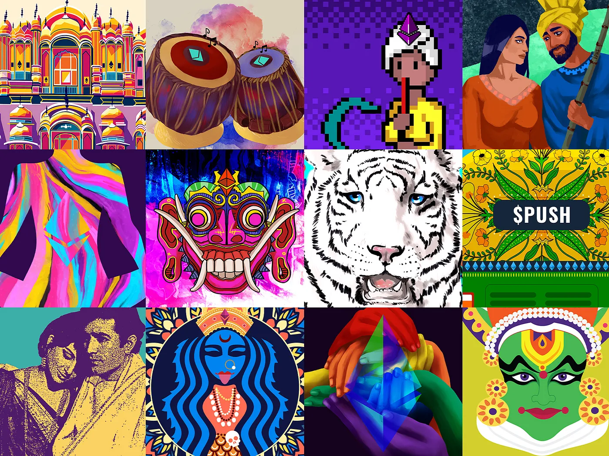

import { ImageText } from '@site/src/css/SharedStyling';

<!--truncate-->

Just because we’re a notification protocol doesn’t mean we can’t have a little fun. 🙃 We at EPNS are huge fans of the NFT space and the emerging creator economy. We have seen DeFi lower the barriers for opportunity-creation within the financial world, and are thrilled to be witnessing a similar wave of adoption among creators and artists.

So, we decided to throw our hat in the ring by supporting artists, celebrating our origins, and giving back to the community along the way. And just in time for the $PUSH token sale and the EPNS mainnet launch! 🙌

_🎨_ Today, we’re excited to unveil our NFT collection **$ROCKSTARS of EPNS_._**  The collection is a series of 100 illustrations by commissioned Indian artists. 🇮🇳 The NFT will be released in two phases: the initial gratitude drop, and the following weekly drop.

**Gratitude drop.** Recently, we announced our [TGE](https://medium.com/ethereum-push-notification-service/announcing-the-epns-push-token-generation-event-4d1699e716f5) and our intention to airdrop $PUSH to members of the community who supported us through Gitcoin Grants Round 6,7 and being part of the EPNS testnet beta. Our gratitude doesn’t stop there, though! There have been many advisors, consultants, and guides who have gotten us to this day through countless hours of strategy discussions and meetings. The first NFT drop will go to 48 of these individuals — we’ll reach out to you on Twitter to send you your NFT if you’re one of them!).

**Weekly drop.** The remaining 52 NFTs will be gifted to members of the community over the course of the next year. Every Monday, we’ll give one EPNS NFT to a community member who has been a particular fan, supporter, and evangelist of the EPNS protocol. 1 per week until we celebrate our one year anniversary at this same time next year. We even hope to collaborate with other projects in the space to gift special partner NFTs! Keep an eye out for the rules and how to throw your hat in the ring — coming soon!

To our community — thank you! We’re excited to have arrived at this moment. We cannot wait to launch EPNS on the Ethereum mainnet soon and start delivering decentralized notifications for all.

So how can you throw your hat in the ring? We’d love to hear from you; feedback about the protocol, the applications, support online, participation in community channels, and more!

