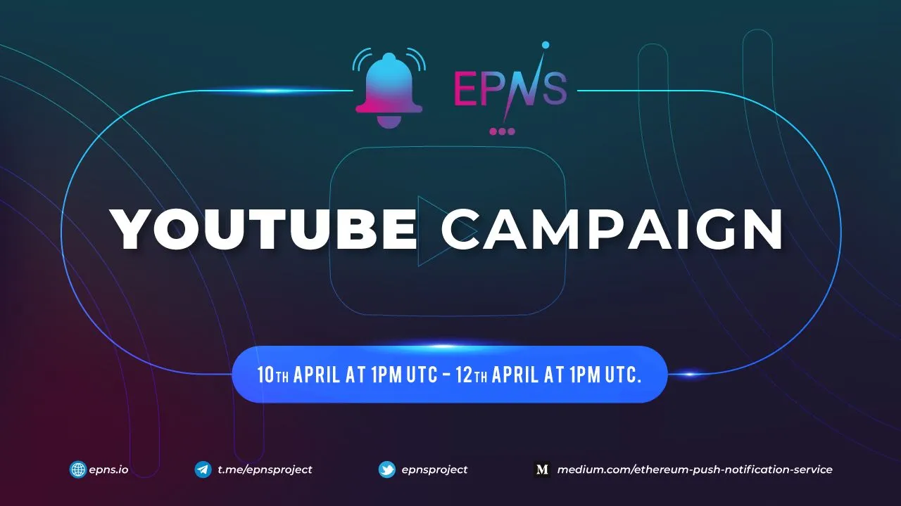

import { ImageText } from '@site/src/css/SharedStyling';

<!--truncate-->

If you cannot wait to aggregate all your dApp notifications in one place, your wallet, and streamline your life, we have good news! The EPNS push notification mobile app can be downloaded today. You can gain early access to the EPNS app while winning rewards through our 2-day YouTube Campaign.

🍎 iOS App: [https://apps.apple.com/app/ethereum-push-service-epns/id1528614910](https://apps.apple.com/app/ethereum-push-service-epns/id1528614910)

▶️ Android App: [https://play.google.com/store/apps/details?id=io.epns.epns](https://play.google.com/store/apps/details?id=io.epns.epns)

If you are ready to receive your time-sensitive DeFi alerts, social network notifications, governance proposals, and all other important notifications from your dApps, download the EPNS app and sign up for the EPNS decentralized notification service.

When you use the EPNS push notification service, you earn incentives in the form of $PUSH tokens. Start earning $PUSH tokens now.

The EPNS 2-day YouTube Campaign is **OPEN** 🙌 🙌

**START DATE:** April 10th at 1PM UTC

**END DATE:** April 12th at 1PM UTC

To participate you need to follow these 3 simple steps:

🔺1. Subscribe to the EPNS YouTube channel and hit the bell icon: [https://youtube.com/user/neosmithharsh](https://youtube.com/user/neosmithharsh)

🔺2. Watch this short video to learn about EPNS: [https://youtu.be/kwwnlmUpRsk](https://youtu.be/kwwnlmUpRsk)

🔺3. Like and comment on what you think about the project in the comment section: [https://youtu.be/kwwnlmUpRsk](https://youtu.be/kwwnlmUpRsk)

All 3 steps are **mandatory** to be eligible for the random selection.

10 winners will be chosen randomly and each winner will get $25 worth of PUSH tokens (each at the Public Sale Price of $0.12). Winners will be announced within 4 days of the campaign end.

**_\*\*Note: All tokens will be released to the winners after 4 weeks of the IDO date._**

❌ **Anyone found using multiple IDs to participate in the campaign will be immediately disqualified. The team will be checking for duplicates.**

# Disclaimer

## 🚨 WARNING 🚨

❗**Beware of scammers and fake addresses**❗

❗EPNS team members will **NEVER DM** you ever about anything!❗

❗**$PUSH will not be available** until the **Polkastarter IDO on April 13**❗

✅ Only follow the **official links** for trusted information ✅

✅ Join the **official EPNS channels**  ✅

**Website** [https://epns.io/](https://epns.io/)

**Twitter** [https://twitter.com/epnsproject](https://twitter.com/epnsproject)

**Telegram** [https://t.me/epnsproject](https://t.me/epnsproject)

**Telegram** **Announcement** **Channel** [https://t.me/epnsprojectnews](https://t.me/epnsprojectnews)

🚨 WARNING 🚨
