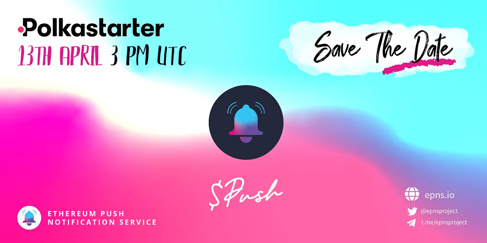

import { ImageText } from '@site/src/css/SharedStyling';

<!--truncate-->

Tomorrow, April 13th, 2021, is the $PUSH IDO on Polkastarter for the Ethereum Push Notification Service. A day ahead of the IDO, we wanted to release more information to keep the community informed and ensure the day goes smoothly for the whitelisted and KYC’d individuals. Thank you to everyone for your incredible support, we’re humbled by the enthusiasm for this milestone, and we’re excited for what lies ahead!

As a reminder, all whitelisted addresses can be found [here](https://docs.google.com/spreadsheets/d/1UICkgTxB5-X18KCbG845QVYqWWguTFmXyBtHqaKGea4/edit?usp=sharing). If you have completed your KYC to participate in the Polkastarter IDO, you _must_ use the same address that you originally submitted.

Heading into the IDO, remember to see the [EPNS Telegram](https://t.me/epnsproject) for all official communications. No one from the EPNS team will ever DM you, and will never ask for your crypto!

Polkastarter IDO Information
============================

**Token information**
---------------------

*   833,333 $PUSH tokens (0.83% of total supply) will be offered through the Polkastarter IDO.
*   Sale price: $0.12 per $PUSH
*   Max Cap: The max cap per person is $250 in ETH

> **Official token contract address:** [0xf418588522d5dd018b425E472991E52EBBeEEEEE](https://etherscan.io/address/0xf418588522d5dd018b425e472991e52ebbeeeeee)

**Pools and Allocations**
-------------------------

2 pools: POLS Pool and Community (Standard) Pool.

Community Pool allocation = **50%** (416,666 $PUSH). No POLS is required for it (No POLS required). Learn more about [how to participate In a standard pool.](https://support.polkastarter.com/article/6-how-to-participate-in-a-standard-pool-and-claim-your-tokens)

> **Update**: 📍 Community Pool [https://www.polkastarter.com/pools/ethereum-push-notification-service-public](https://www.polkastarter.com/pools/ethereum-push-notification-service-public)

POLS Pool allocation = **50%** (416,666 $PUSH). To participate in the POLS pool, you must hold a minimum of 3,000 POLS tokens at the time of the Polkastarter IDO. Learn more about [how to participate In a pool exclusive to $POLS holders](https://support.polkastarter.com/article/9-how-to-participate-in-pols-only-pool).

> **Update**: 📍 POLS Pool [https://www.polkastarter.com/pools/epns-pols](https://www.polkastarter.com/pools/epns-pols)

It is heavily recommended to visit and bookmark [polkastarter.com](http://polkastarter.com) ahead of time.

**Whitelist Shortlisted Participants**
--------------------------------------

*   All shortlisted whitelist participants have been sent notification from our official email account [polka@epns.io](mailto:polka@epns.io).
*   To check whether you made the Whitelist and for KYC details, see our [whitelist announcement](https://medium.com/ethereum-push-notification-service/epns-push-polkastarer-ido-whitelist-results-f9f875099ad6).
*   Only addresses that have passed KYC will be whitelisted.
*   Note that there will be more KYC verified whitelisted wallet addresses than there are IDO subscription allocations. **Allocation will be secured on a first come, first served basis.**

**Token Sale Timeline**
-----------------------

Below is the timeline indicating the key events that will occur on the day of our launch on Polkastarter on Tuesday, April 13th 2021. All times stated are in UTC.

📌 **Tuesday, April 13, 2021 Timeline**

**12:30 PM UTC on 13th Apr:** Telegram chat muted.

**3 PM UTC on 13th Apr:** Polkastarter IDO begins.

**Uniswap listing within 1.5 hrs hours** of Polkastarter IDO ending.

**4:30 PM UTC: IDO ends on Polkastarter.** Whitelisted users can claim $PUSH from Polkastarter pools.

Trading will begin on the Uniswap platform within 1.5 hrs hours of the Polkastarter IDO sale completion.

**Safety During the IDO**
-------------------------

⚠️ Do not fall for any scams, or interact with any other smart contracts.

⚠️ Please note that **NO** $PUSH tokens will be distributed/ available to claim before April 13th, 2021, 4:30PM UTC.

⚠️ $PUSH is not yet live nor trading on any DEX/CEX.

Stay safe, stay in the EPNS official channels, and follow the EPNS IDO schedule.

**Telegram:** [https://t.me/epnsproject](https://t.me/epnsproject)

**Telegram Announcements:** [https://t.me/epnsprojectnews](https://t.me/epnsprojectnews)

**Twitter:** [https://twitter.com/epnsproject](https://twitter.com/epnsproject)

**Website:** [https://epns.io/](https://epns.io/)

We are overwhelmed by the community support as we transition into the next phase of our journey. We want to again thank everyone for their support of the first decentralized push notification service for Web 3.0. We appreciate your participation!

💫 All the best to everyone

Stay tuned for further updates!

**About Ethereum Push Notification Service**

Ethereum Push Notification Service (EPNS) is a decentralized notification protocol that enables any smart contracts, dApps or even traditional services to send notifications to wallet addresses, as long as those wallet addresses have opted in to receive them from that particular service.

Stay in touch! [Website](https://epns.io/), [Twitter](https://twitter.com/epnsproject), [Telegram](https://t.me/epnsproject), [Medium](https://medium.com/ethereum-push-notification-service), [Whitepaper](https://whitepaper.epns.io/), [Litepaper](https://medium.com/ethereum-push-notification-service/ethereum-push-notification-service-litepaper-e7ca0a662862)

Disclaimer
==========

🚨 WARNING 🚨
=============

❗**Beware of scammers and fake addresses**❗

❗EPNS team members will **NEVER DM** you ever about anything!❗

❗**$PUSH will not be available** until the **Polkastarter IDO on April 13**❗

✅ Ensure email is from [polka@epns.io](mailto:polka@epns.io). Be aware of email “spoofing” and when in doubt, be sure to check with our admins for any questions: [https://t.me/epnsproject](https://t.me/epnsproject) ✅

✅ Only follow the **official links** for trusted information ✅

✅ Join the **official EPNS channels**  ✅

**Website** [https://epns.io/](https://epns.io/)

**Twitter** [https://twitter.com/epnsproject](https://twitter.com/epnsproject)

**Telegram** [https://t.me/epnsproject](https://t.me/epnsproject)

**Telegram** **Announcement** **Channel** [https://t.me/epnsprojectnews](https://t.me/epnsprojectnews)

🚨 WARNING 🚨
=============

