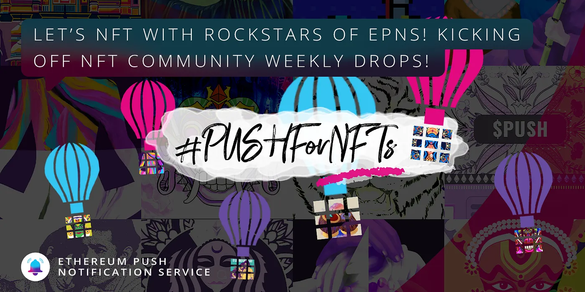

import { ImageText } from '@site/src/css/SharedStyling';

<!--truncate-->

Last week, we announced our gratitude [NFT collection **#ROCKSTARS of EPNS**](https://medium.com/ethereum-push-notification-service/the-first-nft-collection-from-epns-677e23173c95), a set of 100 NFTs commissioned by Indian artists to show our appreciation for the incredible support of the PUSH community. On the heels of our Polkastarter IDO and Uniswap listing this week, [we have a lot to be thankful for](https://medium.com/ethereum-push-notification-service/the-wind-behind-epns-3b1f3b18852)!

48 of the 100 NFTs will be gifted to a set of early advisors, supporters, and evangelists of the EPNS protocol who helped us reach so many milestones over the past year. The remaining 52 NFTs will be distributed 1x/week **starting Monday, April 19** community members who continue to help us on our mission to bring push notifications to Web3! **Along with each NFT, recipients will receive 2,400 $PUSH!**

Maybe you’re longtime fans of EPNS or maybe you’re brand new to joining us on this mission! So, how can you get a #ROCKSTAR NFT?

We’ll be distributing one NFT a week (every Monday) to one community member who does something to help us push the envelope forward. We want to help protect this year-long community project from being gamified, so we won’t just be looking at social media likes and engagement (nor do community members _have_ to do something on social)!

So what are some ideas? Well, in no particular order, here are some things community members have done for us in the past which we love 💖

*   Created some killer memes about EPNS and push notifications for web3 💪
*   Written a blog post explaining an element of the protocol or token design very clearly 🤓
*   Provided some top notch UX feedback on the protocol/dapp and how we can improve it 👨‍💻
*   Discovered a bug! And brought it to our attention so we could address it 🐛

Those are just some ideas — but feel free to get creative, academic, weird (or all 3!).

We will always try our best to stay on top of all that our incredible community is doing, but the best way to get our attention is to tag us and include the #ROCKSTAR hashtag on Twitter to let us know what you’re up to! Each week we’ll see what people are doing, what others in the community have expressed support for, and we’ll let you know on [Twitter](https://twitter.com/epnsproject) if that week you’re the winner!

Again — thank you to the entire EPNS community for all your support. Over the next year, we are excited to continue returning our gratitude. #ROCKSTARS of EPNS here we come!
