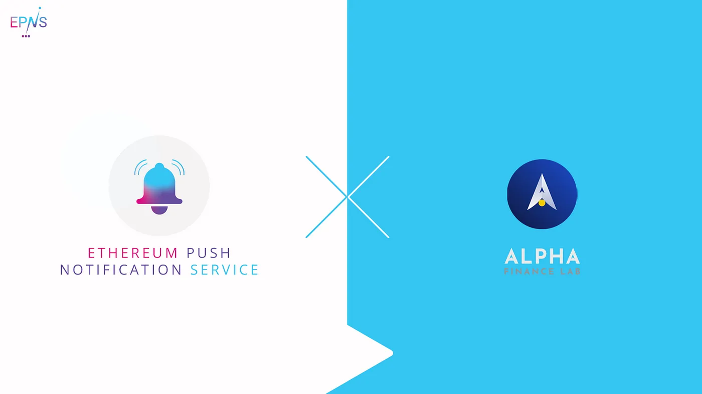

import { ImageText } from '@site/src/css/SharedStyling';

<!--truncate-->

DeFi never stops. It never stops growing, never stops innovation, and certainly it never stops surprising everyone in the crypto-space and in the traditional finance world. Keeping up with this rapidly changing environment requires developing tools and products that can interoperate, and equally as important — developing great user friendly interfaces. This is where EPNS plugs-in to help meet the most demanding user expectations.

Towards this effort, we’re excited to announce that we are working with the [Alpha Finance Lab](https://alphafinance.io/) team to further develop the core EPNS protocol features through their Alpha Homora product. Alpha Homora brings protocol interoperability to a whole new level, and allows users to participate as Yield farmers, Liquidity providers, ETH lenders, liquidators, and bounty hunters. For EPNS this represents a great opportunity to join forces with one of the most cutting-edge teams in the DeFi scene to make sure we grow our protocol to create sustainable, decentralized notifications.

Our pilot program with [Alpha Finance Lab](https://twitter.com/AlphaFinanceLab) and their Alpha Homora product will consist of:

- Building a channel for Alpha Homora on our protocol (see our [litepaper](https://github.com/push-protocol/push-whitepaper/blob/master/Ethereum%20Push%20Notification%20Service%20Litepaper.pdf) for definitions of channels, services, and more).
- Exploring and creating notifications use cases like upcoming liquidation of leveraged positions etc.
- Working with Alpha Homora team to enable technical discussions towards building a decentralized communication layer that is scalable and powerful for the whole of Web3.0.

We are eager to begin this journey with the amazing Alpha Finance Lab team to continue growing DeFi to new heights.

**_Pilot Program Updates_** **_as of June 24th, 2021_**

With Alpha Homora we created a channel to which users can opt-in to receive notifications about their loan positions when they reach a risky level.

Currently, the threshold is defined programmatically as this implementation relies on our Showrunners framework.

Working on this case gave us food for thought, and developed into internal brainstorming sessions to understand how to address some settings like this via the protocol.

## **About Alpha Finance Lab**

Alpha Finance Lab is an ecosystem of DeFi products that will interoperate to maximize returns while minimizing downside risks for users. Each Alpha product focuses on capturing unaddressed demand in DeFi in an innovative and user friendly way.

Stay in touch with Alpha Finance ! [Website](https://blog.alphafinance.io/), [Twitter](https://twitter.com/AlphaFinanceLab), [Telegram](https://t.me/AlphaFinanceLab), [Discord](https://discord.com/invite/Z2vuKDT)
