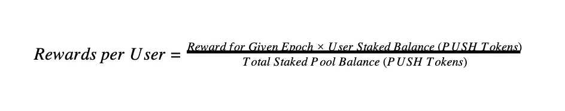
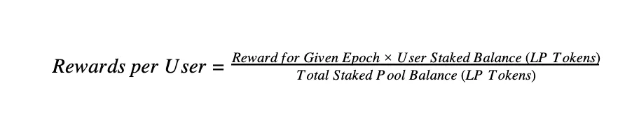

import { ImageText } from '@site/src/css/SharedStyling';

<!--truncate-->

Following our successful IDO launch of the Ethereum Push Notification Service governance token: **$PUSH**, we are thrilled to announce our Liquidity Rewards Program launching on **16th April**. The initial EPNS rewards program is designed to provide robust incentivizations for the $PUSH community ahead of our upcoming mainnet launch.

Users can participate in our Liquidity Rewards Program in our [EPNS staking portal](http://incentives.epns.io) in 2 ways:

1.  Staking $PUSH tokens directly on our Portal (no ETH needed except to pay gas).
2.  Staking UNI-V2 liquidity provider (LP) tokens. Users can receive LP tokens by providing liquidity to the [PUSH/ETH Uniswap pool](https://info.uniswap.org/pair/0xAf31Fd9C3B0350424BF96e551d2D1264d8466205).

> `All Community incentives are live at [https://incentives.epns.io](https://incentives.epns.io)`

A total of 5,510,000 $PUSH is allocated towards this rewards program. Participants will be able to claim their rewards by the end of each epoch (7 days). Earlier participants will earn higher rewards. The rewards program will end on **15th March 2023.**

## **Reward Distribution Keypoints:**

- Rewards are distributed as $PUSH tokens.
- Total reward is 5,510,000 $PUSH
- Allocated rewards will decrease for each sequential epoch.
- Rewards will be distributed at the end of each epoch (7 days), to be shared in % proportion to a user’s contribution to the pool.
- Staking rewards are calculated using the following formulae:
- Staking will only be available through the official [EPNS staking portal.](http://incentives.epns.io)

## **For $PUSH Staking**

## **For UNI-V2 LP token Staking**

## **When does the program start and how long will it run?**

Start Date: 14th April 2021

End Date: **15th March 2023**

## **(Option 1) Stake $PUSH tokens**

Visit the [EPNS Staking page](https://incentives.epns.io/) and connect your wallet. Stake your $PUSH tokens into the contract by providing the amount, clicking the **‘Deposit’** button and submitting the transaction.

## **(Option 2) Stake Uniswap-V2 PUSH/ETH LP tokens**

_Step 1: Provide Liquidity on Uniswap_

Visit the [PUSH/ETH Uniswap Pool](https://app.uniswap.org/#/swap?inputCurrency=0xf418588522d5dd018b425e472991e52ebbeeeeee) and add liquidity in exchange for Uniswap-V2 Liquidity Provider tokens. You will need to have both ETH and PUSH in your wallet before you are able to provide liquidity.

_Step 2: Stake UNI-V2 LP tokens on EPNS_

After providing liquidity into Uniswap’s PUSH-ETH pool, you will have acquired PUSH-ETH liquidity provider tokens. These tokens can be staked in EPNS $PUSH rewards staking contract to farm $PUSH.

Visit the [EPNS Staking page](https://incentives.epns.io/) and connect your wallet. Stake your LP tokens into the contract by providing the amount, clicking the **‘Deposit’** button and submitting the transaction.

## **When can I withdraw my tokens from the EPNS staking portal?**

Users can withdraw their $PUSH tokens or their UNI-V2 LP tokens from the EPNS staking portal at any time by visiting the [EPNS Staking Page](https://incentives.epns.io/) and removing your stake.

Step 1: Visit the [EPNS Staking page](https://incentives.epns.io/)

Step 2: Connect your wallet

Step 3: Withdraw your deposited tokens from the respective pool by mentioning the amount, clicking on **‘Withdraw’** and submitting the transaction.

## **How do I claim rewards?**

Step 1: Visit the [EPNS Staking page](https://incentives.epns.io/)

Step 2: Connect your wallet

Step 3: Claim your $PUSH rewards by clicking on **‘Mass Harvest’** and submitting the transaction using your wallet.

## **Summary of Liquidity Rewards Program:**

- Total Reward Estimation: 3,005,000 / 2,505,000
- Start Date: 14th April 2021
- End Date: 16th March 2023
- Duration: 100 weeks
- Link to Official PUSH/ETH Uniswap pool: [https://app.uniswap.org/#/swap?inputCurrency=0xf418588522d5dd018b425e472991e52ebbeeeeee](https://app.uniswap.org/#/swap?inputCurrency=0xf418588522d5dd018b425e472991e52ebbeeeeee)
- Link to EPNS Staking page: [https://incentives.epns.io](https://incentives.epns.io)
- EPNS $PUSH token contract address: [https://etherscan.io/address/0xf418588522d5dd018b425e472991e52ebbeeeeee](https://etherscan.io/address/0xf418588522d5dd018b425e472991e52ebbeeeeee)

**Please note that you are responsible for making sure you are providing liquidity properly — the EPNS team can’t help you track down misplaced assets. Please ensure you use a compatible wallet for $PUSH ERC-20 tokens. We recommend MetaMask.**
