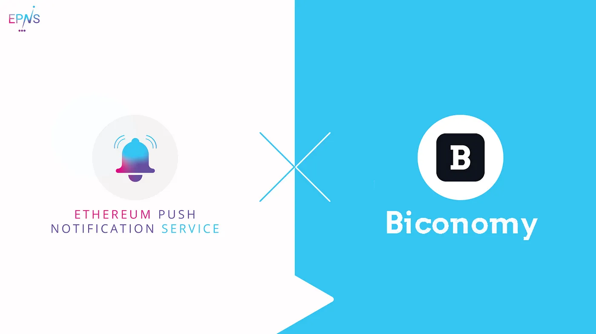

import { ImageText } from '@site/src/css/SharedStyling';

<!--truncate-->

With the growing Ethereum ecosystem, especially DeFi, more and more users are entering the ecosystem. The main need for new users is to easily start using dApps, without having to deal with the complexities of blockchain. Biconomy plays a vital role in bringing this user experience for the masses by enabling a gasless experience for the end-users. From a dApp owner perspective, this is very valuable as plug-n-play of meta transactions using Biconomy can greatly remove any friction while onboarding new users into the ecosystem.

Towards this effort, we are delighted to announce that we are working with Biconomy to develop the core [EPNS](http://epns.io) protocol. Biconomy is one of the most innovative teams in the space, building the inter-chain transaction infrastructure for next-generation Web3.0 applications.

During our pilot program collaboration with Biconomy, they will use EPNS to send notifications out to their relayers for important communications.

At EPNS, we are constantly looking out to ease the use cases for the services and the users. One of the exploration points for that is meta transactions to offload the users on-chain interactions. EPNS is ecstatic to state that we will be exploring Biconomy to enable meta transactions for the same during the pilot as well. By working closely with the Biconomy team we will have an opportunity to understand clearly the needs of Web3 infrastructure leaders in this space.

By working on integration with Biconomy, EPNS is excited to showcase how collaborations are important for decentralized applications to take their business to the next level and provide a frictionless user experience and higher level of participation.

**About Ethereum Push Notification Service**
--------------------------------------------

Ethereum Push Notification Service (EPNS) is a decentralized notification protocol that enables any smart contracts, dApps or even traditional services to send notifications to wallet addresses, as long as those wallet addresses have opted in to receive them from that particular service.

Stay in touch! [Website](https://epns.io/), [Twitter](https://twitter.com/epnsproject), [Telegram](https://t.me/epnsproject), [Medium](https://medium.com/ethereum-push-notification-service), [Whitepaper](https://whitepaper.epns.io/), [Litepaper](https://medium.com/ethereum-push-notification-service/ethereum-push-notification-service-litepaper-e7ca0a662862)