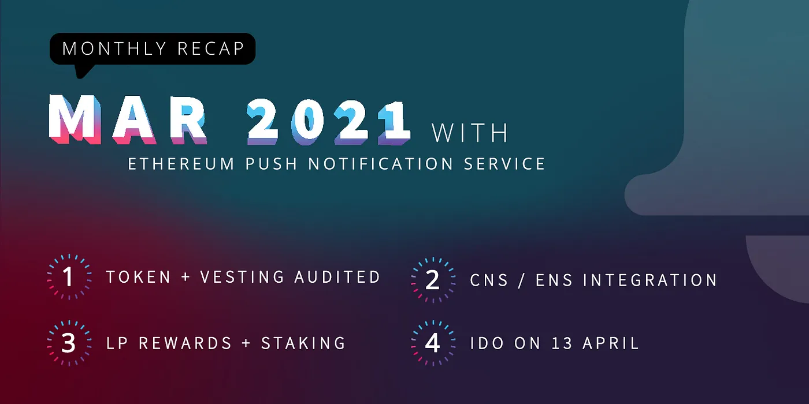
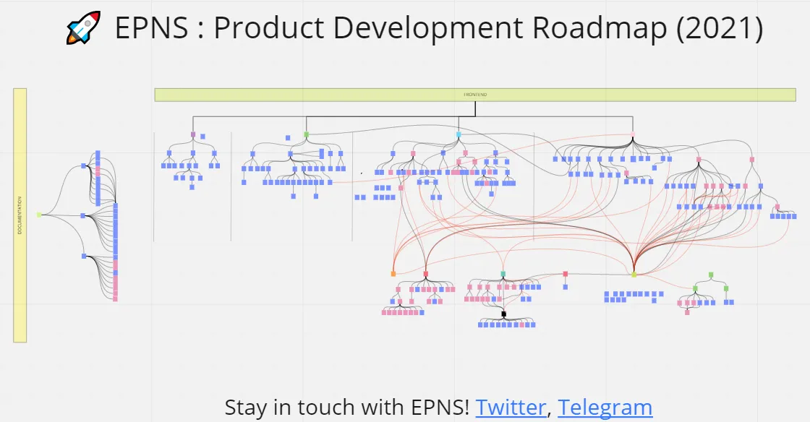
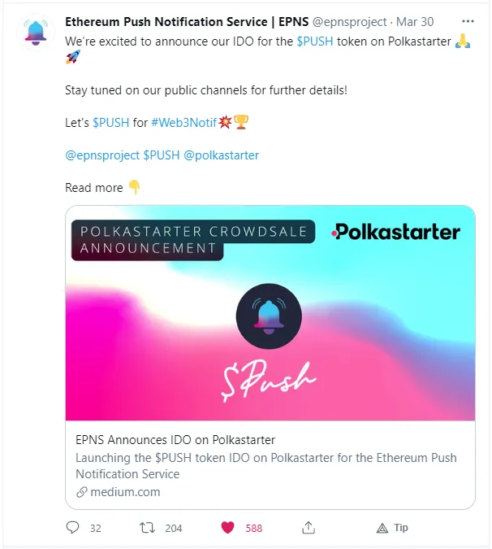

import { ImageText } from '@site/src/css/SharedStyling';

<!--truncate-->

This one is coming a tad late, but we wanted to share our updates with the awesome community as always. Another month has passed in the blink of an eye proving that fun never ends in the crypto-lands.

March was focused on our efforts around preparing for our Token Generation Event (TGE), let’s look at what’s been keeping us busy.

# Preparing for the big $PUSH

It took a lot on everyone’s part, and we did this as a team!

Preparing for the launch of $PUSH required orchestrating several moving pieces and making sure solid non-stop progress was being made in the correct order. These are some of the key high-level tasks involved in this process:

- Development of TGE related Smart contracts (**$PUSH** token, Staking, and Time Vesting smart contracts) and their corresponding internal auditing followed by a formal audit by the ChainSafe team ([See the official Audit results here](https://twitter.com/ChainSafeth/status/1379879154124943361)).
- Design of incentive mechanisms for participants of the protocol.
- Following all steps to ensure a successful IDO (Initial Dex Offering) launch on April 13th, 2021.
- Coordinating strategic collaborations with key players in the blockchain space to help us further refine EPNS. Announced pilot programs with 🦄 [Uniswap](https://twitter.com/epnsproject/status/1377305643384664065?s=20), [SuperFluid](https://twitter.com/epnsproject/status/1374677663915200520?s=20) and [Gnosis](https://twitter.com/epnsproject/status/1371816495563501577?s=20).

# EPNS 2021 Roadmap

This past month culminated a process of learning and discovery that allowed us to understand more precisely what the Ethereum ecosystem needs, and how can we best provide the right infrastructure to help.

We will soon be releasing our **Official Roadmap** together with a complementary blog post sharing more information about what we have accomplished and what’s going to be our focus for the rest of the year.

# Development

While most of our development efforts in March 21021 were around TGE, we are also getting everything ready to welcome the development community to start implementing the EPNS protocol. These are some of the key development items accomplished through March 2021:

- Development of smart contracts, granular testing scripts, and deployment scripts for all the TGE related smart contracts.
- Internal auditing of all smart contracts.
- Fixes and optimizations performed after feedback from the auditing firm.
- Front-ends for token vesting, claiming NFTs, staking and liquidity mining.
- Integration Guides including complex scenarios covering the different types of integrations. These will soon be approved for release.
- Started working on various Pilot Program EPNS implementations with our strategic partners.
- Implemented ENS/Crypto domain support.

# Community Updates

Our highlights for March 2021:

- **Conferences**: Harsh Rajat spoke at [#Unblock2021](https://twitter.com/epnsproject/status/1367397526156967937?s=20), India’s biggest blockchain-based virtual summit, about️ the EPNS journey! — Our very own Richa Joshi spoke at [KBA Blockchain Bootcamp on Women’s Day](https://twitter.com/kbaiiitmk/status/1375315945820852229?s=20) — Harsh Rajat spoke at Streamr Data Challenge panel discussion on ‘[Building the Internet of Ethereum](https://twitter.com/epnsproject/status/1369993408220078087?s=20)’ and [DeFiicon](https://twitter.com/epnsproject/status/1367043415234342913?s=20).
- **Featured**: Honored to be featured by Hackernoon ‘[Push Notifications Will Pull Blockchain Out of the Stone Age of Communication](https://hackernoon.com/push-notifications-will-pull-blockchain-out-of-the-stone-age-of-communication-unhashed-1-ql1f33d6)’
- **Blog posts**: March 2021 we talked about [$PUSH Token Economics](https://medium.com/ethereum-push-notification-service/push-token-economics-d7f566c29b1a), and also made the [Formal Announcement of EPNS $PUSH Token Generation Event](https://medium.com/ethereum-push-notification-service/announcing-the-epns-push-token-generation-event-4d1699e716f5). Check them out!
- **Podcast:** Kicked off a new YouTube Podcast series, **Rockstars of Ethereum (RoE)**. Check out the [first episode of RoE with Kevin Owocki](https://youtu.be/nClMGshU1nU) as our first guest.
- Telegram growth metrics (March): We’ve experienced explosive growth from the end of March to Early April - **WOW!!!**
- Top engaged tweet (March)

Everything accomplished during March 2021 was only possible thanks to everyone’s support and hard work. We continue on our journey towards giving the Ethereum ecosystem one more building block to improve usability and user adoption. We couldn’t have done it without all of you.

Humbled by your support and appreciation 🙏🏼,

The EPNS team.
