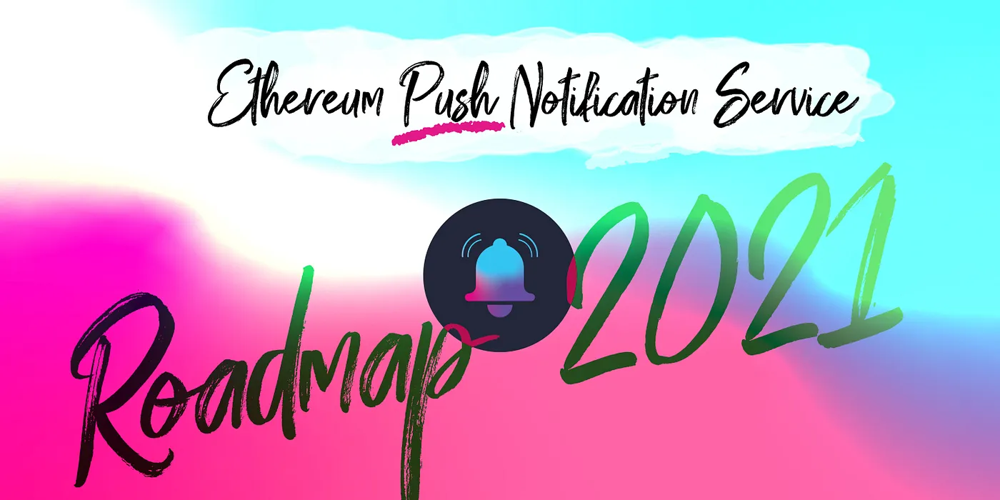
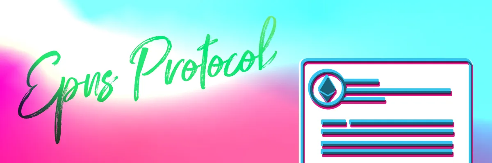
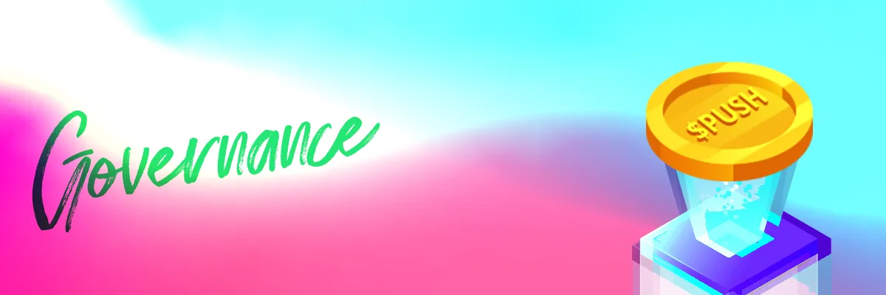
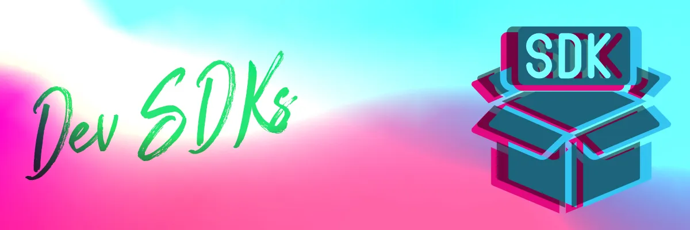
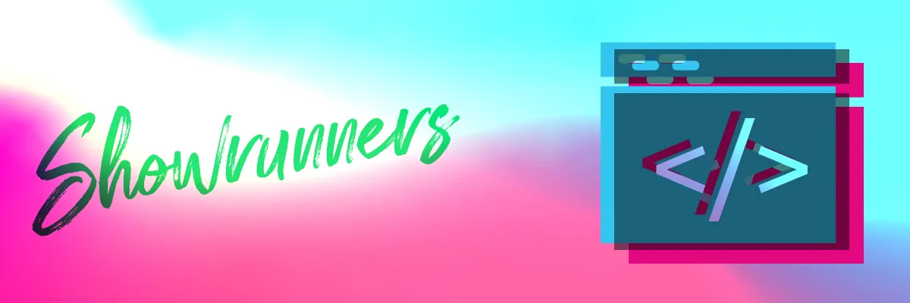
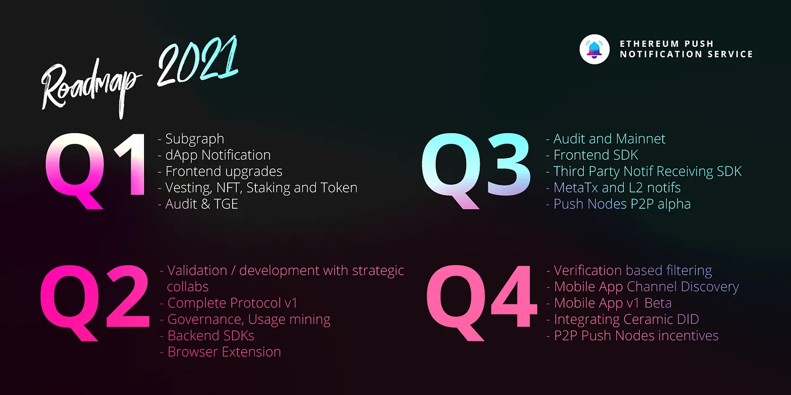

import { ImageText } from '@site/src/css/SharedStyling';

<!--truncate-->

This past year has been an unbelievable adventure of learning and growth for us at EPNS since we originally came up with our PoC during ETHGlobal’s Hack Money 2020 Hackathon. We have received so much support and appreciation from the entire Ethereum community, and we can’t thank you enough.

This week marks the one year anniversary of the start of EPNS’ journey towards becoming the standard, flexible communication middleware for both Web3 and Web2 companies to benefit from.

For the EPNS protocol to become a de-facto communication layer, several different ecosystem cogs need to be innovated and developed. Our roadmap for 2021 thus is designed to address the highest priority elements that we intend to complete to achieve the maximum impact with v1.0 of the EPNS Protocol and the entire ecosystem of EPNS.

Working on these will enable us to deploy the protocol on the Ethereum Mainnet with the necessary communication middleware APIs and SDKs built into it for sending notifications, which will allow us to foster a developer ecosystem.

Additionally, putting special attention to creating a receiving infrastructure that allows for the easier embracing of the protocol for any crypto wallets and platform that wants to implement decentralized notifications.

To help us achieve our objectives, we will focus on the following product categories:

- EPNS Protocol (Send Notifications)
- PUSH Nodes (Retrieval & Dispatch)
- Governance of EPNS Protocol
- Front-End products: dApp, MobileApp, Browser extension
- Development SDKs and Documentation
- Showrunners (to enable traditional services to interface with Web3)

#### EPNS Protocol (Send Notifications)

The main goal of the EPNS Protocol is to make sure all notifications are prepared and sent in compliance with the protocol standards. This will make every notification readily available to be picked up by the PUSH Nodes in charge of dispatching.

To this effect, we already have completed several features, some of the prominent ones are:

- Upgradability with on-chain governance upgrades
- Ability to create channels
- Ability to subscribe / unsubscribe
- Ability to passively earn through staking (by services)— lending (via protocol) — interest (to users)
- Ability to send notifs

Though the majority of the MVP features are complete, we did find a few more features during our validation cycle to include those in v1 as well. Some of these are:

- Delegating multiple user wallets to send notifications on a channel’s behalf
- Enabling subscription via meta transactions
- Verification badges and social proofs that can be used as a reputation score and to filter channels on the frontend
- Pivoting to delivering all notifs even when a user is not a subscriber of a channel. Instead, having provisions to land them into spam box achieving the same - result but a more adaptable UX
- Designing the spam score throttle to ensure automatic throttling of notifs
- Layer 2 support for the protocol
- Integrating Ceramic decentralized identifier (DID)

By delegating more wallets, we intend to address the issue of network congestion. If a channel delegates 5–6 wallets, then these could be used to send notifications in a round-robin fashion and hence reduce the chance of transactions being queued in the txpool.

At present, using the EPNS protocol, a service can send messages and notify only its subscribers. We plan to upgrade it in such a way that services may send messages to all its users, but only those who have subscribed to the channel would receive the message as a notification. Others would receive it in their spam box without a push notification.

With the integration of Ceramic, users would be able to receive notifications on their DID, which could be an ID connected to an ethereum wallet or bitcoin of any other blockchain.

#### Push Nodes (Retrieve and Dispatch)

The main goal of the PUSH Nodes is to listen to events in the EPNS protocol smart contracts and dispatch the notifications to the corresponding recipients.

Features currently available include:

- The cache of channels/payloads
- Capability to map subscribers addresses to channels in the database
- Ability to deconstruct and synchronize payloads sent from a channel in the payloads database
- Connect wallet addresses to deviceIDs

While currently the receiving nodes infrastructure is built in a centralized manner, working on decentralizing this component is one of our top priorities.

Some of the tasks we will be working on are:

- Establish a peer-to-peer network of PUSH nodes
- Implement a P2P Push nodes incentive mechanism
- Pinning of notification payloads on IPFS

Even though we only listen to smart contracts of Layer 1 dApps and services at the moment, our ultimate aim is to be a blockchain agnostic decentralized middleware solution. Forming a P2P network of PUSH Nodes would be a stepping stone to achieving that goal. This will ensure nodes are more scalable and the protocol will be able to support Layer 2 solutions and lays the foundation to support other solutions as well in the future. Along with establishing the network, the implementation of an incentive mechanism for active participants is also in our pipeline.

With all notification payloads uploaded to IPFS, making sure that no notification gets lost is of utmost importance. We will be working towards pinning all the notification payloads sent out to users.

#### Governance

Governance is crucial for any decentralized protocol, and EPNS is no exception. Incentives for participation both in terms of token rewards and otherwise is importance to ensure strong network effects. We already created the following incentives for governance:

Introduced liquidity mining and staking on https://incentives.epns.io
Introduced $ROCKSTAR of EPNS NFTs and $PUSH rewards to signal gratitude to early community and to reward new community and their participation in the ecosystem. [Read more about it here](https://medium.com/ethereum-push-notification-service/the-first-nft-collection-from-epns-677e23173c95)

Moving forward, we plan to further introduce three governance capabilities to continue decentralizing the EPNS protocol:

- Upgradeability through online voting
- Incentives towards developing 3rd party channels via the protocol
-Incentives for active participation in the protocol

The $PUSH Token plays an essential role as it carries on-chain governance as well as enabling fees to split right from the token genesis. Token holders that own the tokens for the longest time will have higher fees based on their share — whenever a majority of users decides to activate the fee and the fee split.

#### Development SDKs, and Documentation

<b>Toolkits and SDKs</b>
After participating in Hackathons, bounty programs, and integrating EPNS with some of our partners, we’ve learned which tools will make a developer’s life easier.

We are targeting the release of four SDKs:

<b>Front-end SDK</b>: Will enable 3rd party services to interface with the channels, and facilitate sending notifications to users directly from third party dApp front-ends.

<b>Back-end SDK</b>: Will allow easy integration for protocols wanting to send notifications interfacing directly with the EPNS protocol smart contracts.

<b>PUSH Mobile SDK</b>: Will enable Mobile Apps to easily integrate and interface with EPNS PUSH Nodes and receive real-time notifications with the PUSH SDK doing most of the heavy lifting.

<b>EPNS Subgraph</b>: Together with these three important components of our Developers Toolkit, we will continue developing further our Subgraph.

#### Technical Documentation
We will develop extensive Technical documentation about the EPNS products, Integration guides, and tutorials in addition to what already exists. From the basic HelloWorld to more complex integrations with real-world protocols.

Our focus will be on three main areas, for which we will provide both simple and advanced examples of all types of integration:

<i>
Server Integration → through EPNS protocol

dApp Integration → through EPNS protocol

Smart Contract Integrations → through EPNS protocol Smart Contracts
</i>

With the Server integration, our intent is to provide developers with a boilerplate solution that will help them speed up the EPNS integration process into their respective protocols.

Some additional guides for developers we will be working on are:

- How to Create channels?
- How to Send notifications through the dApp?
- How to deliver automated notifications?

#### How To Guides for End users
Our How-To Guides section will be mostly focused on end-users. Providing them with a One-stop-shop to help them get set up and maximize the power of EPNS and all its products.

- How to set up to receive decentralized notifications?
- How to subscribe to channels?

### Front-End

EPNS will offer three major front-end components providing participants of the protocol different alternatives to interface with their favorite products and services. These components are:

- dApp (decentralized App)
- MobileApp (iOS & Android)
- Browser extension.

#### Decentralized App (dApp)
Up until today, we have been working on a set of foundational features on our dApp that will allow us to grow more functionalities. Some of them being:

- Creation of channels and viewing basic channel statistics (Stake of channel, number of users, Owner indicator)
- Subscribe/Unsubscribe to channels and viewing notifications.
- Sending different types of notifications with different configurations.

Now, we will add more mechanisms for channel owners and subscribers to do more! Some of them being:

<b>For channel owners:</b>

- Adding Notification templates, notification previews, a quick send panel, and scheduling of notifications
- Seeing notification statistics
- Updating/disabling channels, readjusting stakes, channel categories, verified badges for channels

<b>
For Subscribers:
</b>

- Mass channel subscribe/unsubscribe
- Different channel layouts, and the ability to configure settings per channel when available.
- Channels filters and categories
- Display of approximate earnings

Additionally, for the end-user, we will develop dashboards that will give much more aside from receiving notifications or browsing channels. It will allow the user to perform actions regarding governance, rewards incentives, creating profiles, and more.

#### Mobile App (iOS & Android)
Same as with the dApp, we have been building a solid foundation and now its time to scale it. Some of the features we have been working on being:

- Signing in with just the public wallet address
- A dashboard that allows users to view their profile and lock the app, as well as swiping out a wallet
- Receiving notifications based on Pull, including private notifications
- Support for logging in with ENS and .crypto domains
- Streamline the mobile app onboarding process by allowing users to configure access to the app using passcode and biometrics

Now, these are some of the features we have in the pipeline to expand the set of functionalities available in the Mobile App:

- Channels discovery, Muting of notifications, Report Spam, Scanning QR codes to subscribe to channels.
- Notifications search, pagination, different notifications screen layouts, improved security towards displaying private notifications — including adding other methods such as Wallet Connect to read private notifications without signing via private key
- Profile information including passive earnings, and the ability to claim passive earnings from the Dashboard.

#### Browser Extension
This component seeks to be a very lightweight yet powerful tool that provides a reduced but still rich feature set of all the capabilities available in the dApp and the Mobile App.

#### Showrunners (Notification Logic Nodes)

An important part of our plan falls into improving our Showrunners offering by expanding its capabilities together with adding more useful channels to the community.

We have already achieved significant progress in the infrastructure front, by implementing the following:

- Routines to ensure business continuity, making provisioning a priority by implementing channel monitoring with alerting and automatic funds flow from Master - Wallets to Supporting Wallets
- Channels testing tools for developers
- Notifications scheduling capabilities blockchain-based and event-based
- Database Support, Cache layer, and Logging

Having worked on these foundational elements empowers us to have more flexibility to design channels that meet the community needs, and also prepare us to be ready for upcoming trends and new protocols.

What’s next in line?

- Ability to send email from AWS SES
- Ability to send notifications from multiple wallets for the same channel
- Robust list of channels that provide significant value to the community covering a wide variety of topics such as DeFi, DAOs, Services, NFTs, and marketplaces.

We plan to release v1.0 of our Showrunners this year to serve as a boilerplate solution for developers to rapidly develop their own Showrunners software.

TLDR;

We are proud and committed to our mission to fill an existing gap in communication in Web3 today and we take this endeavor with the greatest urgency and responsibility. Let’s build the ultimate notifications layer suite together!

If you have any comments or questions please feel free to reach out to us on telegram or check out our website for more details: https://epns.io/

