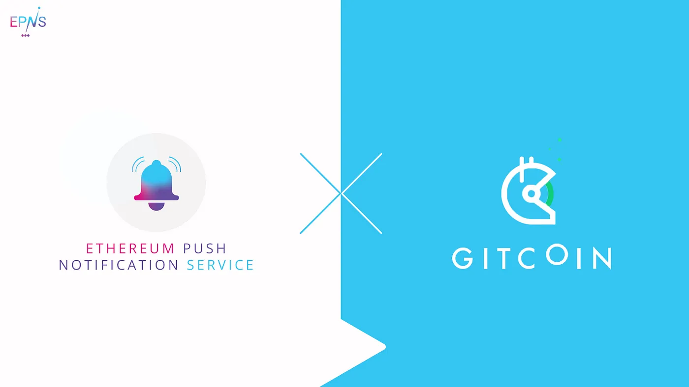

<!--truncate-->

Without a doubt the driving force behind the success of the Ethereum blockchain is and will be the community behind it.

People working together freely and transparently motivated primarily because they want to use the product they are making, and with the idea of producing community goods. EPNS is on a mission to contribute to this awesome ecosystem and provide one more building block that will enable improvements to user experience and help with adoption.

[Gitcoin](https://gitcoin.co/) is the first name that comes to mind when thinking about bringing together open source communities. We at EPNS are delighted to announce that we are working together for a pilot program that will entail:

- Working closely with Gitcoin and developing core protocol v1 features according to their needs
- Exploring possible integration in their upcoming Gitcoin Grants rounds, as early as GR10

The partnership greatly helps us in taking EPNS to new levels, while bringing new communication channels to Gitcoin to grow Open Source Software (OSS). Some ideas we have in mind include: better notification channels for interesting grants to fund during a Grants round, ways for grant owners to engage with their donors, and other mechanisms to connect funders and builders in Gitcoin’s ecosystem.

As we have stated many times in the past we share very similar values with the Gitcoin team, and we are truly grateful to Gitcoin for all the support and guidance provided to us. It’s a privilege to have the opportunity to play a part on this mission of using the public markets for public goods.

## **About Gitcoin**

Gitcoin is a community where builders can earn funding in Web 3 while creating open source decentralized applications, learning new technologies, and meeting like-minded developers.

Stay in touch with Gitcoin! [Website](https://gitcoin.co/), [Twitter](https://twitter.com/gitcoin), [Discord](https://discord.com/invite/jWUzf7b8Yr)
