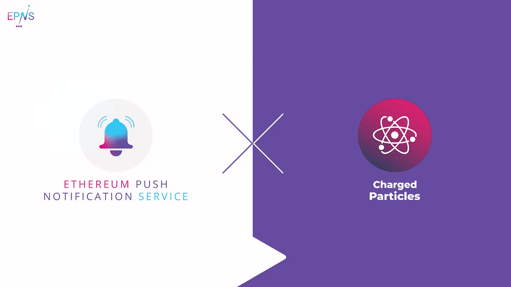

import { ImageText } from '@site/src/css/SharedStyling';

<!--truncate-->

NFTs (non-fungible tokens) have been the drivers behind the revolution in gaming and art landscapes, and more recently they’ve made a glamorous entrance in the DeFi scene bringing with them all sorts of new possibilities. Overloading the intrinsic features of NFTs will superpower this very unique asset class and take it to the next level.

In connection with this effort, we are thrilled to announce our partnership with Charged Particles that will help us fine-tune and further develop EPNS protocol.

Our pilot program with Charged Particles will consist of:

- Working together on implementing decentralized notifications for NFT deposits, interest earned, and other actions in the Charged Particles platform.
- Working with the Charged Particles team to enable technical discussion towards building the decentralized communication layer that is scalable and powerful.

While NFTs are already innovative in nature, protocols like Charged Particles are on a mission to give them an extra “Charge” in an elegant fashion and we’re excited to work with them on this unique collaboration.

> _We look forward to EPNS enabling instant notifications for our protocol’s users for nearly all activities happening within their NFTs — Deposits, Interest thresholds hit, Time-locks expiring — there’s a lot and we’re truly excited to partner with EPNS to provide these key updates to our users, commented_ Ben Lakoff, Co-Founder of Charged Particles
>
> Charged Particles is merging the two hottest trends of the industry DeFi and NFT. It’s interesting and intriguing to see them evolve and be a part of their journey along with ensuring that users of their platform are able to benefit from the communication layer of Ethereum! commented Richa Joshi, Co-founder of EPNS

## **About Charged Particles**

Charged Particles are Interest-bearing Non-Fungible Tokens (DeFi NFTs) that are minted with an Asset Token and accrue interest through a Liquidity Provider giving the Token a “Charge”. The amount of interest earned from the token represents the “Charge” that the token (Particle) has amassed.

Stay in touch with Charged Particles! [Website](http://charged.fi/) | [Docs](https://docs.charged.fi/) | [Telegram](https://t.me/chargedparticles) | [Twitter](https://twitter.com/DefiNft) |  [Instagram](https://instagram.com/definft) | [Discord](https://discord.gg/HdRx4SBMDv) | [LinkedIn](https://www.linkedin.com/company/charged-particles) | [YouTube](https://www.youtube.com/channel/UCdFyFUS4FE_j977OZ4VKjaQ) | [Reddit](https://www.reddit.com/r/chargedparticles) | [TikTok](https://www.tiktok.com/@chargedparticles)
