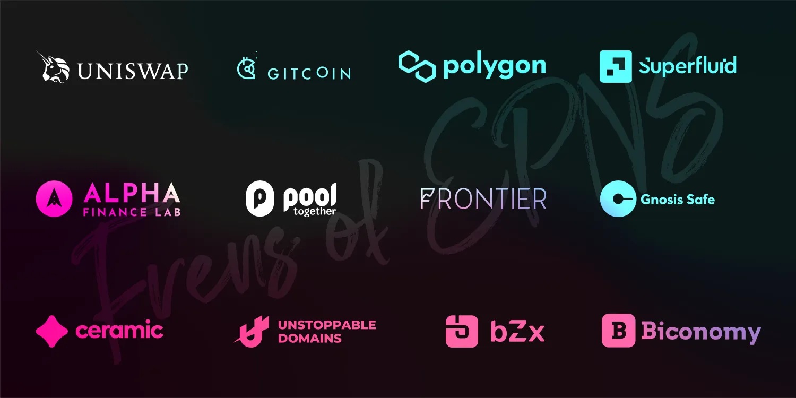

import { ImageText } from '@site/src/css/SharedStyling';

<!--truncate-->

The past couple of months at EPNS have been ecstatic. The team has been working hard to deliver the new era of decentralized notifications in Web3, and we’ve been receiving a ton of support from the community. But no matter how much we believe in the decentralized future of push notifications, we also realize that it doesn’t matter until other teams, and projects, actually implement the protocol to bring notifications to their users.

In order to tackle this, EPNS has been partnering and collaborating with some of the most amazing and innovative teams within the Web3 space, introducing practical use cases fine-tuned and customized to each protocol’s needs and niche. This not only allows us to show the world the true potential of decentralized push notifications with EPNS, but also create a more user-friendly experience for the users of our partner protocols.

For the past month or so, we have been consistently announcing new collaborations and partnerships, and we realize it might get a bit overwhelming to keep track of what projects are working with EPNS to make it better each day, and vice versa! Don’t worry, we have aggregated that information for you ;)

Our recent pilot program collaborators and partners include:

- [**Superfluid**](https://medium.com/ethereum-push-notification-service/programmable-money-2-0-meets-epns-4a2f52dccb32) — We’re exploring adding automated notification capabilities triggered by the basic functions available in the Superfluid Protocol such as: Starting, Editing and Cancelling a stream.
- [**Uniswap**](https://medium.com/ethereum-push-notification-service/accelerating-defi-with-epns-f2cbfaa33c91) — Our pilot collab with Uniswap includes building a channel for them which users can subscribe to and start receiving notifications when a new governance proposal is created, users transactions have been approved, warning them about gas costs, notifying them of impermanent loss, and much more.
- [**PoolTogether**](https://medium.com/ethereum-push-notification-service/win-win-for-users-of-pooltogether-and-epns-adb6e8d9188f) — In our pilot collab with PoolTogether we’ll bring push notifications to the users to notify them about the prize pools.
- [**Unstoppable Domains**](https://medium.com/ethereum-push-notification-service/epns-partners-with-unstoppable-domains-4d5507ddb6bd) — We’ve working with the Unstoppable Domains team, currently integrated .crypto domains that means users can start receiving push notifications at their own personal \[YourName\].crypto domain name
- [**Mask.io**](https://medium.com/ethereum-push-notification-service/building-web3-on-top-of-web2-0-with-mask-io-29d0d5e562e5) — Our collaboration with Mask.io enables bridging the Web2 to Web3 gap, direct-to-wallet notifications for users trading crypto without ever leaving Twitter or Facebook.
- [**Alpha Homora**](https://medium.com/ethereum-push-notification-service/we-alpha-homora-innovations-in-defi-with-epns-3873f74dc48) — Our collaboration with Alpha Homora involves exploring and creating notifications use cases like upcoming liquidation of leveraged positions etc.
- [**Biconomy**](https://medium.com/ethereum-push-notification-service/meta-txn-power-house-biconomy-collaborates-with-epns-d33032658466) — During our pilot program collaboration, Biconomy will use EPNS to send notifications out to their relayers for important communications. And we will also be exploring Biconomy to enable meta transactions to offload users’ on-chain transactions, and hence save gas.
- [**Polygon (previously MATIC)**](https://medium.com/ethereum-push-notification-service/scaling-web3notifs-on-polygons-layer-2-100e19e3269d) **—** During our pilot program with Polygon, we will implement Polygon’s infrastructure in the EPNS protocol to deliver scalable, low-cost notifications. This includes notifications when funds move between wallets as well as when they move from L2 to L1 and vice versa. We will also be co-developing with the Polygon team to support Polygon’s vision of the “Internet of Blockchains”.
- [**Frontier**](https://medium.com/ethereum-push-notification-service/defi-aggregator-frontier-to-support-web3-notifications-fd9a4927f689) — Our collab includes working with the Frontier team to enable technical discussions towards building a SDK that is deployable as a plug and play solution for all crypto wallets, exploring protocol usage within the Frontier app, and also a possible future integration with the Frontier Wallet.
- [**Gitcoin**](https://medium.com/ethereum-push-notification-service/gitcoin-growing-open-source-using-web3-notifs-36a9ec6e97dc) — During our pilot program we will be working closely with Gitcoin and developing core protocol v1 features according to their needs, and explore possible integration in their upcoming Gitcoin Grants rounds, as early as GR10.
- [**bZx**](https://medium.com/ethereum-push-notification-service/epns-partners-with-bzx-to-deliver-crucial-margin-trading-push-notifications-to-wallets-a2f52e4fcefe) — Our collaboration with bZx includes, adapting the highly customizable EPNS protocol to meet the myriad of push notification needs of the users of both traditional and multi-protocol lending products. This includes sending margin lending and trading notifications directly to bZx user wallets.
- [**Ceramic**](https://medium.com/ethereum-push-notification-service/advancing-ceramic-networks-decentralized-identity-network-with-epns-264b24a7508f)\- Our pilot program program with Ceramic will include embracing Ceramic protocol and DID in EPNS protocol to enable blockchain agonistic behavior for the receiving nodes of EPNS. We also intend to work with the Ceramic team to enable technical discussions towards building a decentralized communication layer that is scalable and powerful, and also to explore/create a standard for the Ceramic protocol that can enable sending push notifications through a user’s DID, with the routing preferences managed in Ceramic’s [IDX](http://idx.xyz/) identity protocol.
- [**CLR.fund**](https://medium.com/ethereum-push-notification-service/advancing-clr-fund-funding-protocol-with-web3notifs-366b61408aa3) — With this pilot program with the CLR.fund team we are looking forward to be able to enable creating a new communication layer within the CLR platform, that allows the users to receive decentralized notifications regarding events like, when a round has started or finalized, when contributions are received, when funds are claimed, or when a tally is published.
- [**UniLend Finance**](https://medium.com/ethereum-push-notification-service/epns-partners-with-unilend-finance-to-deliver-notifications-for-permissionless-money-markets-e647300b68ce) — During our collaboration, we will work with UniLend to utilize the EPNS protocol to notify users when new tokens are listed, when a trade goes through, when an airdrop is announced, when their flashloan occurs, We will also work with UniLend to add $PUSH liquidity to their protocol, which will allow users to receive rewards and airdrops, as well as flash loan with $PUSH.
- [**Charged Particle**](https://medium.com/ethereum-push-notification-service/advancing-charged-particles-interest-bearing-nfts-with-epns-dc5643325300) — We’ll be working on implementing decentralized notifications for NFT deposits, interest earned, and other actions in the Charged Particles platform.
- [**GnosisDAO’s SafeSnap**](https://medium.com/ethereum-push-notification-service/epns-honored-to-be-gnosisdaos-safesnap-launch-partner-e8a176b9a36) — EPNS was one of Gnosis SafeSnap’s launch partners. GnosisDAO has created a tool that can execute community governance proposals in a decentralized manner. In future, we’re looking forward to using SafeSnap in the EPNS ecosystem to allow greater fluidity in governance. Gnosis’s SafeSnap brings on-chain execution to off-chain voting outcomes, via a Gnosis Safe module connected to [Reality.eth](https://reality.eth.link/) (an escalation-game-based oracle). This results in avoiding needless gas costs for on-chain voting, secure assets in Gnosis Safe and a phased approach towards decentralization.

As we work closely with each of our collaborators and partners and with their highly skilled and experienced teams, EPNS will be able to communicate and have technical discussions with them to build a scalable and powerful decentralized communication layer for the whole of Web3.0.

As we move forward we expect to explore a lot more use cases for projects in Web3 by leveraging push notifications to make all of our lives more efficient, open, and secure; through our wallets.

Stay tuned for further updates! And thanks for being part of our journey 💖
