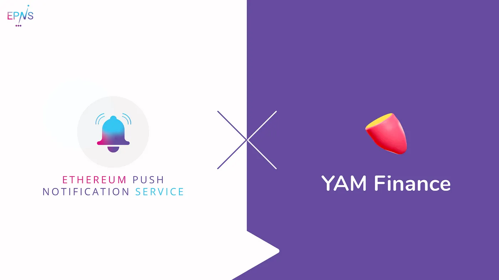

import { ImageText } from '@site/src/css/SharedStyling';

<!--truncate-->

One of the largest community-owned DAOs in DeFi space, YAM Finance has been at the forefront of launching some of the most innovative products in the ecosystem, including [Degenerative Finance](https://degenerative.finance/), which features synthetic futures that can be used to hedge gas prices or speculate on assets such as stocks and NFT’s.

Currently, YAM users rely on Discord bots to get alerts, such as if their collateral ratio changes (putting them in close risk for liquidation) or any price movements occur. Such alerts can get lost in the noise and, while they do address the needs of the community today, can’t keep up with community growth and don’t align with the Web3 ethos of full decentralization.

Today, EPNS is excited to announce that we are partnering with the YAM Finance team to develop the communication and notifications layer of YAM. YAM is among the strongest communities and protocols in the DeFi space, and we are looking forward to working with the team to enable YAM users to enjoy the benefits of notifs!

The collaboration with the YAM team will also help us in understanding the requirements of innovative services in the market and to develop additional features for the V1 of our protocol based on their invaluable inputs.

Our pilot program with YAM Finance will consist of:

*   Creating a channel for YAM Finance to notify their users of liquidation risks. Users will get notified before reaching their minimum collateral ratio.
*   Exploring and building further important notifications for various use cases in the YAM Ecosystem, such as alerts on governance actions (snapshot and on-chain votes).
*   Working with the YAM Finance team to enable technical discussions towards building a decentralized communication layer that is scalable and powerful for the whole of Web3.0.

**About YAM Finance**
---------------------

YAM Finance is a community-owned DAO that is innovating at the intersection of decentralized governance and programmable finance. Yam started as a fair-launch DAO and is now building DeFi products such as Synthetic Tokens, Treasury Management as a Service for other DAOs and permissionless Insurance.

Stay in touch with YAM Finance! [Twitter](https://twitter.com/yamfinance), [Discord](https://discord.com/invite/nKKhBbk), [Website](https://yam.finance/)
