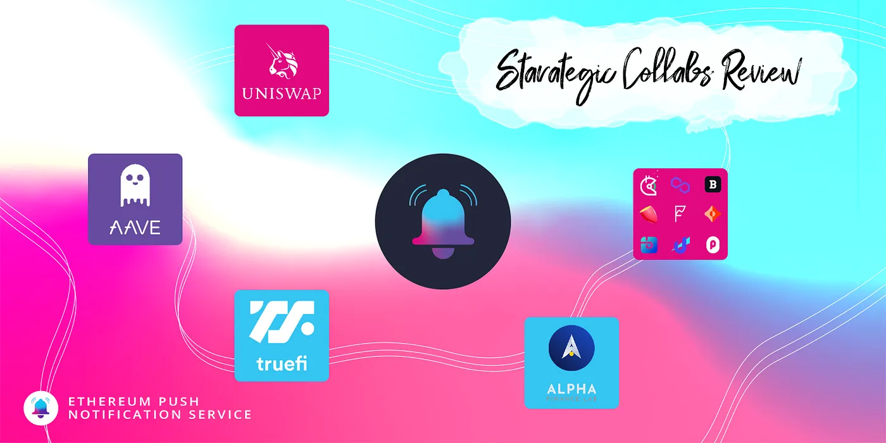
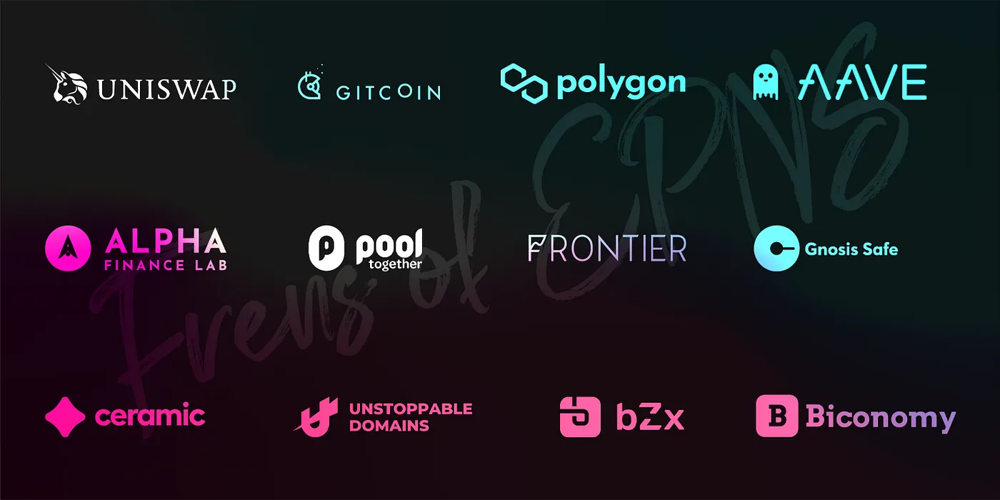

import { ImageText } from '@site/src/css/SharedStyling';

<!--truncate-->

One of the items in our [Q2 Roadmap](https://medium.com/ethereum-push-notification-service/epns-roadmap-2021-c4ededc57a12) was strategic collaborations and pilot programs with top projects of the ecosystem. We aimed for having 4-5 projects and to get them involved but were blown away by the love and reception given to us by over 25+ project with whom we are running the pilot program of EPNS.

<ImageText>Meet Frens of EPNS</ImageText>

With them, we were able to put EPNS to test, and make sure what we are building is aligned to protocols needs now and in the foreseeable future. Let’s look at the great progress we made with few of different Projects and what we learned from them.

#### Uniswap

With Uniswap we implemented EPNS decentralized notifications to let users know when a new proposal is submitted.

By making use of the Call to Action feature users will be able to go directly to the proposal with 1 click.

In this case we hooked directly with Uniswap’s V2 contracts.

Currently, we are exploring implementing EPNS for more use cases available with V3 including sending notifs when the LP provider range of trading curve goes out, ie: they are unable to earn any fees.

#### Aave

With Aave we had the opportunity for the first time to put EPNS to test looking at events happening in Polygon and sending notifications directly to wallet addresses.

With this integration users are notified whenever the Health Factor representing the safety of their loans is reaching a low level.

In this case, the goal is using EPNS decentralized notifications to help protect user’s assets in case they are in risk.

#### Alpha Homora

With Alpha Homora we created a channel to which users can opt-in to receive notifications about their loan positions when they reach a risky level.

Currently, the threshold is defined programmatically as this implementation relies on our Showrunners framework.

Working on this case gave us food for thought, and developed into internal brainstorming sessions to understand how to address some settings like this via the protocol.

#### TrueFi

With TrueFi we worked on a solution to notify users when new loans are available for voting, and also to alert users when their loans are coming due.

Implementing this channel allowed us to use our Protocol in a different way, observing a dynamic list of contracts that can grow depending on the platform usage.

Working on this case also gave us the opportunity to learn new ways to optimize our protocol.

### Milestone Learnings

This important milestone in our roadmap comes packed with lots of lessons learned and important facts & experiences that reassured to us that we are doing things right.

While most of our features were validated, we also had the opportunity to adjust and even pivot into different direction some of our protocol features.

### Protocol Features Update

#### Protocol Settings

With AAVE Loan Liquidation, we understood the importance of deep customizations of a user setting for a particular channel.

#### Indirect Subscribe

We are pivoting indirect subscribe from a service without user consent to now a spam box feature where in channels can send notifications to user wallets but if the user hasn’t opted in to receive those notifications then it will not be shown as a push notification to the user and will land in their unauthorized box, think how twitter deals with DMs that you haven’t accepted.

#### Delegation of Channel Controls

Working with top DeFi projects made us realize that channel can’t be only controlled by one wallet address as there might be few different owners of that channel (think co-founders or people assigned that responsibility). With that in mind, we also introduced delegation of channel controls and the ability to send notifications on channel behalf from other wallets.

#### Verified Badges

We also realized that not all channels would be created with good intentions and wanted the frontend discovery dApp of ours to have that ability which will be done via verified badges that can be handed by us to verified channels and those verified channels can even hand over verification to others. This ensures that the Frontend is able to distinguish useful channels if the user wants to filter them out but at the same time ensures web3 ethos are taken care of.

#### What's coming next?

We originally started this Pilot Program Collaborations with the goal of learning and spreading the word about EPNS with a handful of teams. We end this quarter amazed and humbled with the response received, as reached a list of more than 25 projects looking to work with us to implement EPNS decentralized notifications for their use cases.

We want to finish with a big thank you to our community and the teams working and about to work with us . The inputs and feedback received is invaluable to make sure we become the de-facto communication middleware for both Web3 and Web2 companies to benefit from.

#### Stay Connected

If you are interested in providing feedback and working more closely with our development team to improve EPNS for developers, we invite you to join our [Discord Community Server](https://discord.gg/nYrqZ734nu).
