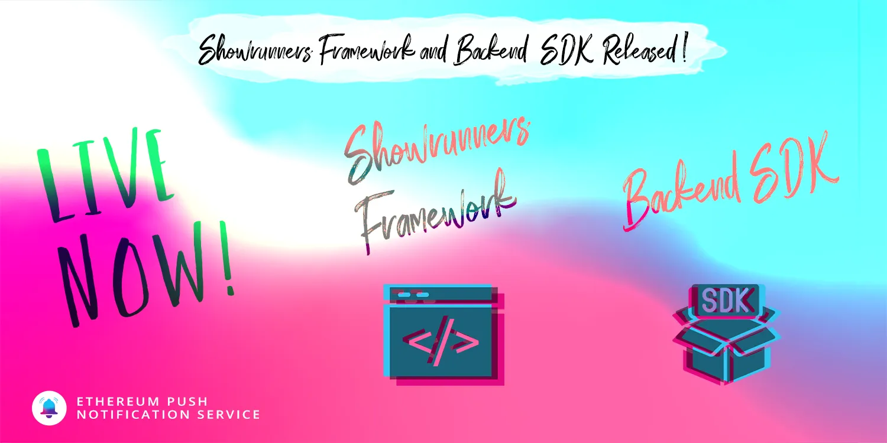

import { ImageText } from '@site/src/css/SharedStyling';

<!--truncate-->

We are thrilled to announce the release of two new open-source EPNS tools to enhance the integration and implementation of EPNS Decentralized Notifications within your dApps and protocols, the EPNS Backend SDK Beta v1.0 and the EPNS Showrunners Framework; two of our most anticipated roadmap milestones for Q2.

More detailed information can be found on our [Roadmap 2021 blog post](https://medium.com/ethereum-push-notification-service/epns-roadmap-2021-c4ededc57a12).

### Showrunners Framework in short

- Allows developers & protocols to send decentralized notifications with custom logic to EPNS Protocol from backend servers.
- Includes a highly customizable scheduling engine that allows for setting up recurrent verifications to trigger notifications.
- This framework relies entirely on the EPNS Backend SDK explained below. However, this doesn’t limit developers to use the SDK directly if a full Showrunners framework implementation is not necessary.

✅ [Showrunners Framework Github](https://github.com/push-protocol/push-showrunners-framework-staging)

### Back-end SDK in short

- Allows developers & protocols for easy access to EPNS common functionalities from within their backends. For instance: getSubscribedUsers and sendNotification.
- This SDK also comes packed with tooling for easy debugging and testing of notifications through the simulate object.
- npm package available at https://www.npmjs.com/package/@epnsproject/backend-sdk

✅ [EPNS Backend SDK Github](https://github.com/push-protocol/push-backend-sdk-staging)

### Do you want to try the EPNS Backend SDK?

We have several resources for those interested in start experimenting with the Showrunners framework and the Backend SDK or contributing to them

### Example Apps

To help developers get started with the Showrunners Framework and using the new SDK, our public [Showrunners repo](https://github.com/push-protocol/push-showrunners-framework-staging) includes sample implementations that we have worked for our Pilot Program Collaborations. This repository aims to serve as a reference for a comprehensive Showrunners implementation containing both simple and complex demonstrations of how to integrate EPNS with other popular protocols and services.

[This video](https://drive.google.com/file/d/1nh-HiVDc-OeNTFbYSdaDMwTmSfGwPAut/view?usp=sharing) briefly describes the implementation we worked for Uniswap to notify users when a new Governance Proposal is submitted. It also shows how to use Postman to trigger notifications for debugging and testing purposes; and how a full round-trip looks like — from the moment a new proposal is submitted until the user gets the notification in their Mobile App and click on it to view it.

### Documentation

- EPNS Integration Guides Gitbook: https://app.gitbook.com/@ethereum-push-notification/s/integration-guide/

### Stay Connected

If you are interested in providing feedback and working more closely with our development team to improve EPNS for developers, we invite you to join our [Discord Community Server](https://discord.gg/nYrqZ734nu).

As usual, this is evergreen documentation that we will keep building, updating, and improving.
