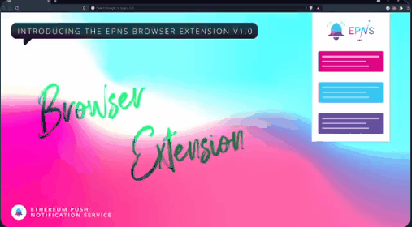

import { ImageText } from '@site/src/css/SharedStyling';

<!--truncate-->

We’ve come to the end of a Q2/2021 that for us as a team, makes us feel proud of everything accomplished and how much we’ve learned over this period.

Without further ado, let’s see what has been keeping us busy this month!

Roadmap Q2 Milestones ✅
=======================

Strategic Collabs! - Frens of EPNS keeps growing 💖
---------------------------------------------------

We worked diligently to deliver EPNS integrations with some of the most important protocols in the ecosystem.

*   **Uniswap**: To notify users when a new proposal is submitted.

*   **Aave**: To notify users when their loans in Polygon-Aave are reaching a low Health factor.

*   **Alpha Homora**: To notify users about upcoming liquidation of leveraged positions, and taking them to their dashboard with 1 click.

*   **TrueFi**: To notify users when new loans are available for voting, and when loans are coming due.

We are ecstatic with the response received from the community as we end up Q2 with a list of 25+ protocols wanting to integrate EPNS into their offerings.

For more details about Collaborations, please check our recent [Strategic Collabs blog post](https://medium.com/ethereum-push-notification-service/roadmap-q2-strategic-collabs-and-what-we-did-so-far-with-them-ca86a868656d).

EPNS Browser Extension v1.0
---------------------------

This extension allows users of blockchain platforms and wallets to get notified from the decentralized web.

We are making it easier to receive EPNS Push notifications while you browse the web.

The EPNS Browser Extension Alpha v1.0 has been submitted to the chrome store, and will be available soon.

This is just the start of a component that we plan to supercharge!

Great News for Devs! 👷🏽
-------------------------

This month we released two other tools for the development community:

*   **Showrunners Framework & Backend SDK Beta v1.0**: Together with this tool we also released sample apps and documentation aiming to help the developers get started with implementations. We covered this in detail in a [recent blog post](https://medium.com/ethereum-push-notification-service/epns-showrunners-framework-and-backend-sdk-beta-v1-0-are-live-7348c0725a12). Make sure to check it out!
*   **Status update for protocol v1: This is where planning meets learning!  
    **We finished everything we had planned for the EPNS protocol as per our roadmap, and working on the Pilot Program Collaborations led us to make important improvements to our protocol to ensure we are ready to fulfill current and future needs.  
    \- Protocol Settings  
    \- Indirect Subscribe  
    \- Delegation of Channel Controls  
    \- Verified Badges  
    Make sure to read the [**Protocol Features Update Section**](https://medium.com/ethereum-push-notification-service/roadmap-q2-strategic-collabs-and-what-we-did-so-far-with-them-ca86a868656d) in our blog post.

**EPNS Community Incentives**
=============================

We are getting stronger by the minute 💪🏽! By the end of June, we are observing well over $4M Total Value Locked in, and over **600,000** $PUSH has already been handed out in rewards!

Our #ROCKSTARS Community NFT program keeps setting the bar higher and higher. We are amazed by the quality and creativity of the contributions made by the participants; being true ambassadors of EPNS in social channels, and spreading the word with other teams. Thank you!!

Other Highlights
================

*   We are excited to be announced in [Messari Hub](https://messari.io/asset/epns-ethereum-push-notification-service?utm_source=messaricrypto&utm_medium=tweet&utm_campaign=epns-hub-announcement).
*   Listings: [PUSH listed in MEXC in the Innovation zone](https://support.mexc.com/hc/en-001/articles/4403088065178).
*   [EPNS collaborating with Aave to bring Push Notifications to Aave users](https://medium.com/ethereum-push-notification-service/epns-collaborates-with-aave-to-bring-push-notifications-to-aave-users-3cdd7baf38e0).
*   Our **Rockstar of Ethereum** latest episodes with [Sandeep Nailwal](https://www.youtube.com/watch?v=ZU_RDJseZ88) and [Mariano Conti](https://www.youtube.com/watch?v=cXpXHJkKCKE) are  live!
*   **Featured by:** [BanklessFR](https://banklessfr.substack.com/p/-la-pratique-du-mardi-comment-sabonner), [Superpumped](https://www.youtube.com/watch?v=_U_dYc-h9E8) with Tanmay Bhat and Akshay BD, [TheDailyWei by Anthony Sassano](https://twitter.com/sassal0x/status/1402271751950802945), [YourStory](https://yourstory.com/2021/06/here-are-6-blockchain-startups-watch-out-2021/amp) as one of the blockchain startups of 2021. Bollywood actor [Kunal Kapoor mentions EPNS](https://twitter.com/kapoorkkunal/status/1408367127275261953). Harsh was invited to join The Good Time Show in Clubhouse. Harsh shared his view on [India Crypto craze in Open The Magazine](https://openthemagazine.com/cover-stories/crypto-craze/). Our very own Richa was featured in [WazirX’s Humans of Crypto](https://www.youtube.com/watch?v=4FARhVg4UJo) and on the [Arab EmTech & Startups Conference](https://twitter.com/arabemtechconf/status/1402343210228273159).
*   **AMA:** AMA session with Coin Crunch India.

Staying aligned to our roadmap and successfully executing all tasks around it is vital for us to continue fostering a growing community that trusts EPNS. The amazing coverage we had this month together with the development milestones achieved, is our fuel to continue looking to reach new horizons.

