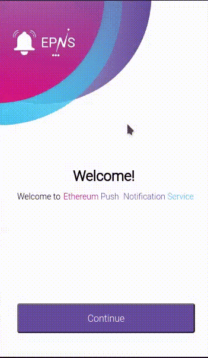

import { ImageText } from '@site/src/css/SharedStyling';

<!--truncate-->

We are thrilled to announce the arrival of <b>EPNS Chrome Browser Extension Alpha v0.1!</b>

[Part of our Q2 2021 Roadmap](https://medium.com/ethereum-push-notification-service/epns-roadmap-2021-c4ededc57a12) was to extend the outreach of decentralized notifications to more platforms outside mobile and this extension allows users to do exactly that, ie: get notifications from Web3 without visiting dApps to check your actions!

<blockquote>
Note: Currently it’s recommended for developers and advance users to install the extension via our git. This is an alpha version so things will most likely break till they get better, the extension has been submitted to chrome store as well and we will be releasing them soon!

The EPNS Chrome Browser extension is now LIVE in the Chrome Web Store!!
https://chrome.google.com/webstore/detail/epns-protocol-alpha/lbdcbpaldalgiieffakjhiccoeebchmg/
</blockquote>

#### Setup
If you have used the mobile App before you should already be familiar with the basics, however if it’s your first time please continue reading this guide and in 3 simples steps you will start receiving notifications from your favorite services.

👉 Chrome Browser Extension: https://chrome.google.com/webstore/detail/epns-protocol-alpha/lbdcbpaldalgiieffakjhiccoeebchmg/

#### Repos
👉 Production Environment Repo: https://github.com/ethereum-push-notification-service/epns-browser-ext

👉 Staging Environment Repo: https://github.com/ethereum-push-notification-service/epns-browser-ext-staging

#### Getting Started
Setting up your extension to start receiving notifications is super easy.

1. Open the extension to jump immediately into The Welcome! screen. Click continue to start the setup process.
2. Enter the wallet address from which you want to start receiving notifications, and click Verify.
3. You are all set to start receiving notifications!

By simply clicking the QR code on the left of your wallet address you can switch to another wallet.

### Update as of July 4th, 2021
The EPNS Browser Extension is now available in the Chrome Web Store!!
https://chrome.google.com/webstore/detail/epns-protocol-alpha/lbdcbpaldalgiieffakjhiccoeebchmg/

<b>What's coming next?</b>

We will continue taking steps to expand the features and ease of use of this component and allow users to do much more that receiving notifications.

Make sure to visit: https://app.epns.io/ , to view all channels currently available for subscribing.
