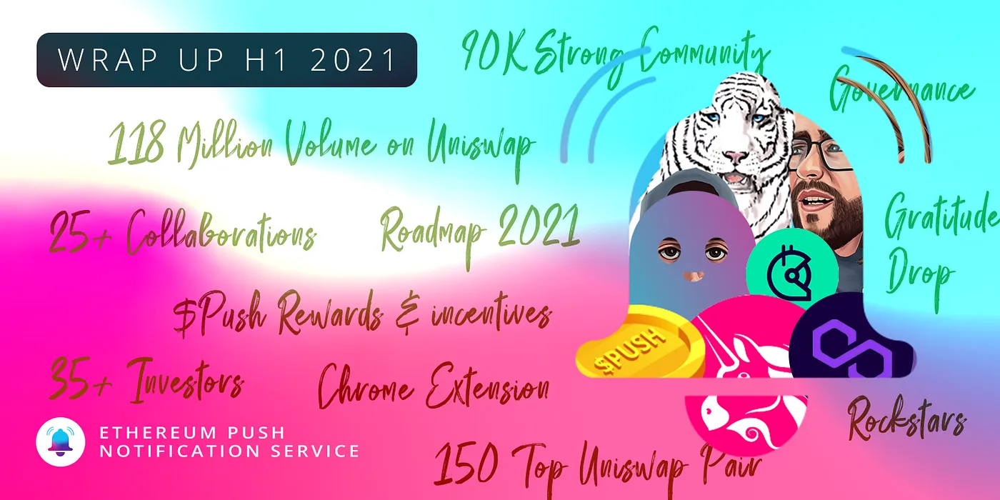
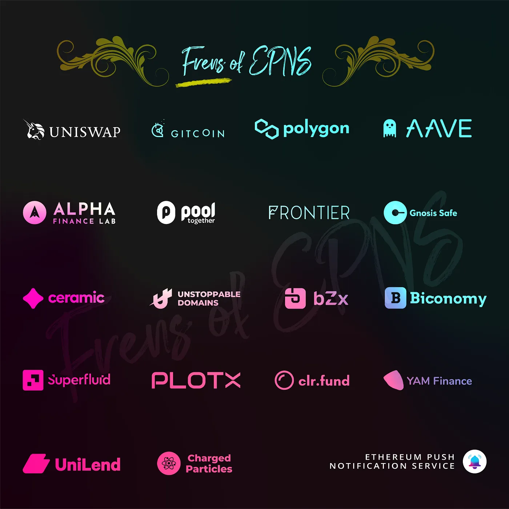

import { ImageText } from '@site/src/css/SharedStyling';

<!--truncate-->

With the halfway mark of the year recently behind us, we wanted to take a moment to look back at what we’ve achieved in the first 6 months of 2021 as we look towards the remainder of the year, including our mainnet launch in the upcoming months.

First, it’s worth us kicking off with gratitude to our incredible community of support, investors, and advisors. These people have lent us their time and their knowledge to support our growth and our journey to provide the core notification layer for the decentralized economy. Thank you to each and every one of them!

So far this year, the most critical event for EPNS was our token generation event (TGE) and Polkastarter IDO in April. A lot of pre-work went into that event, however — and we spent the first few months of the year laying down some foundations for the EPNS protocol.

**Developer Tooling:** We continued to develop our SDKs, [Subgraphs](https://thegraph.com/explorer/subgraph/epnsproject/epnsprod), new back-end infrastructure support, and more tools for the developers to build faster and better integrations with EPNS.

**Staging Environment:** Have you checked out our staging environment? If not, you should — it’s where much of the fun happens. Throughout the past 6 months, we’ve been adding quick access to additional resources to better help people onboard themselves to the EPNS protocol, including: DAI minter, Ropsten Faucets, app download links (Android & iOS), quick access to documentation material, and more.

**Channels:** EPNS lets anyone subscribe to channels that deliver them notifications based on customizable actions that occur on-chain, lettering users stay on top of their addresses and dApp activity like liquidation warnings in DeFi. We’ve spent time this year rolling out a lot of

**Chrome Extension:** Recently, we announced the arrival of EPNS Chrome Browser Extension Alpha v0.1! The EPNS Chrome Browser extension is now LIVE in the [Chrome Web Store](https://chrome.google.com/webstore/detail/epns-protocol-alpha/lbdcbpaldalgiieffakjhiccoeebchmg/).

# The $PUSH Token Launch

In April, we celebrated one of our largest milestones to date: the $PUSH token generation event. $PUSH is the native token to the EPNS protocol [— to learn more, see here](https://medium.com/ethereum-push-notification-service/push-token-economics-d7f566c29b1a).

The TGE began with our IDO on Polkastarter. During the IDO, we raised over 44 ETH from over 400 participants. Later that day after the Polkastarter IDO, $PUSH went live on Uniswap, and permissionless trading began. Just a couple of days later, we announced our listing on WazirX, India’s largest crypto exchange.

To date, $PUSH has $118m in volume on Uniswap with over 3,000 on chain token holders — also securing a spot in the top 150 token pairs. We’ve also listed on MEXC — with more exciting announcements to come!

To learn more about the TGE and the token distribution of $PUSH, [see here](https://medium.com/ethereum-push-notification-service/announcing-the-epns-push-token-generation-event-4d1699e716f5).

# Ecosystem Collaborations

We see so many opportunities for notifications in the Web3 ecosystem. Especially following our TGE, we started collaborating with leading protocols in the blockchain space to help them scope, create, and test those opportunities for their platforms ahead of our mainnet launch. We’ve announced _over 25 collaborations_ in 2021, including:

- [Aave](https://medium.com/ethereum-push-notification-service/epns-collaborates-with-aave-to-bring-push-notifications-to-aave-users-3cdd7baf38e0)
- [Uniswap](https://medium.com/ethereum-push-notification-service/accelerating-defi-with-epns-f2cbfaa33c91)
- [Gitcoin](https://medium.com/ethereum-push-notification-service/gitcoin-growing-open-source-using-web3-notifs-36a9ec6e97dc)
- [Polygon](https://medium.com/ethereum-push-notification-service/scaling-web3notifs-on-polygons-layer-2-100e19e3269d) (prev. Matic)
- [Unstoppable Domains](https://medium.com/ethereum-push-notification-service/epns-partners-with-unstoppable-domains-4d5507ddb6bd)
- [Pool Together](https://medium.com/ethereum-push-notification-service/win-win-for-users-of-pooltogether-and-epns-adb6e8d9188f)
- [YAM Finance](https://medium.com/yam-finance/yam-finance-integrates-epns-for-decentralized-communication-and-notifications-8611b9a9921c)
- [Biconomy](https://medium.com/ethereum-push-notification-service/meta-txn-power-house-biconomy-collaborates-with-epns-d33032658466)
- And more!

[Check out some of these collaborations in action](https://medium.com/ethereum-push-notification-service/roadmap-q2-strategic-collabs-and-what-we-did-so-far-with-them-ca86a868656d) — Web3 notifications on Uniswap, Aave, Alpha Homora, and more!

# EPNS Rewards and $PUSH Incentives

The TGE was the precursor to announcing the [$PUSH Incentives program](http://incentives.epns.io). Our rewards program offers a total of 5,510,000 $PUSH to be distributed during the program, which ends on 15th March 2023.

The incentives website launched with two pools: The PUSH Staking Pool, and the Uniswap LP Pool, allowing users to participate in yield farming and liquidity mining opportunities and enjoy great APYs.

Learn more about EPNS Rewards and $PUSH Incentives [here](https://medium.com/ethereum-push-notification-service/epns-push-liquidity-rewards-program-d16ff2c0fef4).

# Community

Where would we be without our community? Answer: not very far. We spent a lot of the past six months finding as many opportunities as we could to thank you for all the support you’ve shown us. A portion of our TGE airdropped funds to early users of the protocol — i.e. those who stuck with us through the bugs to help us arrive at the best product for Web3 notifications.

After our token release, we announced the [Rockstars of EPNS NFT gratitude program](https://medium.com/ethereum-push-notification-service/kicking-off-the-epns-nft-community-drops-6a5c49808cf). For the next year following the token launch, we are distributing 1 NFT and 2,400 $PUSH to one community member a week who demonstrates their support of the EPNS protocol. So far, we’ve seen memes, videos, documentation recommendations, and more submitted on Twitter and are blown away by the support and creativity of the community.

Keep rocking on 🤘

# Looking Ahead

We’re ecstatic about all we’ve achieved this year, but we know there’s so much more to do to bring about the community’s vision for a notification layer of Web3. One of our biggest communication efforts this year was the [**2021 EPNS Roadmap**](https://medium.com/ethereum-push-notification-service/epns-roadmap-2021-c4ededc57a12), which we published in April following the TGE. The Roadmap lays out our plans for Q3 and Q4 of this year, letting the community know what’s in the pipeline.

And what’s the most exciting part of the roadmap? In our opinion, it’s the impending mainnet launch of the EPNS protocol. After months and months of testnet tinkering, we’re excited to officially bring notifications to the Web3 ecosystem, and work with our collaborators to offer better communication to their users.

Mainnet is so exciting …but wait!! let’s also talk push nodes which will make L2s communication a reality… and the fact that they can theoretically support other blockchains (even non-evm ones) is a PoC which we all want to see happening! Onwards to infinity and beyond!

Much 💕, from us to you!

The EPNS Team
