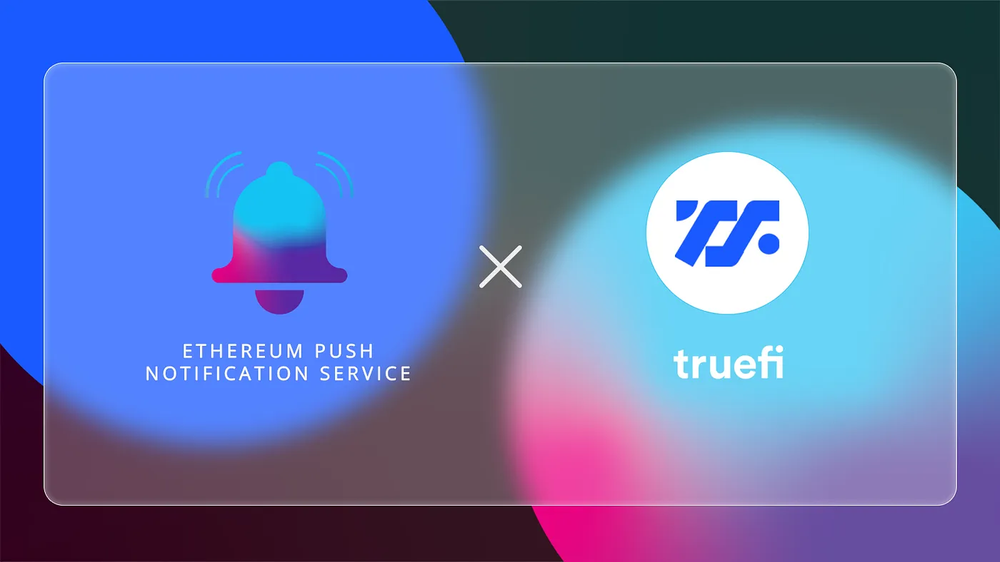

import { ImageText } from '@site/src/css/SharedStyling';

<!--truncate-->

DeFi is a space where maximum disruption happens every day. Thanks to the powerful composability of Ethereum, new solutions emerge quickly, and enable more people to participate in this financial revolution. When it comes to loans, collateralized and uncollateralized loans have attracted new kinds of players to the DeFi space.

With the mutual goal to grow this exciting space, we are thrilled to announce that we are working with [TrueFi](https://truefi.io/) to develop the core EPNS protocol. TrueFi is a team with a notable trajectory building cutting-edge products for Web3, and we are looking forward to working with the team to refine the EPNS protocol to create sustainable, decentralized notifications.

Our pilot program with TrueFi will consist of:

*   Creating a standard for the TrueFi platform that will enable sending notifications based on predefined thresholds and conditions.
*   For borrowers: Notifications around when rates are changing and when their existing loans are coming due
*   For stakers and lenders: Creating a communication channel to keep token holders aware of new loan requests that require voting and provide stakers with a fast and efficient way to go to the app and vote for/against a loan.
*   Working with the TrueFi team to enable technical discussion towards building the decentralized communication layer that is scalable and powerful.

TrueFi brings a new concept to the DeFi scene with the idea to attract major industry players and institutions as borrowers looking to secure high-value long term loans. We are grateful to be partnering with one of the most innovative teams in the space to help take DeFi beyond.

**About TrueFi**
----------------

TrueFi is a DeFi Protocol for on-chain, unsecured lending, which allows earning high yields on stablecoin loans and borrowing capital without collateral. You can stay in touch with TrueFi on [Twitter](https://twitter.com/TrustToken) and [Discord](https://discord.com/invite/3tMyMqyqDj).
