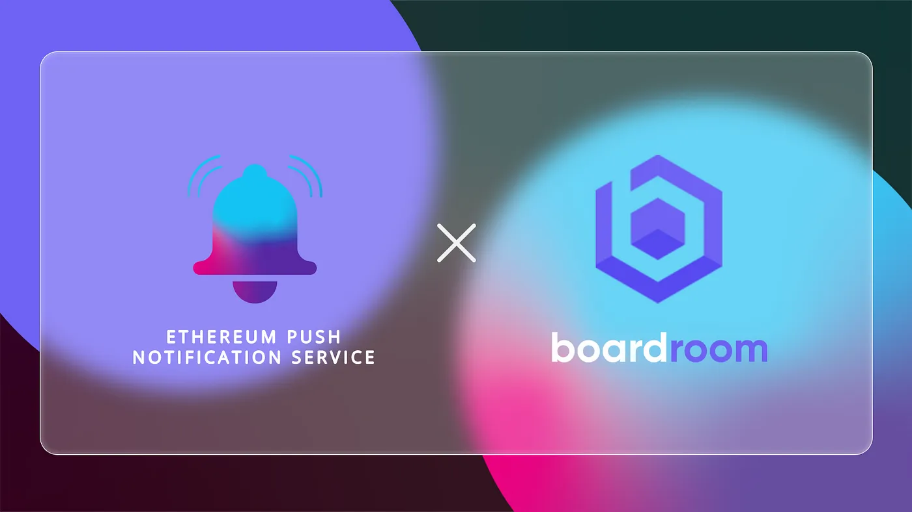

import { ImageText } from '@site/src/css/SharedStyling';

<!--truncate-->

DAO and Protocol Governance supports transparent and inclusive decision-making, enabling a distributed set of stakeholders to adopt and implement key decisions that contribute to the operation and growth of a network and community Enabling a group of participants who do not know or trust each other to agree on the state of shared governance and administration requires strong communication mechanisms. **To take communication in governance to the next level, we are excited to announce our pilot program collaboration with Boardroom to provide decentralized push notifications.**

Participation in network governance has been hindered by fragmented discussion and voting channels, burdening stakeholders with an unnecessary effort to engage with the networks they themselves ‘own’. An important step in lowering these frictions involves building powerful and user centric tooling that quickly and easily alerts users of important topics and decisions that will impact their network. Decentralized notifications provide a huge leap forward in user experience by providing timely information to diverse stakeholders, and will completely change how folks interact with network governance moving forward.

## **Why Boardroom needs decentralized notifications**

[Boardroom](https://www.boardroom.info/) is a governance platform improving distributed decision-making across stakeholder-owned crypto networks, with its dashboard facilitating simple and transparent stakeholder oversight and management of this new paradigm of organizations and communities. The collaborative platform brings together a standardized interface, proposal viewing, and discussions. Yet without Push Notifications, governance participants are still required to keep an eye on email, social, and other channels to stay up to date with the latest activities, resulting in a lower engagement and participation level.

## **Solution: Instant Wallet Notifications With EPNS**

By implementing EPNS Push Notifications, Boardroom users will receive information directly to their wallets in a timely manner. Not only will they receive notifications about ongoing events, but also an actionable link that makes participation easier and thus encourages engagement.

The collab benefits to Boardroom users include:

- EPNS will send notifications about new proposals, voting, and brainstorming; as well as updates and results.
- Boardroom will work together with the EPNS team to meet the evolving and future notification needs of users on the platform.
- Boardroom users will be able to customize notification settings and formats for different product needs.

## **EPNS-Boardroom Collaboration: What We Plan to Achieve**

During this “pilot program” collaboration with Boardroom, we will build a channel for Boardroom where users can subscribe to receive notifications. These notifications will benefit from the different notification formats available from EPNS to provide highly customizable and effective outreach, which can include receiving updates about ongoing proposals and voting, alerts when new proposals have been added, and more. Working with the Boardroom team will enable technical discussions towards building a communication layer that is powerful and flexible for the most demanding governance needs.

With Boardroom being one of the key players in the development of efficient governance tools and products, we foresee many more notification channels set in motion to fulfil all governance participants’ requirements.

Boardroom is a clear example of governance put into practice, and for us it is a pleasure to work side-by-side with a team that reflects our same core principles.

Brainstorm, Vote, Learn, Notify!

## **About Boardroom**

Boardroom is an integrated governance management platform improving distributed decision making across crypto networks with tools and services for high-value digital stakeholder interactions. Boardroom’s mission is to enable stakeholder-owned platforms to scale while upholding the interests of all their constituencies, by providing a dashboard that facilitates simple and transparent stakeholder oversight and management of DAOs.

Stay in touch! [Website](https://www.boardroom.info/), [Twitter](https://twitter.com/boardroom_info), [Discord](https://t.co/H4VJVIA00J?amp=1), [Blog](https://governance.substack.com/)
