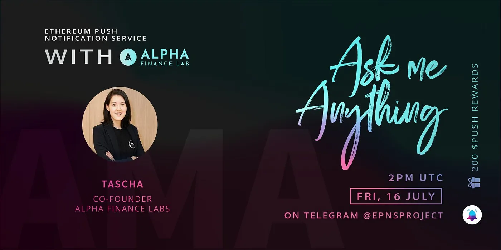

import { ImageText } from '@site/src/css/SharedStyling';

<!--truncate-->

We had the pleasure to have Tascha Panpan from [Alpha Finance Lab](https://alphafinance.io/) joining our community on 16th July 2021 for an AMA session. We are thrilled to see such a formidable response from the EPNS community. Thanks!

**_Date_**_: Friday, 16th July, 2021  
_**_Time_**_: 2:00PM UTC_

**Guest:** _Tascha Panpan, Co-founder, Alpha Finance Lab_

_Find the AMA transcript below:_

**EPNS Alpha Finance Lab AMA — Friday July 16th**

**Host:** Dantes Stan

**DANTES STAN**: Hi @tascha_panpan.👋 Welcome to the EPNS Community! It is a pleasure to have you with us today.

**TASCHA PANPAN**: Hi everyone! Glad to be here.

**DANTES STAN**: Before we start, could you please introduce yourself and go over your background so everyone here gets to know you better @tascha_panpan?

**TASCHA PANPAN**: Sure thing. I’m Co-Founder and CEO of Alpha Finance Lab. Previously, I was head of strategy at Band Protocol, product manager at Tencent, and originally an investment banker in traditional finance. Graduated from UC Berkeley, so go Bears!

**DANTES STAN**: Impressive stuff @tascha_panpan!!

**TASCHA PANPAN**: Done.

**DANTES STAN**: Let’s move to the next segment of our AMA Session.

I hope you’re ready for the next segment? I will be asking some questions. 🙂

**TASCHA PANPAN**: Let’s do it!

**DANTES STAN**: Hehe.

> _Why did you guys launch Alpha Finance Lab? What is the rationale behind it?_

**TASCHA PANPAN**: The first product that we built is Alpha Homora, the first leverage yield farming product in DeFi. Before Alpha Homora, there was no such concept as leverage yield farming.

Currently, we are building AlphaX, our new and second product in the derivatives space. We’re taking the same mindset we did with Alpha Homora to AlphaX, so pretty much creating a new category of our own in the derivatives space.

Our rationale behind this vision is that we believe that DeFi is here to stay. However, given the nascent stage DeFi is in, the industry will inevitably go through significant changes as it matures.

So, being able to react quickly to the market/change in the DeFi landscape and building/incubating products that capture unaddressed demand as the landscape matures will ensure Alpha Finance Lab continues to play a key role in DeFi throughout the industry lifecycle.

**DANTES STAN**: Please remember to let me know when you are done. 🙂

**TASCHA PANPAN**: Done.

**DANTES STAN**: Awesome. Thanks for sharing this with us. Let’s move over to the second question.

> _Can you walk us through Alpha’s product offering, and maybe talk a little about the recent launch of Alpha Launchpad?_

**TASCHA PANPAN**: Sure, as mentioned briefly earlier, the first Alpha product is Alpha Homora.

This is the app on Ethereum: [https://homora-v2.alphafinance.io/](https://homora-v2.alphafinance.io/)

This is the one on BSC: [https://homora-bsc.alphafinance.io/](https://homora-bsc.alphafinance.io/)

There are 2 types of users who can use Alpha Homora.

1.  Lenders. So for Alpha Homora V2 on Ethereum, lenders can lend a number of assets and earn high lending interest rates. Many of these assets are also not supported on any other lending protocols, or if supported, the yields are a lot lower than those on Alpha Homora V2.
2.  Leverage yield farmers. These are the users who want to yield farm in a more capital efficient way. This means you can use Alpha Homora to yield farm, for instance farming SUSHI on Sushiswap, but you will get a lot more returns with the same starting capital than if you were to yield farm normally. This is because Alpha Homora allows you to take leverage to yield farm.

For more info, you can also check out the step-by-step guide here:https://alphafinancelab.gitbook.io/alpha-homora-v2/yield-farmers/tbd-types-of-pools-and-where-apy-comes-from

I’ll keep AlphaX details for now, as we haven’t shared those publicly. Stay tuned though ;)

Recently, we also launched Alpha Launchpad, which is the first DeFi incubator program built by builders for builders.

Alpha Launchpad is the only launchpad program that focuses on incubating DeFi projects from the ground up and driving significant growth post-launch.

The incubated projects will get to work with the core Alpha team and a number of key DeFi community members and contributors on all things the teams need to launch and grow successfully. The Alpha Launchpad team will help advise and mentor.

In returns, Alpha community \[members\]who stake their ALPHA tokens on [https://tokenomics.alphafinance.io/](https://tokenomics.alphafinance.io/) will also get a share of the incubated projects tokens by simply staking their ALPHA tokens.

For those who are interested in applying to the Alpha Launchpad, you can find more information here as well: [https://launchpad.alphafinance.io/](https://launchpad.alphafinance.io/)

Done.

**DANTES STAN**: Wow. This is great, I can’t wait to use your product and I know our community members are also interested. 😀😊

Let’s move to the next question.

> _Can you talk to us about what’s coming for Alpha, and what milestones you are looking to achieve this year?_

**TASCHA PANPAN**: AlphaX is coming up next for the Alpha community. AlphaX is our new and second product in the derivatives space.

This year, there are many milestones we are looking to achieve.

On Alpha products side, we are looking to launch AlphaX and grow AlphaX to be the go-to derivatives platform in DeFi. All of this is while continuing to grow Alpha Homora V2. We’ll also continue to brainstorm more Alpha products that we see should be built to capture the market demand.

On the Alpha Launchpad side, we are looking to incubate quite a number of quality projects this year. This means there are going to be a number of incubated projects’ tokens that ALPHA stakers will get this year. We’re looking to continue growing the Alpha Launchpad team and decentralize it as well.

On the Alpha Launchpad side, we are looking to incubate quite a number of quality projects this year. This means there are going to be a number of incubated projects’ tokens that ALPHA stakers will get this year. We’re looking to continue growing the Alpha Launchpad team and decentralize it as well.

Done.

**DANTES STAN**: So many exciting things coming. 🙌🤗

Let’s move to the 4th question.

> _Can you please elaborate on what Alpha is looking to achieve with this collaboration with EPNS, and what’s the desired impact for your users?_

**TASCHA PANPAN**: For sure, EPNS helps a lot with notifications service for Alpha Homora users (leverage yield farmers type). With leverage yield farming, users can be at liquidation risk, since by leveraging Alpha Homora will borrow assets to yield farm for users.

With any borrowing, liquidation can take place if the borrowed amount exceeds the value the protocol allows users to borrow (to ensure the safety of the protocol and lenders).

So with EPNS, Alpha Homora users can subscribe to the notification system and get notified when their positions are at liquidation risk, so users can quickly manage the positions before they are actually liquidated

Done.

**DANTES STAN**: I am enjoying this AMA. 😊

Let’s move to the last question of this segment.

> _How do you think the product offering from Alpha will be used together with EPNS in the future?_

**TASCHA PANPAN**: I think if EPNS can expand the support to notify Alpha Homora users even before they are at liquidation risk, that would be amazing.

Additionally, if EPNS can notify any DeFi user when there is a spike in lending interest rates in a particular asset on Alpha Homora, that would help a lot of lenders in DeFi too. Because at the moment, Alpha Homora V2 generates the highest lending interest among all lending protocols. So we also want to let more people know of these great rates, and we think EPNS can help with the notification system.

Done.

**DANTES STAN**: Amazing, Thank you for your answers @tascha_panpan! We will now move to the last round which is a Live Q/A session.

Since we announced the ALPHA Finance Lab x EPNS AMA, the excitement in our community has really increased. It’s time to give them a chance to ask their questions. I can’t wait to see what they have in their fridge 😅

Dear Community, get ready to shoot all your Questions! 🚀

I will UNMUTE the group soon and @tascha_panpan will pick and answer as many questions as possible but only participants with the BEST questions will be selected as winners at the end of the AMA.

Are you all ready?

3..

2….

1…..

\[Over 300 questions are submitted by community members.\]

**DANTES STAN**: Wow….I am not surprised by the number of questions. I know many have been waiting. 😅

Our chat is on MUTE again. We have got the last set of Questions from community members.

How’s the response @tascha_panpan? haha

**TASCHA PANPAN**: How many should I select to answer?

**DANTES STAN**: You can pick and answer the BEST Questions, any number you want to Answer. 10 is fine 🙂

> **_XPERIA_**_: Hi!_
>
> _What is Alpha Homora V1 and V2? How do they work and how will users get benefits of this features? What are the differences?_
>
> _@tascha_panpan_

**TASCHA PANPAN**: I definitely cannot not answer the first question, impressive to be the first one sending from all the questions submitted here.

V1 and V2 are different in a number of ways

As a lender, if you lend on V1, you can only lend ETH. On V2, you can lend many assets. This is because leverage yield farmers on V2 can borrow many assets to yield farm. \[They are\]not required to only borrow ETH like on V1.

On the yield farmers’ side, apart from being able to borrow multiple assets to yield farm, you can also supply the LP token as collateral.

V2 is also a lot more flexible, allowing us to support non-ETH farms, such as the stablecoin pool (Curve 3 pool) as well.

> **_TINY_**_: Could you please tell me just a little more about the team and some of their backgrounds? I have personally seen many projects launch with inexperienced team members, and some of those didn’t go so well due to easily avoidable mistakes._

**TASCHA PANPAN**: Hi Tiny, sure thing. You know my background already from the beginning of the AMA. Let me share Nipun’s background here as well, as he’s a Co-Founder and CTO.

Nipun graduated from MIT with a masters degree in Electrical Engineering and Computer Science (4.9/5.0) and a bachelor degree in Mathematics (4.9/5.0) and Computer Science (4.9/5.0). He also has won 4 gold medals and 1 silver medal from the International Mathematical Olympiad (IMO), and is currently ranked 3rd in the IMO hall-of-fame (global ranking).

He’s worked in multiple areas and developed a number of tech before co-founding Alpha Finance Lab, such as an automated stock price prediction algorithm based on quantitative time-series data. He also self-developed an algorithm to detect and trade arbitrages in cryptocurrency markets.

> **_UNIDENTIFIED_**_: What are the ways of earning Alpha ? Can I mine it? What are the benefits when I hold Alpha ?_

**TASCHA PANPAN:** Assuming you have no ALPHA at all, you can earn ALPHA by doing 2 things.

1. Lend ETH, USDT, USDC, or DAI on Alpha Homora V2: [https://homora-v2.alphafinance.io/.](https://homora-v2.alphafinance.io/) Apart from the lending interest rate, you will also get ALPHA.

2. Leverage yield farm of more than 1x leverage on Alpha Homora V2.

For more details on leverage yield farm and a step-by-step guide, you can check here: [https://alphafinancelab.gitbook.io/alpha-homora-v2/tbd-overview-of-alpha-homora-v2-dapp](https://alphafinancelab.gitbook.io/alpha-homora-v2/tbd-overview-of-alpha-homora-v2-dapp)

Once you have ALPHA, you can stake them on Alpha Tokenomics and that is where you will unlock much value from there. Let me explain a bit more on the value you get from staking ALPHA. Can stake here: [https://tokenomics.alphafinance.io/](https://tokenomics.alphafinance.io/)

By staking ALPHA you will get

1. ALPHA (this is not minted, but this is the protocol fees Alpha products have collected and we are distributing the fees to ALPHA stakers).

2. Incubated projects tokens. Since we created the Alpha Launchpad incubator program, we make sure the incubated projects bring value to the ALPHA stakers by distributing a portion of their tokens to ALPHA stakers. For instance, Beta Finance, which is the first Alpha Launchpad incubated project, they are going to distribute a portion of BETA token when they launch to ALPHA stakers as well.

3. Down the line, you will also earn incubated projects’ protocol fees (selected projects) as well.

All of these are earned by simply staking ALPHA.

> **_UNIDENTIFIED_**_: What is the PROJECT’s revenue model? In which ways do you generate revenue/profit?_

**TASCHA PANPAN**: Alpha generates revenues from many ways.

For Alpha Homora, we collect 20% of borrow interest rate as protocol fees on Alpha Homora V2 (and 10% on V1, 10% on vBSC).

For AlphaX, there are going to be a number of ways we will collect fees.

For Alpha Launchpad, incubated projects’ tokens will be considered revenue for the Alpha community too, as they will get them by staking ALPHA.

Lastly, some of the incubated projects will also distribute a portion of their protocol fees to ALPHA stakers, so another revenue stream for the Alpha community.

As a side note, currently more than 37% of ALPHA’s circulating supply is being staked at the moment.

> **_UNIDENTIFIED_**_: As a community-based project, How can I support Alpha Finance’s success? Do you have a Global Ambassador Program or a Referral Rewards System?_

**TASCHA PANPAN**: We have an Alpha Grants Program, in which anyone can support Alpha as an ‘Alpha Builder’ or ‘Alpha Thinker’.

We are rolling out a lot more community initiatives within a month or so as well, so there will be more ways the community can contribute and support the project.

More details about the Alpha Grant Program here: [https://alphafinancelab.gitbook.io/alpha-finance-lab/alpha-grants-program/overview-of-developer-grants](https://alphafinancelab.gitbook.io/alpha-finance-lab/alpha-grants-program/overview-of-developer-grants)

> **_UNIDENTIFIED_**_: For Alpha, what security features will be implemented to prevent hacking due to bugs in smart contracts? Does the Alpha team test regularly to identify vulnerabilities?_

**TASCHA PANPAN**: Yes, we have implemented a number of things on this front to ensure top security for all Alpha products.

1. Multiple audits by top security audit firms

2. Continuous peer reviews by trusted and the most respected security researchers in the space

3. Continuous internal reviews

4. Internal monitoring tools

5. Active bug bounty program with Immunefi

> **_HOA VAN_**_: I see your project Alpha developing many products! This is an advantage being able to meet most of the user’s needs! However, does developing multiple products make it difficult to manage? How do you guarantee the quality of all the products in Alpha?_

**TASCHA PANPAN**: Good question, and actually not hard to manage, as we have many sub-teams inside the Alpha team. Each sub-team acts like a unit of its own to maintain and grow each product going forward. We guarantee the quality of all Alpha products by having the core team (not the sub-team) build the product itself. This means the core team will build all Alpha products while the sub-teams will further take the built product to maintain and grow even further.

> **_JOLYNN DOBBS_**_: What are the key milestones on your roadmap, both things you have already achieved and things that we can look forward to?_

**TASCHA PANPAN**: You can check out the recent things we have achieved and the roadmap here: [https://blog.alphafinance.io/alpha-finance-lab-vision-roadmap/](https://blog.alphafinance.io/alpha-finance-lab-vision-roadmap/)

> **_KYLA WHITTEN_**_: How can users stay updated with this project? Are there channels, including local communities where users can get the latest updates?_

**TASCHA PANPAN**: The Alpha website would be the best start, as it contains all links and docs there: [https://alphafinance.io/](https://alphafinance.io/)

**DANTES STAN**: One more to go. 🙂

> **_KITTEN FUN_**_: I am quite impressed with your project name, so can you tell me where it comes from? What does it mean to you and why did you choose that name for your project?_

**TASCHA PANPAN**: The name Alpha Finance Lab came from multiple core ideas we hold for our project.

1.  Alpha = We make sure our products help generate alpha for users. Alpha in finance is the additional gains you get on top of the standard gains in the market.
2.  Finance = e are focused on the DeFi area.
3.  Lab = We are a DeFi lab, so we want to have the name showcase this essence of our project. Being a DeFi lab will allow us to innovate and keep up with the fast-paced industry

Done.

**DANTES STAN**: Thank you for your insightful answers, @tascha_panpan. We highly appreciate it and this ends the last round of our AMA. 💪

**TASCHA PANPAN**: Thank you Dantes and everyone in the EPNS community!

Again, below are the quick links to the Alpha community. The Alpha Wolves always welcome more wolves to join the pack!

Twitter: [https://twitter.com/AlphaFinanceLab](https://twitter.com/AlphaFinanceLab)

Telegram: [https://twitter.com/AlphaFinanceLab](https://twitter.com/AlphaFinanceLab)

**DANTES STAN**: Good! I know our community members enjoyed the AMA and I know they will be joining ALPHA Finance Lab. 😊

Dear Community,

We will announce segment 3 winners within 4 days on our announcement channel. 🥳

Subscribe to @epnsprojectnews

That’s it for our AMA guest. Let me thank @tascha_panpan, Co-founder at Alpha Finance Labs for joining our chat group today and sharing insights on the project.

On behalf of the entire EPNS team and community we wish you and your team great success.

**TASCHA PANPAN**: Thank you all. Have a great day/night!

**DANTES STAN**: That ends the EPNS AMA with Alpha Finance Labs!

Thank you everyone for participating in this insightful AMA. We love our EPNS Fam! ❤️
