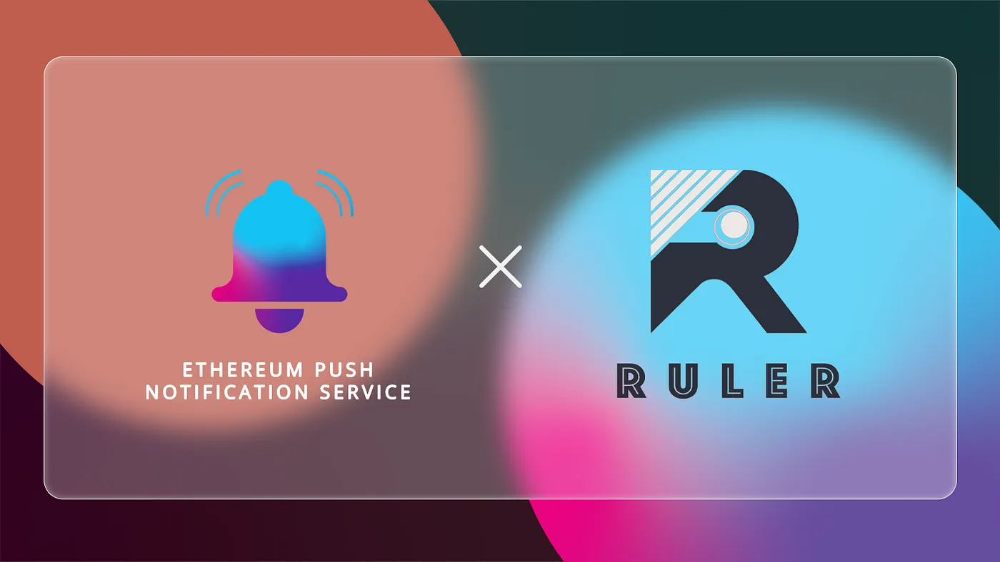

import { ImageText } from '@site/src/css/SharedStyling';

<!--truncate-->

DeFi and the peer-to-peer lending and borrowing space have been ever-expanding and have been one of the killer use-cases of the Web3 ecosystem. Although most peer-to-peer lending protocols rely on the value of the collateral provided for the loans, this often comes with the risk of liquidation at times of market volatility. In order to combat this, Ruler protocol has arrived with non-liquidatable fixed-term loans for those who may not want to take the risk of liquidation.

Ruler Protocol allows users to take short-term, fixed-rate, market-priced loans. They are non-recourse or non-liquidatable loans, and users are only required to pay back their loans prior to the due date to receive their collateral back. Interest rates are not determined by a bonding curve, but rather by market supply and demand. Ruler also allows for fungible loans where the debt/credit itself is represented as ERC20 tokens.

Although Ruler Protocol allows for fixed-term loans (often with a time period of 1 month), users of the protocol have no way of being reminded about their next due date for paying back the loan, before it’s too late.

In this context, we are thrilled to announce our pilot collaboration with Ruler Protocol to build a robust and decentralized communication layer for Ruler.

For our pilot program, we will be working with Ruler to bring:

- Reminders for Ruler Protocol users about their loans at least 24 hours before loan expiry.
- Notifications when minting rcTokens or rrTokens.
- Notifications when mint ratio goes down significantly
- Other complex automated notifications.

We are delighted to be able to work with Ruler Protocol and take one more step towards decentralizing the communication layer of DeFi and Web3.

## **About Ruler Protocol**

Ruler is a peer-to-peer DeFi borrowing and lending platform, offering loans that are free of liquidation risk.

You can stay in touch with Ruler Protocol on [Twitter](https://twitter.com/RulerProtocol) and [Discord](https://discord.com/invite/XcAQKg2YGP).
