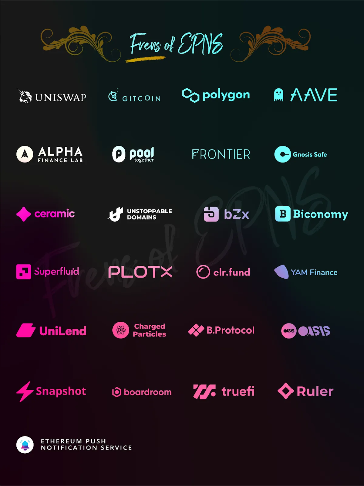
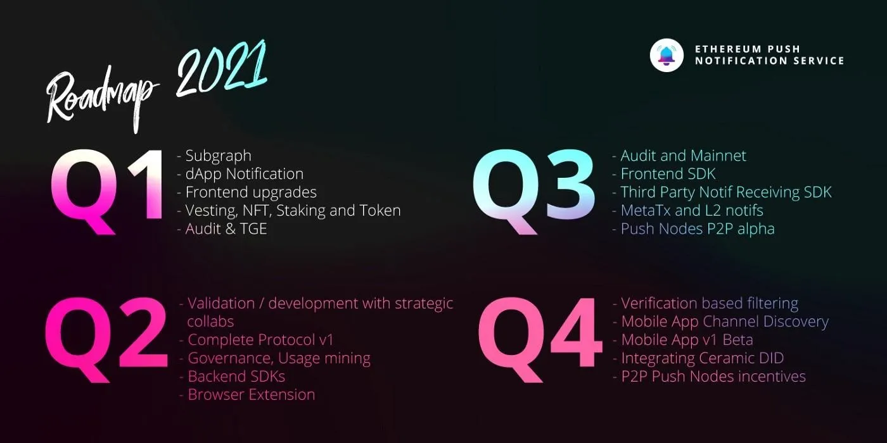

import { ImageText } from '@site/src/css/SharedStyling';

<!--truncate-->

Last July 28th, 2021 we had the pleasure to join YAM Finance’s Discord server for an AMA session. Definitely an enriching experience that gave us the opportunity to share with both our communities what we are building and what's coming in the near future.

Thanks for joining and for your great questions!

**_Date_**_: Wednesday, 28th July, 2021  
_**_Time_**_: 4:00PM UTC_

**Guests:**

Richa Joshi, Co-founder, Ethereum Push Notification

Harsh Rajat, Co-founder, Ethereum Push Notification

_Find the AMA transcript below:_

**EPNS AMA on Yam Finance Discord July 28, 2021**

**ZETALEAK**: Welcome everyone!

Today we’re thrilled to be joined by Richa Harsh from EPNS!!

**RICHA**: Hey, hey Awesome folks! Awesome to be here 👋 Thank you for hosting us.

**ZETALEAK**: Please keep quiet for the first section if you want to win prizes guys!

**HARSH**: Hey Guys! Excited to be here🍠❤️

**ZETALEAK**: Any talkers will NOT win the prize! Rule 1 😄

Welcome Richa and Harsh! How are you guys? Would you like to introduce yourselves and EPNS?

**RICHA**: Sure! I’m co-founder at Ethereum Push Notification Service (EPNS) and mainly focus on the Marketing and Growth. 🙂

**HARSH**: Hey Everyone! I am Harsh, Founder and Project Lead of Ethereum Push Notification Service. Some background about me. I love all things tech and have as a byproduct gathered 11+ years of experience in dabbling across various spectrums of tech and design in almost all popular fields (mobile, web services, SAAS and of course Blockchain).

> **ZETALEAK**: Amazing guys! Why did you guys launch EPNS and what problem does it seek to solve?

**HARSH**: Ethereum Push Notifications Service aka EPNS is communication middleware for blockchain that enables any smart contracts, dApps or Web3 service to send notifications to wallet addresses.

\*\*The idea in TLDR;\*\* Taking a note from Apple and Google Notifications Middleware, which we all virtually use, we realized that services need a standard, open communication layer protocol just like them to enable UX and services finally being able to reach users via decentralized notifications tied to their crypto wallets.

Here is a cool video teaser we created to share a glimpse of the notifications

[https://www.youtube.com/watch?v=kwwnlmUpRsk](https://www.youtube.com/watch?v=kwwnlmUpRsk)

For instance, Liquidation on AAVE, Compound or any DeFi, DAO Governance proposal (Yam!), or ENS/DEX orders. Each of these are a reality right now but no solution exists to address them and the problem will only worsen as more services come to Web3.

> **ZETALEAK**: Very cool!! Can you talk about the milestones in your roadmap and what’s next for EPNS?

**RICHA**: Just to share a bit about our journey 🙏 so far: We have had an awesome journey! Ideation and loads of research were taken to \*\*Ethereum Foundation\*\* -> \*\*EthGlobal HackMoney 2020\*\* where we build POC -> selected for \*\*IDEO PVD\*\* -> selected for \*\*Gitcoin Kernel fellowship \*\*and came out as top 20 projects! -> entered \*\*Gitcoin Grant round 7 (top 5 projects / 210+ contributors) \*\*which led us to raise our seed round.

Also, extremely grateful to be backed by 35+ top VCs and Web3 leaders including: Balaji Srinivasan, Binance Labs, True Ventures, LD Capital, Sandeep (Polygon), Mariano Conti, Anthony Sassano (EthHub /TheDailyGwei), DeFiDad, Preethi Kasireddy among several more awesome peeps.

**HARSH**: Haha, Richa beat me to it, but in short: We have come a long way from Raise -> POC -> Live notifications (coming from mainnet but going through our Ropsten protocol) -> launching channel discovery on app.epns.io -> launching yield farming for community.

But that’s just the start and that’s the coolest part. We are looking at Launching Governance in just under two weeks -> Mainnet in Q3 -> Push Nodes and Staking in Q4.

**RICHA**: [https://medium.com/ethereum-push-notification-service/soaring-through-the-sky-with-epns-pilot-programs-4d02f09a6a8](https://medium.com/ethereum-push-notification-service/soaring-through-the-sky-with-epns-pilot-programs-4d02f09a6a8)

**HARSH**: Alpha Drop

> **ZETALEAK**: Woah! What a journey! And you guys are just getting started. 🚀
>
> Can you touch upon the EPNS ecosystem briefly and how everything works?

**HARSH**: Thanks Guys!

The way EPNS works in on two levels:

\- Sending Notifications (Which is done through either interacting with our middleware smart contract (EPNS Communicator/or sending notification payload directly to push nodes).

\- Receiving Notifications and Dispatching (this forms the open communication network ) which any crypto wallet can listen for and show it on their frontend.

Currently, these push nodes are sending notifs to our mobile apps and our extension but yes, as I mentioned the vision is that you can open Metamask and bam! the notifications will be right there.

As for the logic of notifications, we took the stance that services are sending notifications to users and they should decide the logic, whether on-chain or off-chain. Of course, to increase network effect, we selected few elite projects (Like Yam!) for whom we will build this logic out as well.

**HARSH**: We lovingly call them Frens of EPNS! 💓

**RICHA**:

> **ZETALEAK**: Thanks for sharing. EPNS is leading the charge on this vital piece of infrastructure!
>
> Final question and then we will open this channel for community questions!
>
> What is your long-term vision for the EPNS project?

**HARSH**: Easy, Become the Communication Layer for Ethereum, L2s and then finally for other blockchains as well! We are lucky to be in the right place at the right time to create this which hopefully will make the Web3 even easier to embrace and hop on!

**RICHA**: Harsh’s answers are getting too short. Here’s our Roadmap 🙂

**ZETALEAK**: Love the big vision guys! I’m really excited that Yam DAO is joining you guys on this journey.

We can’t wait to get set up using the EPNS service to help users of our Yam Synths platform [https://synths.yam.xyz/](https://synths.yam.xyz/)

Don’t forget you can earn yield by minting and LPing synths guys 🙂

Also everyone, reminder we have a POAP for all attendees!

[https://twitter.com/yamfinance/status/1419681062016327686?s=21](https://twitter.com/yamfinance/status/1419681062016327686?s=21)

If you like POAPs and NFTs make sure to stick around as we regularly do giveaways. ❤️

**RICHA**: [https://tenor.com/view/wow-wow-cat-cat-cat-wow-cattitude-wow-gif-17576200](https://tenor.com/view/wow-wow-cat-cat-cat-wow-cattitude-wow-gif-17576200)

**ZETALEAK**: So that concludes the panel questions! Thank you so much Richa and Harsh !

I will now open up for community questions!

Don’t forget, $200 PUSH is up for grabs for the best questions!

**RICHA**: Let’s do this guys!!

**HARSH**: This was really cool, Thanks for having us. Going to get some Yield for Yam now!

PS: We also have our yield program which users can join to earn incase they own $PUSH: [https://incentives.epns.io](https://incentives.epns.io)

PS: We love our community and have $ROCKSTAR NFTs for one user every week: [https://medium.com/ethereum-push-notification-service/kicking-off-the-epns-nft-community-drops-6a5c49808cf](https://medium.com/ethereum-push-notification-service/kicking-off-the-epns-nft-community-drops-6a5c49808cf)

PS: We love to have you guys join our Push community as well (https://t.me/epnsproject | [https://twitter.com/epnsproject](https://twitter.com/epnsproject) | [https://epns.io)](https://epns.io))

> **DUODUOLIU**: Does the community empower NFTs? Like community voting, governance, etc.? Or just a JPG image?

**HARSH**: Woah, yes, NFT contains 2400 $PUSH, and yes, it will empower voting, governance, etc as well.

**DUODUOLIU**: Very good.

**ZETALEAK**: 👀

> **88888888**: Will early supporters have pre-emption rights or community participants have the opportunity to receive free cryptocurrency.

**HARSH**: Early supporters get cool things like deciding the vision of the project, getting higher APRs and a lot of cool stuff though free cryptocurrency might not be one of the benefits.

> **BLACKHORSE**: Harsh How about the future to implement this to other blockchains as well?

**HARSH**: We already starting laying the ground work on it! And yes, plan is to make it come to all smart blockchains, even non-EVM ones, though governance will always stay on Ethereum.

**OFFICE**: How can get this NFT?

**HARSH**: Start here: [https://medium.com/ethereum-push-notification-service/kicking-off-the-epns-nft-community-drops-6a5c49808cf](https://medium.com/ethereum-push-notification-service/kicking-off-the-epns-nft-community-drops-6a5c49808cf)

**88888888**: It’s beautiful, it’s cool, and I’m looking forward to it now, and it feels good.

**BLACKHORSE**: Sound good. Estimated timeline to launch first version for non-ethereums?

> **SAKURALU**: $Will there be more empowerment and application scenarios for $PUSH in the future?

**HARSH**: Yes, Push Nodes will need staking (just like Eth2.0) + Since we are a middleware, the token holders decide the fee split (when it’s enabled) among themselves and other crypto wallets integrating the protocol + Incentives and Yield farming (https://incentives.epns.io) + Governance

> **ETHFLY**: When does the project plan to issue its own digital currency.

**HARSH**: Already done, it’s called $PUSH.

**SAKURALU**: Cool. I’m looking forward to it.

> **OFFICE**: How can get this NFT?

**RICHA**: Teaser of our Weekly Community ROCKSTAR NFT along with the blog link on how to participate: [https://medium.com/ethereum-push-notification-service/kicking-off-the-epns-nft-community-drops-6a5c49808cf](https://medium.com/ethereum-push-notification-service/kicking-off-the-epns-nft-community-drops-6a5c49808cf)

[https://twitter.com/epnsproject/status/1417168210718244868](https://twitter.com/epnsproject/status/1417168210718244868)

> **VOLWORLD**: Harsh ROSS What kind of cooperation do YAM and EPNS plan in the future?

**HARSH**: We are building notifications for YAM, which means you as a user will soon start receiving about various events starting from liquidation risks, read more: [https://medium.com/ethereum-push-notification-service/bringing-power-of-web3notif-to-the-awesome-yam-community-95d8a39ed86c](https://medium.com/ethereum-push-notification-service/bringing-power-of-web3notif-to-the-awesome-yam-community-95d8a39ed86c)

> **HANJIANG**: Is EPNS ready to launch an app?

**HARSH**: Already live on iOS, Android and Chrome. Checkout [https://app.epns.io](https://app.epns.io)

**ZETALEAK**: ⏰ 3 minutes remaining to ask your questions, get them in quick!

**BLACKHORSE**: I think it is not best for secure, How about your think?

**HARSH**: It is secure. We support encrypted notifications as well. 🙂

> **BLACKHORSE**: Harsh, It is safe for Hacking?

**HARSH**: Yes, completely safe, read about the technical overview here: [https://whitepaper.epns.io](https://whitepaper.epns.io)

> **88888888**: Is there too little NTFs? After 48 are sent, we only have one a week to fight for. It’s too little. Could you please send more?

**HARSH**: There are still 40+ NFTs up for grabs.

**ZETALEAK**: Ok guys time is up!!

**HARSH**: 100 in total. Here’s a preview of one of them.

> **VOLWORLD**: As far as I know, will YAM’s synths products be applied to? But if the user does not start Discord, are there other types of push methods, such as silent push of mobile APP!

**HARSH**: Yes, we focus on mobile and desktop notifications first :). Check [https://epns.io](https://epns.io) or [https://app.epns.io](https://app.epns.io) for more info.

> **ROSS**: How do you guys feel about a multi-chain world and what kind of additional work will it take to make EPNS work for more than just Ethereum?

**HARSH**: We already started multi-chain preps and laying foundation. Technically, we have two middleware contracts (EPNSCore and EPNSCommunicator), EPNSCore handles governance and will be on Ethereum while EPNSCommunicator will be deployed to multiple chains. The Push Nodes will listen to EPNSCommunicator and validate it with EPNSCore protocol essentially enabling multichain, even non-EVM ones. 😱

**ZETALEAK**: Wow, thank you so much for answering Harsh and Richa ! It’s been a real pleasure having you guys here!

That now concludes the event! Thanks everyone!

Don’t forget to claim your FREE POAP!

To get it you need to message the @POAP-BOT the password ‘epnsama’.

**RICHA**: Thanks Zetaleak for hosting us. This was really fun and thanks.

Awesome YAM peeps for all the wonderful questions. Finally, if you’d like to know more about what we are building, please join:

[https://t.me/epnsproject](https://t.me/epnsproject)

[https://twitter.com/epnsproject](https://twitter.com/epnsproject)

Incentives portal: [https://incentives.epns.io](https://incentives.epns.io)

Visit us: [epns.io](http://epns.io)

**HARSH**: Thanks for having us guys!! We love Yam and this was quite fun for us, hope it was the same for you guys as well. 😊😊

**ZETALEAK**: Absolutely! It was amazing having you here. Here’s to a long future building together. 🙂

**BLACKHORSE**: Security weaknesses: Hackers or other malicious groups or organisations may attempt to interfere with $PUSH and/or the EPNS protocol in a variety of ways, including, but not limited to, malware attacks, denial of service attacks, consensus-based attacks, Sybil attacks, smurfing and spoofing. Furthermore, there is a risk that a third party or a member of the Company, the Distributor or their respective affiliates may intentionally or unintentionally introduce weaknesses into the core infrastructure of $PUSH and/or the EPNS protocol, which could negatively affect $PUSH and/or the EPNS protocol. Further, the future of cryptography and security innovations are highly unpredictable and advances in cryptography, or technical advances (including without limitation development of quantum computing), could present unknown risks to $PUSH and/or the EPNS protocol by rendering ineffective the cryptographic consensus mechanism that underpins that blockchain protocol.

**HARSH**: Love the thoroughness. As with any network, we need to design a proper game theory around it. Though some points are already covered:

\- Malware attacks, Spoofing: Only the channel can send notifications on their behalf, which is verified cryptographically. Furthermore, opt in by users ensure spam isn’t allowed. To ensure that channels don’t turn into bad actors in the middle, we have spam score that will throttle notifications and governance to take the worst channels out.

\- Consensus-based attacks: We are still researching the best approach to follow on this but in essence, defining a quorum (like how eth tx requires multiple confirmation or how etherjs uses multiple data source) should take care of it but this is an ongoing discussion rn and we would \[encourage\] you to participate as well.

\- Third party risk: All our contracts are put in use after audits, $PUSH, incentives, timelocks which are live are already audited by Chainsafe: [https://epns.io/EPNS-release-Audit.pdf](https://epns.io/EPNS-release-Audit.pdf)

Would love to discuss this further as well!

We are grateful and motivated 🙏with all the support and participation from both communities. Thank you!!
