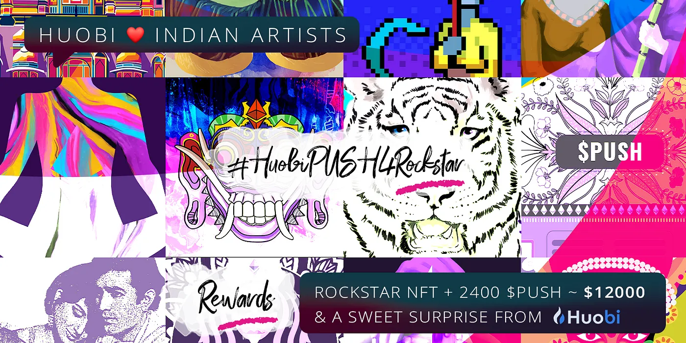

import { SubHeader, ImageText } from '@site/src/components/SharedStylingV2';

<!--truncate-->

Hey Awesome Community 👋!!

Continuing the celebration of $PUSH listing on [Huobi Global](https://medium.com/u/65d3e2271234?source=post_page-----3478bcf2ca1f--------------------------------), this weeks $ROCKSTAR #NFT is sponsored by awesome peeps at 
[Huobi Global](https://medium.com/u/65d3e2271234?source=post_page-----3478bcf2ca1f--------------------------------) to celebrate Indian art 🇮🇳. The winner gets the <b>$ROCKSTAR NFT + 2400 $PUSH </b>(~$12,000)+ <b>Sweet surprise from Huobi 🎁</b>

Channelize your love and get creative in showcasing EPNS x Huobi Global to the world to be the winner 💖 🤗!

#### Huobi Indian Artists NFT Competitions Rules👇
- RT & Like the [tweet](https://twitter.com/epnsproject/status/1432721552961904651?s=20)
- Highlight EPNS and Huobi in your submission
- Freestyle: Creativity knows no bound, create memes, infographics, videos, photos, reviews or anything cool or crazy and submit by replying to the [tweet](https://twitter.com/epnsproject/status/1432721552961904651?s=20)
- Reply to the [tweet](https://twitter.com/epnsproject/status/1432721552961904651?s=20) with #HuobiPUSH4Rockstar and your creative to qualify for the competition.
- Contest ends on Monday, 6th Sep, Winner will be selected by Huobi

Note that the Huobi surprise is limited to India area only.

So, put on your creative hats 🤠 and let’s all have some fun 🎉🎉🎉

Good luck to everyone!🤞

### About Push Protocol

Push is the communication protocol of web3. Push protocol enables cross-chain notifications and messaging for dapps, wallets, and services tied to wallet addresses in an open, gasless, and platform-agnostic fashion. The open communication layer allows any crypto wallet /frontend to tap into the network and get the communication across.

To keep up-to-date with Push Protocol: [Website](https://push.org/), [Twitter](https://twitter.com/pushprotocol), [Telegram](https://t.me/epnsproject), [Discord](https://discord.gg/pushprotocol), [YouTube](https://www.youtube.com/c/EthereumPushNotificationService), and [Linktree](https://linktr.ee/pushprotocol).

