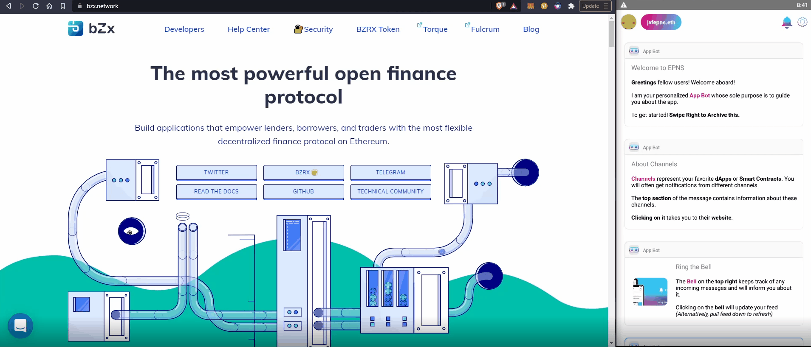
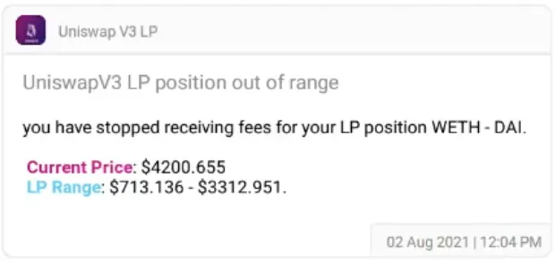

import { ImageText } from '@site/src/css/SharedStyling';

<!--truncate-->

August went by in the blink of an eye, but not without leaving us with great news to share and lots of work done in preparation for closing a successful Q3!

Let's review together what the August 2021 chapter had for us!

Governance updates🎯
====================

One of the most anticipated milestones in our Roadmap for this year is just around the corner! Step 1 of our **Progressive Decentralized Governance** strategy is launching soon.

Through governance, the EPNS community will be able to take an active participation in the direction of the protocol. From initiating proposals to fomenting discussions around it and getting all the support required to make them a reality.

Expect more news very soon! 👀

<iframe src="https://cdn.embedly.com/widgets/media.html?type=text%2Fhtml&amp;key=a19fcc184b9711e1b4764040d3dc5c07&amp;schema=twitter&amp;url=https%3A//twitter.com/epnsproject/status/1433120051088052232&amp;image=https%3A//i.embed.ly/1/image%3Furl%3Dhttps%253A%252F%252Fabs.twimg.com%252Ferrors%252Flogo46x38.png%26key%3Da19fcc184b9711e1b4764040d3dc5c07" allowfullscreen="" frameborder="0" height="576" width="647" title="Ethereum Push Notification Service | EPNS on Twitter: &quot;Are you ready for the $PUSH?🔊 Sound on pic.twitter.com/BcK1Ofazeb / Twitter&quot;" class="eo n ff dy bg" scrolling="no"></iframe>

$PUSH News! — Exchanges, listings, and contests📮
=================================================

This has been a great month for EPNS and $PUSH! Throughout this month we’ve shared exciting news about $PUSH being listed in very prestigious exchanges.

Up until now, we were listed in [Uniswap](https://app.uniswap.org/#/swap?inputCurrency=0xf418588522d5dd018b425e472991e52ebbeeeeee), [Paraswap](https://paraswap.io/#/ETH-PUSH), and [WazirX](https://wazirx.com/exchange/PUSH-USDT) 🙏🏽.

Now, we are also listed in:

*   [Huobi](https://twitter.com/epnsproject/status/1432241447009411078)
*   [Mexc.com’s](https://twitter.com/epnsproject/status/1433058575849512965) mainboard!
*   [Zebpay](https://twitter.com/epnsproject/status/1428197529267625987)
*   [Gate.io](https://twitter.com/epnsproject/status/1432683735372214276)

Great news don’t come alone… they come together with great opportunities and contests! Don’s miss out!

*   [Huobi’s Trade to Win](https://twitter.com/HuobiGlobal/status/1433406855103991818)
*   [Huobi 💖 Indian Artists](https://twitter.com/epnsproject/status/1432721552961904651)
*   [MEXC’s Hold & Earn event](https://twitter.com/MEXC_Global/status/1433057238332051465)

**Development** 🚧
==================

With so many milestones in our roadmap and Q3 coming to an end, we put our heads down to work. Let's review all the happenings in the dev front this month.

More channels 📺
----------------

A lot of progress has been made on this front this month:

*   **Channels in development**: PoolTogether, Oasis.app, Ruler Protocol, and Snapshot.
*   **Channels in QA**: bZx, B.Protocol, and TracerDAO.

*   **Channels in preparation for release**: UniswapV3 and YAM.

Working on these channels have not only helped us gain brilliant insights on what Web3 needs, but it has also helped us improve the tooling that we use and the developers need. This brings us to another key item that we have been working on:

**Plug & play for Showrunners framework**: we are close to releasing an update to our framework and make it available to the dev community, so you can develop on your own channels in a simpler fashion.

**Setting up the EPNS Governance Infrastructure**🎯
---------------------------------------------------

This task entails orchestrating several moving pieces, validating that all processes are sound and that all tooling required is validated before launch.

With this in mind — we are adding yet one more section to our incentives website, where community and stakeholders can delegate voting power to the the person that best represents their interests.

We also set up and validated our Governance Forum and Snapshot space. We as a team ran several rounds of validation to cover all scenarios for a successful launch.

EPIP — new payloads and voting from notifications🤖
---------------------------------------------------

Our EPIP (**E**thereum **P**ush **I**mprovement **P**roposal) to add the capability of voting from a notification itself is currently in the works. We will be testing it and making sure it works as expected as soon as the first version is ready. We will share more details soon.

Mobile App and Browser extension improvements 🚀
------------------------------------------------

Aside from working on performance improvements for both the Mobile App and the Chrome Browser extension, we are at the last stage of adding **Channel Discovery** to them**.**

This will allow users to quickly browse the existing collection of channels available from a list, and very soon even subscribe to them from here.

Finally, a set of cosmetic changes are in the works for the Chrome Browser Extension (currently in Alpha) aiming to closely mimic our Mobile App.

Protocol, Mainnet, and PUSH Nodes 🔎
------------------------------------

With our Smart Contracts auditing being the next milestone in our list, many efforts are coming together to ensure we are ready to hit Mainnet right after.

Tons of progress has been made on the **protocol optimization and channel settings** front. We are finalizing activities regarding Protocol segmentation and its corresponding test cases. We will be done by early September and ready for audit! 📦

At the same time, a big part of our focus is on researching and finding the best approach towards developing our PUSH Nodes. This plays an important role in the decentralization of the Protocol, and it enables yet one more alternative to have an active participation in it.

The more the merrier — Meet our new Frens! 🙌
=============================================

[**Aragon**](https://medium.com/ethereum-push-notification-service/epns-partners-with-aragon-voice-to-power-unstoppable-decentralized-governance-56182b9d9aa0): through this collaboration we aim to keep everyone updated on the future of the protocol and the direction is heading. Notifying Guardians and token holders at every stage of the proposal lifecycle and when action is required.

[**TracerDAO**](https://medium.com/ethereum-push-notification-service/epns-brings-push-notifs-to-tracer-dao-governance-91f7b9a9ddcc): with TracerDAO we are looking to support the DAO governance process by providing timely notifications to deliver important information about governance proposals, discussions, voting, and results.

[**IDLE**](https://medium.com/ethereum-push-notification-service/epns-collaborates-with-idle-to-enable-push-notifications-for-governance-updates-32e142ed2f33): with this collaboration with IDLE we are building a channel for stakeholders and the community to actively participate in the direction of the protocol, and receive notifications with actionable links to encourage participation.

Community Activities
--------------------

Along with these new collaborations, this month we have run multiple events with our existing **Frens** to inform and involve our communities in this exciting process.

*   Cross-AMAs with: B.Protocol, Ruler Protocol, TrueFi, and Idle
*   Participated in B.Protocol’s Community call
*   Meme Contests with: YAM, Ruler, TrueFi, and Idle

We are thrilled to see all the participation and support received! 👏🏼

EPNS Community Incentives
=========================

Let’s start with great news! — we reached a new record **$25M TVL $PUSH** 😎

On top of this, we continue observing great APR percentages in our pools with **139% for UNI-LP** and **38% for PUSH Staking.**

Now, every month our community continue to **WOW**! 😮 us with their creativity and contributions for **Rockstars of EPNS**. This month we had 5 winners of the custom unique NFTs made by Indian artists along with the 2400 $Push.

> _Want participate and win $ROCKSTAR, Start over here:_ [_https://medium.com/ethereum-push-notification-service/kicking-off-the-epns-nft-community-drops-6a5c49808cf_](https://medium.com/ethereum-push-notification-service/kicking-off-the-epns-nft-community-drops-6a5c49808cf)

Last but not least, make sure to participate in our #HotDeFiSummer “[Guess the APR](https://twitter.com/epnsproject/status/1426906201758093316?s=20)” contests!

EPNS in the news 📻
===================

Another month that makes us feel grateful and reassure to us that we are doing things right.

*   [EPNS featured in mainstream news at ET NOW](https://twitter.com/epnsproject/status/1421351789551525890?s=20)
*   [Featured by Polkastarter’s The Polkastars](https://twitter.com/polkastarter/status/1423608692679790592?s=20)
*   [Harsh joining Blockzero Labs podcast to talk about EPNS](https://www.youtube.com/watch?v=bdEBgQhzCnY)
*   [Kashif Raza hosted a Twitter space with Harsh and Richa](https://twitter.com/simplykashif/status/1425764105504260102?s=20)
*   [Forbes India featured Harsh Rajat and EPNS](https://twitter.com/epnsproject/status/1428401382466330625?s=20)
*   [Harsh Rajat talking about EPNS at #EDCON2021](https://twitter.com/EDCON_Online/status/1431280672014884866?s=20)

We are beyond excited about this new phase we are entering to implement Governance and allow the community to participate in the direction of the protocol. This together with all the development efforts happening will allow us to build the notifications layer that Web3 deserves.

Keep PUSHing! 💪🏼

The EPNS team

